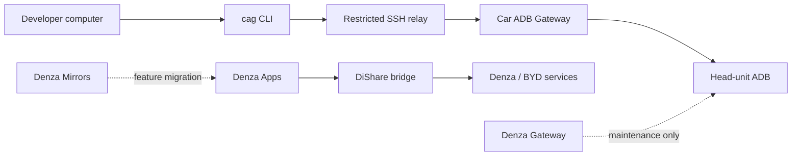

<div align="center">

# Denza Lab

**Android apps, remote tooling, and field research for Denza / BYD head units.**

<p>
  
  
  
  
  
</p>

An opinionated monorepo for building useful in-car software without mixing
product code, remote-access infrastructure, and reverse-engineering experiments.

</div>

> [!IMPORTANT]
> This is a hardware-specific lab, not a turnkey consumer product. Anything that
> touches a live vehicle should be tested conservatively and treated as
> experimental until the relevant documentation says otherwise.

## Portfolio

| Lifecycle | Component | Purpose |
| --- | --- | --- |
| **Active** | [`apps/car-adb-gateway/`](apps/car-adb-gateway/) | Generic, relay-only remote ADB gateway with one trusted computer and a self-healing Android service. |
| **Active** | [`apps/denza-apps/`](apps/denza-apps/) | The single Denza feature app. Simulcast is available today; Denza Mirrors functionality will move here. |
| **Transition** | [`apps/denza-mirrors/`](apps/denza-mirrors/) | Existing side-camera app and the source for the ongoing camera-feature migration into Denza Apps. No new standalone product direction. |
| **Legacy** | [`legacy/denza-gateway/`](legacy/denza-gateway/) | Original LAN-only SSH-to-ADB gateway. Kept for maintenance and reference; superseded for new remote-access work. |
| **Library** | [`libraries/dishare-bridge/`](libraries/dishare-bridge/) | Shared raw DiShare binder integration used by Denza Apps. |
| **Platform** | [`platform/cli/`](platform/cli/), [`platform/relay/`](platform/relay/), [`ops/ansible/`](ops/ansible/) | Developer CLI, restricted relay control plane, and reproducible server provisioning. |

Supporting areas have deliberately narrow roles:

- [`docs/`](docs/) — durable architecture, decisions, and verified findings;
- [`tools/`](tools/) — host-side probes and live-car utilities;
- [`research/`](research/) — parked or non-built experiments;
- `reverse/` — ignored local workspace for extracted artifacts and captures.

## How it fits together



Car ADB Gateway never exposes ADB or SSH on the vehicle network. The vehicle
opens the outbound relay connection, while the developer's SSH connection stays
end-to-end encrypted to the Android app. See the
[architecture](docs/CLOUD-ARCHITECTURE.md) and
[decision log](docs/CAR-ADB-GATEWAY-DECISIONS.md) for the security model.

## Repository layout

The repository is becoming **Denza Lab**: the umbrella name describes the work
better than the historical `denza-gateway` name.

The product cleanup is intentionally staged:

1. Keep active and transition apps under `apps/`, shared code under
   `libraries/`, and frozen products under `legacy/`.
2. Move the supported Denza Mirrors behavior into Denza Apps.
3. Remove Denza Mirrors from the default Gradle build once its replacement is
   verified on a real head unit.
4. Move the frozen Denza Mirrors source from `apps/` to `legacy/`.

Gradle module names remain stable even though their source directories are
grouped by role. During the migration, the repository shape is:

```text
apps/
  car-adb-gateway/
  denza-apps/
  denza-mirrors/       # transition
libraries/
  dishare-bridge/
platform/
  cli/
  relay/
ops/
legacy/
  denza-gateway/
docs/  research/  tools/
```

## Build

Requirements:

- JDK 17;
- Android SDK platforms 36 and 37;
- Android Platform Tools;
- Go for the `cag` CLI.

On a Homebrew-based macOS setup:

```bash
export JAVA_HOME=/opt/homebrew/opt/openjdk
export ANDROID_HOME=/opt/homebrew/share/android-commandlinetools

./gradlew :car-adb-gateway:testDebugUnitTest :car-adb-gateway:assembleDebug
./gradlew :denza-apps:assembleDebug
```

Build transition and legacy apps only when working on them:

```bash
./gradlew :denza-mirrors:assembleDebug
./gradlew :denza-gateway:testDebugUnitTest :denza-gateway:assembleDebug
```

Build and test the developer CLI:

```bash
cd platform/cli
go test ./...
go build -o cag ./cmd/cag
```

Generated APKs and reverse-engineered binaries are intentionally ignored by
Git. Do not add them to the repository.

## Car ADB Gateway in 30 seconds

After an administrator enrolls the vehicle, a person at the head unit can issue
a ten-minute pairing code for one trusted computer:

```bash
cag pair XXXX-XXXX
cag connect -- adb devices
cag connect -- adb shell
cag status
cag disconnect
```

The relay must be deployed through [`ops/ansible/`](ops/ansible/), not by
copying scripts manually. This keeps SSH, PAM, account, filesystem, and
verification rules consistent.

## Documentation

- [Project map](docs/project-map.md) — component boundaries, lifecycle, and build outputs.
- [Repository governance](docs/governance.md) — active, migration, legacy, and research rules.
- [Docs index](docs/README.md) — ownership of durable knowledge.
- [Car ADB Gateway architecture](docs/CLOUD-ARCHITECTURE.md) — normative relay-only design.
- [Car ADB Gateway decisions](docs/CAR-ADB-GATEWAY-DECISIONS.md) — ADR-lite rationale and evidence.
- [Side-camera findings](docs/side-camera-findings.md) — Denza Mirrors evidence and limitations.
- [DiShare API notes](docs/dishare-api-notes.md) — Simulcast and HUD reverse-engineering notes.

Code, manifests, and Gradle files remain the source of truth for current
behavior. Documentation records direction and verified evidence; it should not
become a second implementation model.
