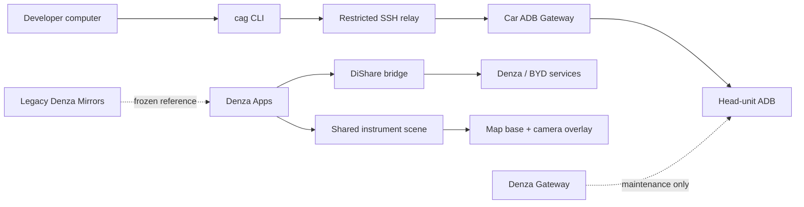

<div align="center">

# Denza Lab

**Android apps, remote tooling, and field research for Denza / BYD head units.**

<p>
  
  
  
  
  
</p>

An opinionated monorepo for building useful in-car software without mixing
product code, remote-access infrastructure, and reverse-engineering experiments.

</div>

> [!IMPORTANT]
> This is a hardware-specific lab, not a turnkey consumer product. Anything that
> touches a live vehicle should be tested conservatively and treated as
> experimental until the relevant documentation says otherwise.

## Portfolio

| Lifecycle | Component | Purpose |
| --- | --- | --- |
| **Active** | [`apps/car-adb-gateway/`](apps/car-adb-gateway/) | Generic, relay-only remote ADB gateway with one trusted computer and a self-healing Android service. |
| **Active** | [`apps/denza-apps/`](apps/denza-apps/) | The single Denza feature app: Simulcast app selection, instrument-display mirrors, and experimental Yandex task projection. |
| **Legacy** | [`legacy/denza-mirrors/`](legacy/denza-mirrors/) | Frozen hardware-verified camera reference. Its working behavior has moved into Denza Apps and it is no longer in the root Gradle build. |
| **Legacy** | [`legacy/denza-gateway/`](legacy/denza-gateway/) | Original LAN-only SSH-to-ADB gateway. Kept for maintenance and reference; superseded for new remote-access work. |
| **Library** | [`libraries/dishare-bridge/`](libraries/dishare-bridge/) | Shared raw DiShare binder integration used by Denza Apps. |
| **Platform** | [`platform/cli/`](platform/cli/), [`platform/relay/`](platform/relay/), [`ops/ansible/`](ops/ansible/) | Developer CLI, restricted relay control plane, and reproducible server provisioning. |

Supporting areas have deliberately narrow roles:

- [`docs/`](docs/) — durable architecture, decisions, and verified findings;
- [`tools/`](tools/) — host-side probes and live-car utilities;
- [`research/`](research/) — parked or non-built experiments;
- `reverse/` — ignored local workspace for extracted artifacts and captures.

## How it fits together



Car ADB Gateway never exposes ADB or SSH on the vehicle network. The vehicle
opens the outbound relay connection, while the developer's SSH connection stays
end-to-end encrypted to the Android app. See the
[architecture](docs/CLOUD-ARCHITECTURE.md) and
[decision log](docs/CAR-ADB-GATEWAY-DECISIONS.md) for the security model.

## Repository layout

The repository is **Denza Lab**: the umbrella name describes the work better
than the historical Denza Gateway product name.

Active apps live under `apps/`, shared code under `libraries/`, and frozen
products under `legacy/`. The migrated Mirrors and navigation paths now live in
Denza Apps behind one instrument-display resolver and scene. The standalone
Denza Mirrors source is retained only as reference and is not a root Gradle
module.

The repository shape is:

```text
apps/
  car-adb-gateway/
  denza-apps/
libraries/
  dishare-bridge/
platform/
  cli/
  relay/
ops/
legacy/
  denza-gateway/
  denza-mirrors/
docs/  research/  tools/
```

## Build

Requirements:

- JDK 17;
- Android SDK platforms 36 and 37;
- Android Platform Tools;
- Go for the `cag` CLI.

On a Homebrew-based macOS setup:

```bash
export JAVA_HOME=/opt/homebrew/opt/openjdk
export ANDROID_HOME=/opt/homebrew/share/android-commandlinetools

./gradlew :car-adb-gateway:testDebugUnitTest :car-adb-gateway:assembleDebug
./gradlew :denza-apps:testDebugUnitTest :denza-apps:assembleDebug
```

Build the legacy gateway only when working on it:

```bash
./gradlew :denza-gateway:testDebugUnitTest :denza-gateway:assembleDebug
```

Build and test the developer CLI:

```bash
cd platform/cli
go test ./...
go build -o cag ./cmd/cag
```

Generated APKs and reverse-engineered binaries are intentionally ignored by
Git. Do not add them to the repository.

## Car ADB Gateway in 30 seconds

After an administrator enrolls the vehicle, a person at the head unit can issue
a ten-minute pairing code for one trusted computer:

```bash
cag pair XXXX-XXXX
cag connect -- adb devices
cag connect -- adb shell
cag status
cag disconnect
```

The relay must be deployed through [`ops/ansible/`](ops/ansible/), not by
copying scripts manually. This keeps SSH, PAM, account, filesystem, and
verification rules consistent.

## Car ADB Gateway field guide

Car ADB Gateway uses two different short-lived codes:

| Code | Created by | Used for | Lifetime |
| --- | --- | --- | --- |
| Enrollment code | Relay administrator | Register one fresh APK installation with the relay. | 60 minutes |
| Pairing code | A person at the enrolled head unit | Connect or replace the one trusted computer. | 10 minutes |

Share either code only with the person who is setting up or operating the
vehicle. A pairing code grants full remote ADB access after the vehicle confirms
the computer.

### 1. Install or update the APK

Build from the repository root, then use the serial shown by `adb devices -l`:

```bash
./gradlew :car-adb-gateway:assembleDebug
adb devices -l
adb -s <serial> install -r apps/car-adb-gateway/build/outputs/apk/debug/car-adb-gateway.apk
adb -s <serial> shell am start -n ru.adbgw.gateway/.MainActivity
```

Keep `-r` when updating an enrolled installation so its private keys and relay
identity remain intact. Uninstalling the APK removes that state and requires a
new enrollment code.

### 2. Enroll the vehicle once

1. Open Car ADB Gateway on the head unit.
2. If Android shows an ADB authorization dialog, approve the app key and press
   **«Проверить снова»**.
3. Ask the relay administrator for a current enrollment code. Administrators
   create it using the procedure in [`ops/ansible/README.md`](ops/ansible/README.md).
4. Enter the code, press **«Подключить автомобиль»**, read the full-access
   warning, and confirm.
5. Wait until the main screen reports that the vehicle is connected to the
   relay. The **«Поддержка»** dialog shows the relay, device ID, ADB endpoint,
   connection state, and recent events when diagnosis is needed.

### 3. Pair or replace the trusted computer

The computer needs the `cag` CLI, OpenSSH, and Android Platform Tools on `PATH`.
Build/install instructions are in [`platform/cli/README.md`](platform/cli/README.md).

1. On the head unit, press **«Подключить компьютер»** or
   **«Заменить компьютер»**.
2. Read the warning and press **«Показать код»**.
3. On the trusted computer, run the displayed command before the code expires:

   ```bash
   cag pair XXXX-XXXX
   ```

4. Wait for `Paired with ...`. A successful replacement revokes the previous
   computer. If replacement fails or expires, the previous computer keeps its
   access.

### 4. Use ADB remotely

`cag` opens the protected tunnel and selects the correct smart-socket or raw-ADB
mode automatically:

```bash
cag connect -- adb devices
cag connect -- adb shell
cag status
```

Use the same prefix for other ADB commands, for example:

```bash
cag connect -- adb shell getprop ro.build.version.release
cag connect -- adb logcat
```

Some raw-ADB head units show a second Android authorization dialog for the
computer's normal ADB key. Approve it at the vehicle before retrying the command.

### 5. Disconnect safely

- `cag disconnect` closes only this computer's local tunnel. It does not disable
  remote access on the vehicle.
- **«Отключить удалённый доступ»** in the vehicle app closes current sessions,
  disables the relay grant, and keeps access disabled after reboot.
- **«Включить удалённый доступ»** in the vehicle app explicitly enables it again.

### Quick diagnosis

- `no car is paired` — create a fresh pairing code at the vehicle and run
  `cag pair`.
- Pairing code rejected — create another code; pairing codes expire after ten
  minutes.
- Enrollment code rejected — ask the relay administrator for another code;
  enrollment codes expire after 60 minutes and are single-use.
- Vehicle is reconnecting — check network access and the **«Поддержка»** events;
  transient network, relay, and ADB failures are retried automatically.
- App was force-stopped — open Car ADB Gateway manually. Android does not allow
  an ordinary APK to restart itself after Force Stop.
- Identity or host-key error — stop and inspect the support details. Identity
  mismatches fail closed and must not be bypassed.

## Documentation

- [Project map](docs/project-map.md) — component boundaries, lifecycle, and build outputs.
- [Repository governance](docs/governance.md) — active, migration, legacy, and research rules.
- [Docs index](docs/README.md) — ownership of durable knowledge.
- [Car ADB Gateway architecture](docs/CLOUD-ARCHITECTURE.md) — normative relay-only design.
- [Car ADB Gateway decisions](docs/CAR-ADB-GATEWAY-DECISIONS.md) — ADR-lite rationale and evidence.
- [Instrument-display findings](docs/instrument-display-findings.md) — display selection, Mirrors, navigation, evidence, and limitations.
- [DiShare API notes](docs/dishare-api-notes.md) — Simulcast and HUD reverse-engineering notes.
- [FSE app installation](docs/fse-app-installation.md) — verified SMB and cross-device path for passenger-screen APKs.

Code, manifests, and Gradle files remain the source of truth for current
behavior. Documentation records direction and verified evidence; it should not
become a second implementation model.
