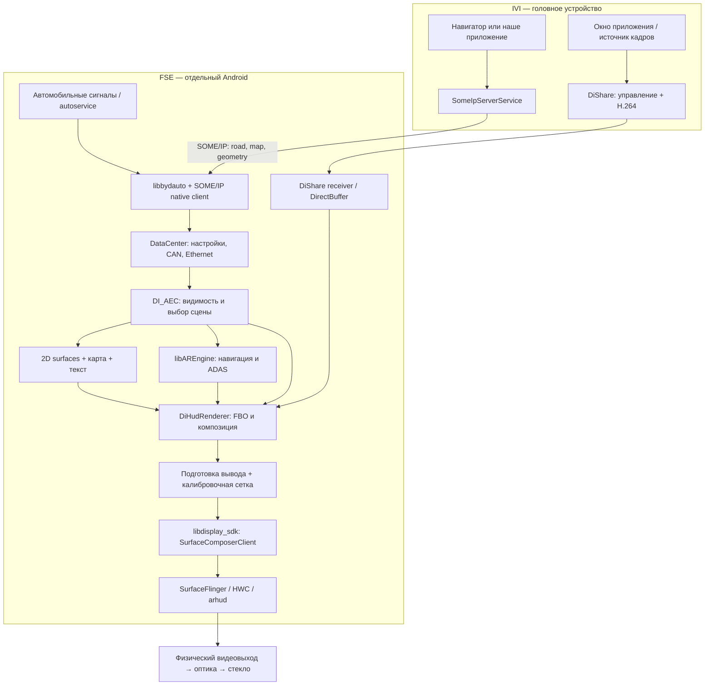
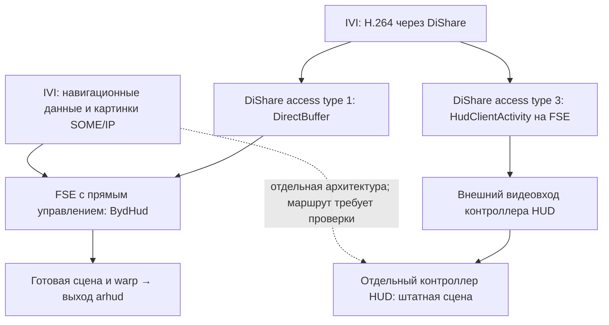
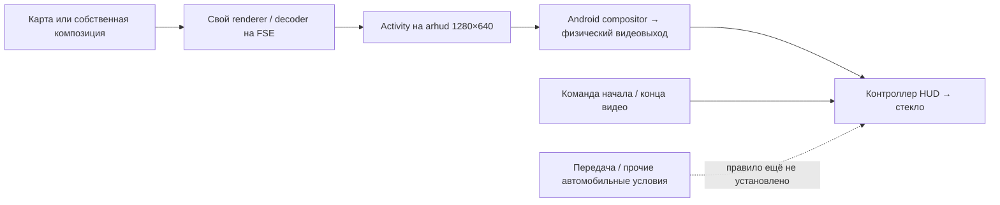
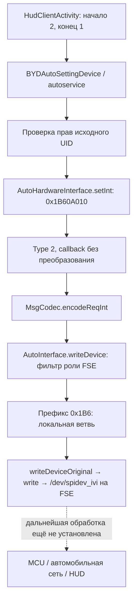
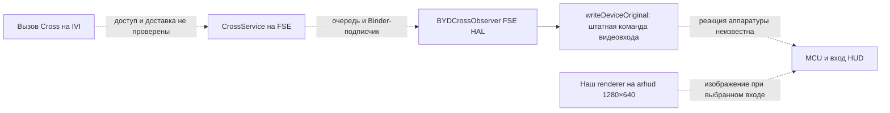

# HUD и BydHud: инженерный разбор

Обновлено **2026-09-24**. Основной разбор выполнен **офлайн по FSE OTA,
Java-коду, ресурсам и AArch64-дизассемблеру**. Затем на машину установлен
FSE HUD Inspector и получен снимок принимающей стороны; автомобильные
сигналы только читали. Результат натурной идентификации —
[раздел 14.8](#fse-inspector-live); трасса P → D → P —
[14.9](#hud-pd-live); поиск пути без Simulcast в framework, native HAL,
правах доступа и MCU-контейнере — [14.10](#hud-independent-route);
прямая Activity нашего APK на arhud — [14.11](#fse-local-probe);
маршрут команды в локальный SPI FSE и штатная диагностика —
[14.12](#hud-hal-input-route); альтернативный вход через Cross, проверенный
эмуляцией функций прошивки, — [14.13](#hud-cross-input-candidate).

**На машине владельца BydHud не зарегистрирован:**
`sys.hud.direct.config = 0`, PackageManager отвечает `NameNotFoundException`.
Файл BydHud присутствует и совпадает с OTA, но его native renderer здесь
не определяет штатную раскладку. FSE видит `arhud` 1280×640 при 60 Гц;
IVI сообщает access type 3 и доступный в P отдельный видеовход HUD.
Штатный полноэкранный тракт — DiShare → `HudClientActivity` → `arhud` →
контроллер HUD. **На месте при переходе в D он закрылся с кодом 605:**
доступность `0x38B00036` изменилась 2 → 1 при скорости 0. После P вернулась
доступность, но сеанс и изображение сами не восстановились. Это не готовое
решение для движения. Собственный renderer на FSE `arhud` **проверен**:
Inspector 0.2.1 создал окно 1280×640 и за 20 секунд получил 397 draw-вызовов
и 397 window frame callbacks. **На стекле ничего не изменилось.**
Одного Android-окна недостаточно; отдельно требуется решить выбор и условия
физического видеовхода. Поведение своего renderer в D ещё не проверялось.

**Продолжение офлайн-разбора:** в HAL команда `0x1B60A010` идёт через
локальный `/dev/spidev_ivi` FSE. Обработчик availability `arhudshift`
сопоставляет FID двух конфигураций HUD, сохраняя значение; проверки передачи
в нём нет. Найден штатный вход в диагностику FSE и переключатель сетевой ADB,
но он требует авторизации. Рабочий независимый видеовход пока не включён.
Дополнительно найден кандидат без FSE shell: доставить команду через Cross
в существующий `BYDCrossObserver` FSE HAL. Офлайн подтверждены регистрация,
разбор буфера и передача неизменённой команды в `writeDeviceOriginal`.
Сетевая доставка, доступ вызывающего UID и реакция HUD ещё не проверены.

**BydHud — системное Android-приложение для конфигурации с прямым
управлением HUD с FSE.** В нём работает нативный движок, который собирает
приборы, навигацию и AR,
выбирает сцену, рисует её OpenGL и подготавливает изображение для оптики HUD.
IVI передаёт ему данные и отдельные картинки; DiShare передаёт видео другим
трактом. Это несколько взаимодействующих подсистем, а не один видеомонитор.

**Граница доказательства:** механизм BydHud ниже описывает direct-drive
вариант общей OTA. Хеши файлов BydHud и установленного DiShare теперь
сверены на FSE; BydHud исключён из регистрации на этой машине. Его профили,
точный crop и P-gate нельзя приписывать отдельному HUD-контроллеру.
Снимок 14.8 не содержит видеосеанса; последующий опыт 14.9 содержит
работающий сеанс и переключение передачи, но не движение автомобиля.
Там, где это существенно, ниже указано «код OTA» или «наблюдалось на машине».

**Уточнение после трассировки PackageManager:** при
`sys.hud.direct.config == 0` система пропускает `com.byd.hud` при сканировании
APK. Наличие файла BydHud в общей OTA не доказывает, что он работает на
конкретном автомобиле. Снимок FSE и свежие показания IVI подтвердили
неинтегрированную конфигурацию с отдельным видеовходом. Подробности и путь к цели
«Яндекс на всей проекции в движении» — [раздел 14](#engineering-yandex-motion).

## Содержание

1. [Главные ответы](#engineering-answers)
2. [Корпус и состав](#engineering-corpus)
3. [Архитектура и слои](#engineering-layers)
4. [Запуск и жизненный цикл](#engineering-lifecycle)
5. [Откуда приходят сигналы и изображения](#engineering-inputs)
6. [Автомат сцен и отключение на ходу](#engineering-scenes)
7. [Раскладки и геометрия](#engineering-layout)
8. [Алгоритм обработки карты и причина кропа](#engineering-map)
9. [Отрисовка 2D, AR и оптическая коррекция](#engineering-render)
10. [Видеотракты](#engineering-video)
11. [До каких уровней можно добраться](#engineering-access)
12. [Ограничения, диагностика и открытые вопросы](#engineering-limits)
13. [Указатель доказательств](#engineering-evidence)
14. [Яндекс на всём HUD в движении: результат поиска способа](#engineering-yandex-motion)
15. [Журнал прежних исследований и опытов](#historical-record)

<a id="engineering-answers"></a>

## 1. Главные ответы

| Вопрос | Установлено |
| --- | --- |
| Кто рисует штатную картинку? | На машине владельца выбрана неинтегрированная конфигурация: BydHud не зарегистрирован, FSE предоставляет видеовыход к отдельному HUD. Точный renderer его контроллера пока не разобран. Для другого, direct-drive варианта OTA: `com.byd.hud` → JNI `libhud.so` → `libDiArHudP.so`; 3D выполняет `libAREngine.so`. |
| Это копия экрана IVI? | В разобранном BydHud штатная сцена синтезируется из автомобильных сигналов, навигационных сообщений и ресурсов APK. Копия окна IVI появляется при DiShare. |
| Можно ли передать свою картинку? | Да: окно карты через SOME/IP `0x8003`, картинка манёвра через поле 8 дорожного пакета `0x8001`. Оба варианта наблюдались на машине. |
| Можно ли передать видео? | Да через DiShare `screen_hud`: окно приложения либо собственный источник по протоколу DiShare. Видео наблюдалось в P и заменяло штатную картинку, включая скорость. |
| Можно ли открыть любой RTSP URL в BydHud? | Рабочего внешнего интерфейса для этого не обнаружено. RTSP-библиотеки присутствуют, но найденная обвязка `DiSRPlayer`/`DiSRStreamSurface` в этой сборке — заглушки. |
| Почему карта обрезается? | На машине кроп наблюдался. В BydHud `DiMapSurface` делает `Crop`, затем при необходимости `Extend`; уменьшения до размера окна нет. Совпадение точного алгоритма с отдельным HUD ECU ещё не доказано. |
| Каков размер окна? | В BydHud: SZ 300×180, HT/SN 270×180, EZ 200×160. На машине BydHud не активен; 300×180 уже работало, точная геометрия слота отдельного контроллера не измерена. Найденный видеовыход FSE 1280×640 — другой уровень геометрии. |
| Выключается ли всё при движении? | Общего правила «выключить весь HUD» не установлено. На этой машине полноэкранный DiShare закрылся уже при D / 0 км/ч. У другого direct-drive варианта BydHud отдельно найдено условие LVDS `gear == P`. |
| Как отключается этот видеотракт? | Здесь FSE объявляет `screen_hud` недоступным, DiShare удаляет receiver с 605. В коде приёмника завершение снимает play-state видеовхода. Это отличается от переключения native-сцены внутри BydHud. |
| Доказано ли такое поведение DiShare на конкретной машине? | Да, P → D → P на месте 2026-09-24. Availability 2 → 1 → 2, скорость 0, изображение исчезло в D и не вернулось в P. Независимый видеосигнал вне DiShare этим опытом не проверен. |
| Можно ли обойтись без картинки на главном экране? | Прямое рисование нашим APK на `arhud` FSE подтверждено: окно 1280×640, 397 кадров за 20 с, без источника IVI и DiShare. На стекле рисунок не появился; включение видеовхода — отдельная защищённая операция. Готового сквозного решения пока нет. |
| Можно ли менять всю раскладку обычным APK на IVI? | Найденные публичные для нас пути позволяют менять содержимое слотов и транслировать видео. Произвольных координат штатных элементов, загрузки layout JSON или доступа к внутреннему GL-контексту они не дают. |

<a id="engineering-corpus"></a>

## 2. Корпус, версия и состав приложения

FSE OTA: `Di5.1_FSE_42.1.8.2605219.1.42.2.3.2605250.2.zip`.
Образ сообщает Android 12 / SDK 32, RK3588, fingerprint
`BYD-AUTO/FSE/FSE:12/SQ3A.220605.009.B1/eng.build.20260708.175801`.
Путь приложения в устройстве: `/system/app/BydHud/BydHud.apk`.

| Артефакт | Идентичность |
| --- | --- |
| APK | versionName `2.0.21`, versionCode `1`, 49 294 980 байт |
| SHA-256 APK | `00d976911ed17cc2e4e3e840dedcd4b5e768bf1ccad30ead4e87847b6ccf9976` |
| SHA-256 `libDiArHudP.so` | `a14125bbe3b589b0988160a15e4bd409bff9da76f2f2d77c39f162bef9419d06` |
| Версия основного native-кода | строка сборки `May 9 2026 17:36:04`, commit `ffa25c73dafec2b511c91d569e747a6ddd8e1879` |
| Версия AR-движка | `ArHudPro v2.0.1`, `May 9 2026 16:57:02`, commit `68fdb686c39cec00199887c911b01e43a490c160` |
| SHA-256 системного `libdisplay_sdk.so` | `fcfd8616354037a13957e5cf60d302e8f8572aa689acc5739b207d1982616cc1` |

Даты компиляции компонентов и дата сборки образа различаются. Нельзя
определять дату всего ПО только по имени OTA или версии Java-оболочки.

### 2.1. Java и manifest

- Пакет `com.byd.hud`, `sharedUserId="android.uid.system"`,
  `persistent="true"`, аппаратное ускорение.
- `MainApplication` управляет запуском и передаёт ресурсы в native.
- `MainActivity` — экспортируемая single-instance Activity, исключённая из
  recent tasks; есть MAIN action, обычной launcher category нет.
- Заявлены BYD-разрешения на instrument, bodywork, setting, AC, ADAS, phone
  и доступ к файлам. Это привилегированный компонент прошивки.
- В просмотренной Java-части нет экспортированного сервиса вида
  `submitFrame`, `setLayout` или `openVideoUrl`.
- View binding у Activity ведёт к `ConstraintLayout`. Основная картинка
  рисуется отдельной нативной поверхностью, а не деревом Android TextView/ImageView.

### 2.2. Библиотеки APK

| Библиотека | Размер, байт | Роль, подтверждённая символами/вызовами |
| --- | ---: | --- |
| `libhud.so` | 828 032 | JNI-входы Java, передача AssetManager и приватного пути, запуск native runtime |
| `libDiArHudP.so` | 1 890 960 | DataCenter, сигналы, SOME/IP, автомат сцен, 2D-элементы, карта, видеосцены, GL и warping |
| `libAREngine.so` | 2 906 984 | AR-навигация, ADAS-сцены, модели, координатные преобразования, состояние 3D-сцен |
| `libassimp.so` | 1 525 736 | Загрузка моделей; связана с графическим движком |
| `libfreetype.so` | 730 824 | Шрифты и глифы |
| `libhud_rtsp_codec.so` | 234 168 | Декодирование медиаданных; наличие не доказывает использование RTSP в активной сцене |
| `librtspclient.so` | 371 184 | RTSP/RTP-клиент; также не доказательство рабочего внешнего входа |

Системные зависимости: `libbydauto`, `libdisplay_sdk`, `libdiagnostic`,
`libsomeipnative-ndk`, `libsomeipimpl_proto`, protobuf, Android NDK media,
`libnativewindow`, EGL/GLES. Следовательно, перенести APK на обычный Android
и получить работающий HUD нельзя без соответствующих vendor-сервисов,
сигналов, конфигурации дисплея и ресурсов калибровки.

APK содержит 892 записи под `assets/`: профили раскладки, текстуры,
шрифты, AR JSON, 3D-модели, шейдеры и демонстрационные/калибровочные материалы.
Это основная часть внешнего вида, а не картинки, приходящие с IVI.

<a id="engineering-layers"></a>

## 3. Архитектура и слои абстракции



Схема показывает **нативный DirectBuffer-вариант**. Альтернативная ветка
DiShare запускает `HudClientActivity` на Android Display с `hud` в имени;
её нельзя без дополнительной проверки отождествлять со стрелкой
`VIDEO → GL` на этой схеме.

Уровни имеют разные контракты:

1. **Смысловые данные:** скорость, передача, маршрут, полоса, препятствия,
   состояние телефона, пользовательские настройки.
2. **Транспорт:** BYD auto API для автомобильных свойств; SOME/IP для
   навигации/ADAS; собственный протокол DiShare для видео.
3. **Нормализация и хранение:** `DiDcGet*`, структуры `CycleSignal`,
   конфигурация и данные SOME/IP, информация об online/offline.
4. **Решение, что показывать:** `DI_AEC_DataProcess` и производные флаги.
5. **Представление:** `Di*Surface`, `DiWidget`, `DiImage`, `DiTextFont`,
   AR-модели и анимации. Здесь существуют карта, скорость и предупреждения.
6. **Композиция:** текстуры, FBO, Z-порядок, alpha, scissor, GL-матрицы.
7. **Оптическая подготовка:** профильные flip/геометрия, warping по сетке.
8. **Вывод:** vendor NativeWindow, SurfaceFlinger/HWC, физический дисплей.

`Surface` в названии `DiMapSurface` означает внутренний C++-объект сцены.
Это **не отдельный Android Display и не доступный Binder Surface**, который
можно получить по имени из другого процесса.

<a id="engineering-lifecycle"></a>

## 4. Запуск и жизненный цикл

### 4.1. Java-оболочка

Предусловие всего раздела: пакет должен пройти системное сканирование.
`PackageManagerService.scanDirLI` вызывает `BydPackageUtil.nonDirectDrive`
и пропускает `com.byd.hud`, если `sys.hud.direct.config == 0`. Эта проверка
восстановлена по fallback DEX-декомпиляции, поскольку обычный JADX пропустил
тело `scanDirLI`. Это выбор аппаратной архитектуры, не проверка движения.


`MainApplication.onCreate()` инициализирует DiCar, получает
`ICarPropertyManager`, подписывается на `Body.BODYWORK_POWER_LEVEL`,
регистрирует наблюдение за дисплеями, передаёт `AssetManager` и путь
`getFilesDir()` в JNI, запускает `CPPThread → startMain()`.

Метод запуска Activity проверяет `getACCMode() == 2`, ищет дисплей с точным
именем `arhud`, передаёт его ID через `ActivityOptions.setLaunchDisplayId`
и запускает `MainActivity`. Есть `activity_once`: повторный вызов после
первого успешного старта не равнозначен созданию нового окна.

Callback питания при значении 2 вызывает запуск; при 0 у существующей
Activity вызывает `moveTaskToBack(false)`. Обнаружение нового дисплея
`arhud` также инициирует попытку запуска. Удаление дисплея в просмотренном
callback логируется.

**Не смешивать enum:** Java `BODYWORK_POWER_LEVEL == 2` и native
`DiDcGetPowerState() == 3` — проверки разных представлений состояния питания.
Это не обнаруженное противоречие «два разных правильных значения одного FID».

### 4.2. Нативная часть

`startMain` устанавливает обработчики сигналов, использует lock-файл
`/tmp/ArHud.pid`, загружает сохранённые настройки/профиль, инициализирует
DataCenter, `MainWindow`, очередь сообщений и рабочие потоки.

| Исполнитель | Что делает | Видимая в коде периодичность |
| --- | --- | --- |
| `DiSignalThread` | Читает автомобильные значения и online, обслуживает конфигурацию, callbacks и обратную связь | `usleep(30000)` в рабочем цикле |
| `DiSomeIpThread` | Инициализация native client, подписки, проверка online сервисов | `usleep(100000)` в цикле online |
| `readThread` | `DI_AEC_DataProcess → DI_AEC_GetDataValue → очередь` | `usleep(30000)` |
| Главный native loop | Забирает данные, вызывает `MainWindow::SendData`, в конце которого вызывается `RenderScene` | Дополнительный `usleep(5000)` |
| Диагностический поток | DTC/диагностическая инфраструктура | Не разобран как полный диагностический протокол |

Эти числа **не измеренная частота на стекле**: работа CPU/GPU, очередь,
декодирование и `eglSwapBuffers` добавляют время. Нельзя сделать вывод
«HUD гарантированно 33 fps» или «главный цикл 200 fps» только из `usleep`.

Есть функции `cppRuntimeFlag`, `isQuitedLoop`, `nativeActivityLifecycle`,
но наличие JNI-символа само по себе не доказывает, что каждый Activity
callback вызывает его. Поэтому `onPause`, уход Activity назад, очистка
native-сцены и выключение оптики — разные события.

<a id="engineering-inputs"></a>

## 5. Источники данных и управляющих сигналов

### 5.1. Автомобильные свойства

Основная цепочка: автомобильные данные → vendor auto service →
`libbydauto` (`android::get*`, `registerObserver`, `enableDevice`) →
`DI_Signal_Get` / `BYDHudAutoObserver` → DataCenter → `DI_AEC_Get_Signal`.
В коде BydHud нет необходимости самостоятельно открывать CAN-сокет.
Физический источник каждого CAN-сообщения до шлюза по этому APK не установлен.

Часть данных опрашивается, часть приходит через callbacks.
В `BYDHudAutoObserver` копируется таблица из 100 записей по 24 байта:
внутренний signal ID, device ID, FID и указатель callback. **Внутренний
signal ID не является FID и не является CAN arbitration ID.**

Доказанная цепочка управления внешним видео:

```text
DiShare HudScreenControl / HudClientActivity
  SET_FSE_INTELLIGENT_PROIECTION_SWITCH_SET_1B6 = 0x1B60A010
  начало = 2; конец = 1
    ↓ vendor auto service, device 1023
BydHud: signal 227 (0xE3)
  WhetherTheScreenIsDisplayedS_CallBack(value, ...)
    ↓ значение + признак valid
  DiDcGetScrenDisp()
    ↓
  DI_AEC_LVDS_Show()
    ↓
  DI_AEC_Srceen_Mode() → сцена 1 или штатная сцена 0
```

Связь `227 → device 1023 → FID 0x1B60A010` прочитана из таблицы
по адресу `0x6dce8` в `libDiArHudP.so`. Callback регистрируется в
`DiSignalThread::Regist_Signal_Listen`. Это связь двух компонентов по
конкретному свойству, а не совпадение названий.

### 5.2. Какие данные использует контроллер показа

| Источник/getter | Назначение |
| --- | --- |
| `DiDcGetHUDSwitch`, `DiDcGetDisplay` | Разрешение HUD и выбранная пользовательская раскладка |
| `DiDcGetPowerState`, `DiDcGetGear`, скорость | Питание, режим движения, показ приборов/ADAS/видео |
| `DiDcGetHUDSwitchStatusFeedback301S` | Отдельное подтверждение состояния HUD, участвующее в LVDS gate |
| `DiDcGetScrenDisp` | Play/stop от DiShare через 1B6 |
| `DiDcGetHUDShowCarMode`, factory, warp pattern/reset | Демонстрационная, заводская и калибровочная сцены |
| `DiDcGetNavigationETH`, `DiDcGetNavigationMap` | Состояние навигации и картинка карты |
| `DiDcGetLanesPicture`, данные манёвра | Бинарные картинки/инструкция навигации |
| ADAS, planned line, obstacles, vehicle position | Пространственная AR-графика и предупреждения |
| Двери, свет, AVH, запас хода, телефон, время | Остальная штатная информация и взаимное вытеснение элементов |

В отдельных getters, в том числе gear, power и HUD feedback, используется
последнее валидное значение, если новое невалидно/недоступно. Поэтому нельзя
обещать мгновенное безопасное гашение любой сцены при потере автомобиля в
сети: нужно отдельно проверять online-логику и все участвующие состояния.
`BYDHudAutoObserver::onServerDied()` в этой сборке — пустой `ret`.

### 5.3. Навигация через SOME/IP

На IVI наше приложение обращается к экспортированному
`SomeIpServerService`, который публикует события сервиса `266 = 0x010A`,
instance `1`, eventgroup `0x1101`. В разобранной IVI-прошивке в этом Binder
не обнаружены проверки вызывающего пакета для публикации этих событий.
Это характеристика данного образа, а не гарантия всех BYD.

| Событие | Содержимое | Что получает HUD |
| --- | --- | --- |
| `0x8001` | `HudRoadInfo_EG` / `HudRoadInfoNotifyStruct` | Состояние навигации, манёвр, расстояния, текст, lane picture в поле 7, maneuver picture в поле 8 и другие навигационные поля |
| `0x8003` | `HudNavigationmap`, protobuf string field 1 | Base64-кодированное изображение карты |
| `0x8002` | EHP/ADASIS-путь в исследованной IVI-прошивке | Не следует считать его доказанным видеовходом; отправитель не найден |
| `0x8004` | Подписка присутствует в новом FSE native-клиенте | В `MyCallBack::onSomeIpEvent` этой сборки нет его обработки: для `0x010A/1` разобраны только `0x8001` и `0x8003`; остальные проходят к выходу. Это не найденный дополнительный видеовход |

Native FSE использует `com::ts::car::someip::native::CNativeClient`,
`registListener`, `subscribe`, `startClient`, callback
`MyCallBack::onSomeIpEvent(hal::Message)` и protobuf C++.
Это не вызов Java `SomeIpServerService` внутри BydHud.

Помимо навигации зарегистрированы подписки:
`0x000A/0x000A/0x8001`, `0x000C/0x000C/{0x8001,0x8002,0x8003}`,
`0x000D/0x000D/{0x8001,0x8005}`, `0x000E/0x000E/0x8001`.
Обработчик декодирует vehicle position, obstacle info, lane lines,
change-lane data и planning line. Здесь поступают пространственные данные
для AR, а не изображения дороги с камеры.

`DiDcGetNavigationETH()` учитывает online навигационного сервиса.
`DiDcClearSomeIpData()` очищает группы данных при неподходящем питании или
offline. **Точный срок жизни каждого последнего кадра и каждого поля
этим исследованием не доказан**; service online не равен свежести кадра.

### 5.4. Что отправляет штатный навигатор

По ранее разобранному IVI: `NaviArHud` рисует отдельную 800×800 карту в
offscreen EGL, делает screenshot выбранного прямоугольника, масштабирует
его до согласованного размера, кодирует PNG/JPEG и публикует `0x8003`.
Для DiLink 5.1 fallback — 300×180, штатная генерация — 5 fps.

То есть **масштабирование уже предусмотрено на стороне отправителя**.
Отсутствие fit в BydHud не мешает штатному навигатору, который заранее
подготовил подходящий кадр.

Карта и дорожный пакет — разные события. Передача только PNG при неактивной
навигации может ничего не показать: именно это наблюдалось в пробе Yandex.
Одновременные публикации нашего приложения и штатного навигатора конкурируют
за одни и те же поля; отдельного compositor ownership API здесь не найдено.

<a id="engineering-scenes"></a>

## 6. Автомат сцен: когда видно изображение и что происходит на ходу

### 6.1. Приоритет выбора сцены

Ниже — восстановленный алгоритм `DI_AEC_Srceen_Mode`, включая порядок
проверок. Название с опечаткой `Srceen` сохранено как в символе.

```text
if calibration_show == 1:                         scene = 4
else if factory_show == 1:                        scene = 3
else if power_state != 3 or hud_switch != 1:       scene = 5
else if showroom_show == 1:                       scene = 2
else if lvds_show == 1:                           scene = 1
else:                                            scene = 0
```

| Scene | Смысл в `MainWindow::RenderScene` | Что рисуется |
| ---: | --- | --- |
| 0 | Штатный UI | Набор 2D-элементов и AR при подходящем HUD_TYPE |
| 1 | Внешнее LVDS/DiShare-видео | `DiLvdsSurface`, отдельная подготовка `renderPrepareLvds` |
| 2 | Showroom | `DiVideoSurface`, подготовка видео |
| 3 | Factory | `DiVideoSurface`, подготовка видео |
| 4 | Calibration | `DiPatternSurface`, калибровочная картинка |
| 5 | Закрытая/пустая сцена | Один раз очистить FBO, подготовить пустой кадр, выполнить warp и swap; далее повторную очистку подавляет флаг |

В ветках 2/3 есть fallback к `RenderUIScene`, если состояние видеоповерхности
не требует собственного кадра. Это не означает, что штатные приборы всегда
рисуются поверх каждого видео. В сцене 1 вызова `RenderUIScene` нет.

Служебные сцены проверяются раньше обычных HUD/power-условий. Это описание
заводского алгоритма, не пользовательский режим воспроизведения.
`calibration_show` имеет память состояния: pattern 1…38 устанавливает его,
reset 1 сбрасывает, другие значения сами по себе не обязаны сбросить флаг.

### 6.2. Точный gate внешней нативной видеосцены

`DI_AEC_LVDS_Show` восстанавливается без предположений о скорости:

```text
if screen_displayed == 2 and gear == 1 and hud_feedback_301 == 1:
    lvds_show = 1
else if screen_displayed == 1 or gear != 1 or hud_feedback_301 == 2:
    lvds_show = 0
else:
    сохранить предыдущее lvds_show
```

Здесь `gear == 1` — **P**. Это проверено по `DiGearSurface::Draw`:
таблица ветвления выводит `1 → P`, `2 → R`, `3 → N`, `4 → D`.
Нельзя подставлять вместо этого enum из Android Automotive VHAL:
там могут быть другие числа.

Следствия для **этой ветки данной сборки**:

- Нулевой скорости в D недостаточно: проверяется передача P.
- Переход в D/N/R сбрасывает `lvds_show`; при обычных условиях снова
  выбирается scene 0 с приборами и навигацией.
- Это локальное решение renderer. Оно не обязано посылать команду
  остановки IVI-encoder, разрывать TCP/UDP или убивать `HudClientActivity`.
- При возврате в P и сохранённых `screen_displayed=2`, feedback=1
  разрешение может установиться снова без нового нажатия Play.
- Неизвестные значения не всегда означают сброс: в последней ветке хранится
  предыдущее состояние, а отдельные getters также кешируют данные.

`DiLvdsPlayer::play/pause/stop` меняют разрешение работы DiShare buffer path
через `diEnableDiShare`; отрисовка выбранной сцены и жизненный цикл
сетевой сессии всё равно остаются разными механизмами.

### 6.3. Что это доказывает для машины владельца

**Доказано по OTA:** native LVDS-сцена BydHud ограничена P.
**Доказано снимком машины 2026-09-24:** FSE имеет
`sys.hud.direct.config = 0`, BydHud не зарегистрирован; IVI вновь сообщает
access type 3. В совпавшем по хешу FSE DiShare это `HudClientActivity`,
тогда как DirectBuffer используется при access type 1. Поэтому native
P-gate BydHud не объясняет ограничения текущего видеовхода. Нельзя переносить
его точный crop на отдельный HUD ECU. Работающий видеосеанс в новом снимке
не трассировался; вывод о маршруте опирается на конфигурацию и код receiver.

Кроме native gate существуют независимые причины окончания DiShare:
HUD availability, питание, звонок, ошибка декодера, удаление receiver,
политика overseas в IVI-прошивке. Их нельзя свести к одному `if (speed > 0)`.

### 6.4. Условия карты

В `DiMapSurface::Draw` карта видима, когда одновременно:

```text
received_map_string не пуста
and display_layout == 1
and vehicle_condition_overlay != 1
and navigation_active != 0
```

`navigation_active` в `DI_AEC_Navigation_Status`:

```text
power_state == 3 and (navigation_eth_status & 0xFE) == 2
```

То есть принимаются статусы 2 или 3 при нужном питании. Снаружи также
должна быть выбрана штатная сцена 0; в сцене видео карта не получает
свой обычный проход отрисовки.

`vehicle_condition_overlay` — автомобиль с индикацией открытых дверей.
`DI_AEC_VehicleCondition_Show` активирует его в P при открытой двери,
включая капот/багажник, и держит примерно секунду после закрытия.
Вне P этот overlay сбрасывается. Так карта может исчезнуть на стоянке
из-за приоритетного состояния кузова, хотя кадры продолжают приходить.

В этих условиях **нет запрета карты по скорости или выходу из P**.
Это согласуется с её назначением для навигации. Это не подмена отдельного
натурного испытания нашего отправителя на ходу.

<a id="engineering-layout"></a>

## 7. Раскладки и геометрия

Есть как минимум три независимых выбора:

1. **Профиль автомобиля:** HT/SZ/SN/EZ, задаёт геометрию, ресурсы,
   возможности и ориентацию вывода.
2. **Пользовательский режим:** STANDARD/SIMPLE/OFF_ROAD.
3. **Текущая сцена:** UI/video/calibration/blank и т. п.

Имена «профиль», «режим» и «сцена» не взаимозаменяемы. Размер картинки
не переключает профиль и не увеличивает выделенную карте область.

### 7.1. Профили из assets

Все координаты ниже — пиксели **логической сцены**, до окончательного
вывода/оптической коррекции. `DISPLAY_WIDTH/HEIGHT` — параметры профиля,
а не измерение реального Android display mode на машине.

| Профиль | Canvas | Effective rectangle x,y,w,h | AR rectangle w,h | Карта x,y,w,h | Альтернативная позиция карты | DISPLAY_WIDTH×HEIGHT |
| --- | --- | --- | --- | --- | --- | --- |
| SZ | 1280×640 | 106,141,1067,357 | 1067×217 | 850,269,300,180 | 850,278 | 1186×396 |
| HT | 1280×640 | 148,140,984,360 | 984×220 | 848,316,270,180 | 848,280 | 1094×400 |
| SN | 1440×480 | 244,80,953,319 | 953×179 | 924,215,270,180 | 924,170 | 1003×336 |
| EZ | 800×480 | 45,122,711,237 | 0×0 | 554,195,200,160 | 554,168 | 749×250 |

У SZ/HT/SN `HUD_TYPE=0`, у EZ `HUD_TYPE=1`.
`MainWindow` вызывает 3D-проход при типе 0. `SUPPORT_LVDS_PLAYER=true`
у SZ/HT/SN, `false` у EZ — ещё одно ограничение помимо условий движения.

Профиль читается `loadVechicleCfg → getCfgFilePath → loadJson → initHudConfig`.
Сохранённое поле `State/CarRecogni` участвует в старте; по коду default — SZ.
`LearnVechicleCfg` читает внутренний signal 457, сохраняет изменение и
завершает процесс для следующего запуска с новой конфигурацией.
AR-библиотека явно распознаёт HT `0x03`, SZ `0x04`, SN `0x05`.
**Назначать эти сокращения коммерческой модели по догадке нельзя.**

### 7.2. Пользовательский режим и путаница enum

`HudModeProperty` явно переводит semantic enum в автомобильное значение:

| Название | Java `HudMode.value` | Underlying значение |
| --- | ---: | ---: |
| SIMPLE | 1 | 2 |
| STANDARD | 2 | 1 |
| OFF_ROAD | 3 | 3 |

Поэтому ранее прочитанное underlying `1` действительно соответствует
STANDARD, хотя в Java enum STANDARD равен 2. Условие карты `display==1`
нужно читать в контексте native-конфигурации, а не копировать Java enum.

### 7.3. Как собирается штатная раскладка

`MainWindow` создаёт набор surfaces и передаёт каждому нормализованный
набор данных. Положение/размер/шрифт/текстура приходят из `HudConfig`.
Далее объект решает, показываться ли ему, меняет геометрию/alpha и
передаёт изображения или текст в renderer.

Основные группы:

| Группа | Найденные классы |
| --- | --- |
| Приборы | `DiSpeedSurface`, `DiSpeedUnitSurface`, `DiGearSurface`, `DiAvhSurface`, `DiRangeSurface`, `DiCurrentTimeSurface` |
| Навигация | `DiMapSurface`, `DiLaneSurface`, `DiInductionSurface`, `DiNextRoadDistSurface`, `DiRemainTimeSurface`, `DiTrafficLightSurface`, `DiDesAnimaSurface` |
| ADAS/предупреждения | `DiAccSurface`, `DiIccSurface`, `DiLdwSurface`, `DiNoaSurface`, `DiBsdSurface`, `DiArBlanketSurface`, `DiHandOffSurface`, `DiBoxSurface`, `DiOwsSurface` |
| Состояние машины/интерфейса | `DiVehicleConditionSurface`, `DiLightGroupSurface`, `DiPhoneSurface`, `DiTextRemindSurface`, left/right turn |
| Специальные сцены | `DiVideoSurface`, `DiLvdsSurface`, `DiPatternSurface` |

Наличие класса не означает его показ во всех профилях.
В `RenderUIScene` есть согласование геометрии: телефон влияет на размещение
других элементов, карта — на оставшееся время, speed limit — на ACC,
предупреждения — на destination animation. Это условная фиксированная
раскладка с анимациями, а не Android responsive layout.

У карты две профильные позиции; `DI_AEC_Map_Pos` выбирает состояние,
`DiMapSurface` анимирует переход. В конструкторе задано время 0,5 секунды.
Этот сдвиг всего окна не является сдвигом области чтения внутри PNG.

<a id="engineering-map"></a>

## 8. Обработка карты: почему виден кроп

Цепочка декодирования:

```text
SOME/IP 0x8003
  → protobuf HudNavigationmap.string
  → сохранённая строка DataCenter
  → DiMapSurface::SetData
  → Base64 decode / PicData::LoadPng(string)
  → декодер изображения в памяти
  → Crop при превышении размеров
  → Extend при нехватке размеров
  → обновление GL-текстуры
  → Draw карты и отдельной mask texture
```

Название `LoadPng` не следует считать строгим контрактом «только PNG»:
используется memory image decoder; в стоке отправитель умеет также JPEG.
Изображение здесь — самостоятельный закодированный кадр, а не H.264 NAL
и не участок непрерывного видеобитстрима.

Пусть `w,h` — входной кадр, `W,H` — размеры карты в профиле.

| Условие | Прямоугольник исходного кадра x,y,width,height |
| --- | --- |
| `w > W`, `h <= H` | `floor((w-W)/2), 0, W, h` |
| `w <= W`, `h > H` | `0, floor((h-H)/2), w, H` |
| `w > W`, `h > H` | `floor((w-W)/2), h-H, W, H` |
| Оба размера помещаются | Crop не нужен |

После crop при нехватке размера вызывается `Extend(W,H,5)`:
горизонтальное центрирование, вертикальная привязка к низу.
В этой ветке `Scaled` не вызывается. `PicData::Crop` копирует строки,
а не ресэмплирует их; memory loader сбрасывает vertical-flip.

**Пример для SZ:** из 600×360 берётся прямоугольник
`x=[150,450), y=[180,360)` — центральная по горизонтали нижняя часть.
Это не левый верхний угол. При 300×360 сохраняется средняя по высоте часть,
а не нижняя: алгоритм действительно различает превышение одной и двух осей.

Отсюда следуют наблюдения пробника: большая рамка исчезает, деления сетки
не отсчитываются от видимого нуля, центральный крест может оказаться у
границы или вне ожидаемого места. По одному такому кадру нельзя надёжно
назвать размер окна. Ранняя гипотеза о top-left crop ниже в журнале устарела.

### Маска и масштабирование всей сцены

Для SZ используется `MapMask.png`, для HT/SN `MapMask_270_180.png`,
для EZ `CommonS/MapMask_200_160.png`. Маска — отдельная чёрная текстура с
переменным alpha, смягчающая края. У SZ alpha в центре 0, в середине
верхнего/боковых краёв 211, у нижнего центра 0. Видимость маски управляется
отдельно от карты и зависит от состояния навигационного изображения.

Дальнейшая подготовка всей сцены и оптический warp могут изменять форму
окончательного изображения. Поэтому верны одновременно два утверждения:
**входной oversized PNG не fit-ится в слот**, но **весь HUD проходит
геометрические преобразования перед выводом**.

### Практический контракт отправителя

Отправитель должен сам подготовить кадр нужного размера: выбрать область
интереса, уменьшить с сохранением пропорций, добавить необходимые поля,
затем кодировать. Передавать 600×360 ради большего поля обзора бесполезно:
это увеличивает объём работы, но не размер слота.

До чтения активного профиля разумная проверенная отправная точка этой машины
— 300×180; это **проверенный вход**, а не окончательно измеренный native slot.
В пробе IVI принимал 15 fps при 300×180 и 10 fps при 400×300/600×360.
Приём Binder/сети, скорость изменения texture и видимая частота на стекле
должны измеряться отдельно.

<a id="engineering-render"></a>

## 9. Алгоритм рисования проекции

### 9.1. Один кадр штатной сцены

1. DataCenter обновляет значения из автомобильных и Ethernet-источников.
2. `DI_AEC_DataProcess` рассчитывает производные состояния и видимость.
3. `MainWindow::SendData` вызывает `SetData` у созданных surfaces и
   передаёт выбранный scene ID в `RenderScene`.
4. Renderer привязывает и очищает FBO.
5. Для scene 0 выполняет `RenderUIScene`; при `HUD_TYPE=0` — `Render3D`.
6. `Render2D` рисует собранные изображения и текст поверх соответствующей
   сцены, с видимостью, alpha, геометрией и порядком элементов.
7. `renderPrepareUi` применяет геометрию вывода UI; у video и LVDS свои
   подготовительные проходы. Для штатного UI включается соответствующий scissor.
8. `renderWarp` деформирует итоговую текстуру по сетке калибровки.
9. `SwapBuffer` предъявляет кадр EGL/NativeWindow.

`DiWidget` хранит позицию, размер, opacity, visibility и Z;
`DiImage` — изображение/текстуру; `DiTextFont` — текст и параметры шрифта.
Есть `sortAllImages` и `sortAllFonts`, shader uniforms и GL draw calls.
Это удерживаемый набор объектов сцены, обновляемый по состоянию.

### 9.2. AR — вычисляемая 3D-сцена

`MainWindow::Render3D` лениво инициализирует `ArEngine`, затем передаёт
`ArEnginData_t`. `StartArHud::ArEngineRender` обновляет высоту,
вызывает `SceneRender::startFrame`, `ArNavigation::update`,
`Adas::update`, затем `SceneRender::draw`.

В AR имеются:

- Навигационные сцены straight, keep left/right, turn left/right,
  U-turn, roundabout, destination; модель и фазы анимации выбираются кодом.
- Модели arrow, phoenix, butterfly и другие внутренние варианты;
  загрузка/проверка моделей, в том числе сообщения о MD5 verification.
- `SceneState::tryStartScene`: арбитраж и взаимное исключение сцен.
- ADAS-геометрия: линии дороги/планируемого движения, препятствия,
  перестроение, зоны предупреждений.
- `ArFusion`: преобразования `gcj02ToWgs84`, `wgs84ToUtm`, `utmToVeh`,
  `vehToGl`, `lonlatToGl`, а также pixel/near-clip/GL conversion.
  Выбор географического преобразования зависит от региональной конфигурации.
- Камера/проекция, interpolation высоты и матрицы view/projection.
  `gear` в `getCurrentGearVp` относится к ступени регулировки высоты HUD,
  а не автоматически к передаче коробки; контекст — `updateHeight`.

Таким образом, «стрелка лежит на дороге» получается из геометрии маршрута,
положения автомобиля, профильных параметров виртуального изображения и
матриц. В изученном входе AR нет обязательного видеокадра реальной дороги.
Не установлено, что BydHud сам делает computer vision или распознаёт камеру.

`arfusion.json` для SZ, например, задаёт `screenWidth=1280`,
`screenHeight=640`, `uiWidth=1067`, `uiHeight=357`, `hfov=8.69`,
`vfov=2.9`, `vid=7.02`, параметры положения/высоты глаза и виртуального
прямоугольника. Семантика названий указывает на модель оптики;
единицы всех полей не подтверждены отдельной спецификацией.
Здесь `opticalHeight=397`, тогда как 2D-профиль имеет `DISPLAY_HEIGHT=396`:
это два разных файла, их значения нельзя молча уравнивать.

### 9.3. Warping для стекла

`diPicProcessingSurface` загружает `gridWarp.para` через
`getHudWarpDataPath`, создаёт `DiPicWarping` / `warpingPoint`, генерирует
таблицы vertices/indices и рисует текстуру на полученной сетке.
Имеются загрузка, сохранение, повторная генерация, обновление данными,
backup-путь и отдельный поворот `rotate(float)`.

Это **деформация итогового кадра**, нужная для геометрии выходного тракта.
Нельзя путать её с `Crop` карты. Точная физическая модель линзы,
полный формат всех калибровочных коэффициентов и персональная калибровка
машины ещё не восстановлены; нельзя утверждать, что это конкретный
полином только по названию warping.

Строки и path helpers указывают на `/collect2/hudresources`, `warpData`,
`gridWarp.para`, `hudconfig/hudconfig.ini`; Java также передаёт private path.
Фактически выбранные runtime-пути следует читать по логам/getter,
а не предполагать, что любая копия одноимённого файла будет использована.

В профилях видео/LVDS у SZ/HT/EZ указаны X-flip=true, Y-flip=false,
у SN — X-flip=false, Y-flip=true. Эти преобразования относятся к
соответствующим текстурным трактам; ими нельзя объяснять исходный
memory-image crop без прослеживания последующих проходов.

### 9.4. Как кадр попадает в дисплей

`diGLESContex::GLESContex_init` вызывает `initNativeWindow(0)` и
`getNativeWindow(0)`, получает реальные width/height/format,
настраивает буферы и EGL window surface/context. При отсутствии окна
пытается получить его снова.

В извлечённом системном `libdisplay_sdk.so`:

- `phys_display_type=0` переводится в имя `arhud` и layer stack `2000`.
- `DirectBufferUtils::getDisplayIdByName` читает
  `/vendor/etc/BydDisplayConfigs.xml`.
- `initNativeWindow` использует `SurfaceComposerClient`: physical display
  token/mode/state, `createSurface`, `setLayer`, `show`, `setSize`,
  `setLayerStack`, `setDisplayLayerStack`, `apply`.
- Это отдельная поверхность семейства `DirectBuffer_*`, а не переданный
  из Java `SurfaceView`.

В конфигурации платы A1 `LVDS-2` связан с `arhud`, vendor DisplayId 8;
рядом `LVDS-3 → dlp`, `LVDS-4 → skyscreen`. Это данные прошивки.
Vendor ID 8, Android logical displayId и layer stack 2000 — **разные
пространства идентификаторов**; нельзя механически запускать Activity
на display 8 без чтения текущего `dumpsys display`.

Связь FSE → физический выход установлена конфигурацией и кодом SDK.
Точная микросхема панели, интерфейс её контроллера, оптическое гашение,
яркость источника света и механика регулировки не восстанавливаются
полностью из этого приложения.

<a id="engineering-video"></a>

## 10. Можно ли подать видеопоток

### 10.1. Рабочий путь DiShare

На IVI DiShare может создать `BYD-Mirror`, запустить в нём окно приложения,
закодировать SurfaceFlinger-композицию в H.264 и передать её FSE.
По прежнему разбору IVI: 30 fps cap, 12 Mbit/s CBR, TCP control на 13132,
видеофрагменты UDP; потеря фрагмента ведёт к пропуску кадра и запросу IDR.
Это параметры просмотренной реализации, не измеренная пропускная
способность и не обещанная задержка.

Принимающая ветка выбирается `SETTING_HUD_INTEGRATE_CONFIG_FLAG`:

| Access type | Действие FSE DiShare | Связь с BydHud |
| ---: | --- | --- |
| 1 | `startHudForFse`: mirror client получает `DirectBufferInterface.getSurface(1)` | Нативный BydHud регистрирует DirectBuffer callback, получает буферы и рисует через `DiLvdsSurface` |
| 2 | `startHudForIvi` возвращает код 55 | В просмотренной реализации не выполнено |
| Иное, в том числе 3 | `startHudForLeftDoMain`: поиск Android Display с `hud` в имени и запуск `HudClientActivity` | Конфигурация машины владельца; BydHud не зарегистрирован. Условия показа отдельного контроллера не установлены |

`HudClientActivity` посылает тот же play-state FID 1B6 и умеет профильные
padding. Это подтверждает управление состоянием, но **не доказывает**,
что декодированная Activity-картинка проходит через `DiLvdsSurface`.

На уровне SDK native callback создаёт BufferQueue/CpuConsumer,
регистрирует producer в Binder `ProducerService`; Java
`DirectBufferInterface` получает соответствующую Surface.
Это внутренняя vendor-инфраструктура FSE.

Не смешивать два enum:

| API | Значения |
| --- | --- |
| `phys_display_type` в native output SDK | 0=arhud; 1/2/3=dlp; 4=skyscreen |
| Java `DirectBufferInterface` buffer type | 1=DISHARE; 2=QT; 3=VIRTUAL_SCREEN_DLP; 4=VIRTUAL_SCREEN_HUD |

В firmware также есть `bydCreatVirtualDisplayService`. Несмотря на поля
и callback для HUD/type 4, `appCreateVirtualDisplay` немедленно возвращается
при `type != 3`, а регистрация callback выполнена только для DLP/type 3.
Рабочее создание virtual HUD в этом сервисе **не реализовано** в просмотренной
сборке. Имена и неиспользуемый каркас не являются готовым способом вывода.

### 10.2. Собственный источник вместо окна приложения

В ранее разобранном DiShare есть
`IDiShareApiService.setMirrorSourceClient(IMirrorSourceClient)`:
источник сам передаёт H.264 в UDP framing DiShare по полученному адресу,
обслуживает запросы ключевых кадров и жизненный цикл stream.
Это не API «дай произвольный Surface в BydHud» и не стандартный RTSP URL.

Готовые отправители/обвязка существуют в исследовательском и legacy-коде
репозитория; для первого воспроизводимого результата проще штатная
трансляция окна. Видеокартинка и показ штатной скорости одновременно
не следуют из этого API. В наблюдавшемся сеансе скорость исчезала.

### 10.3. Локальное видео внутри BydHud

`DiVideoPlayer` и `DiVideoSurface` обслуживают factory/showroom-сцены;
в assets есть `resources/warpTestPattern/{SZ,HT,SN,EZ}/ARHUD.mp4`.
Присутствуют MediaExtractor/MediaCodec и буферы кадров.
Наличие этого плеера не даёт обычному IVI-приложению команды открыть
произвольный файл на FSE.

### 10.4. RTSP: важная граница найденного

`DiSRPlayer` содержит строку `rtsp://192.168.195.2:29570`.
Но в проверенной сборке его `playerInit`, `play`, `pause`, `stop`,
`registerPlayerBuff`, `allocPlayerResources` в основном только логируют;
`DiSRStreamSurface::Draw` и `SetData` — пустой `ret`;
`DiSRPlayer::DecoderFrameGetIndex` всегда возвращает `-1`.

Вывод: в составе остался задел/вариант реализации SR streaming,
но **активный RTSP-видеовход BydHud этим не подтверждён**.
Присутствие `librtspclient.so` и адреса в strings недостаточно для
рекомендации «подними RTSP-сервер, и HUD покажет поток».

### 10.5. Поток отдельных картинок

Через `0x8003` можно показывать последовательность PNG/JPEG — пробник это
уже делал. Но на каждом кадре выполняются упаковка, Base64, protobuf,
передача, декодирование изображения и обновление текстуры. Нет временного
сжатия, clock синхронизации видео и согласованного с отправителем playback API.
Это подходящий механизм маленькой карты; он не равнозначен видеотракту
для полноэкранной камеры с малой задержкой.

<a id="engineering-access"></a>

## 11. Где можно вмешаться и какие нужны права

| Уровень | Точка доступа | Возможности и границы |
| --- | --- | --- |
| Обычное приложение IVI | SOME/IP Binder, road `0x8001`, map `0x8003` | Свои картинки в штатных слотах; сохраняется управление раскладкой со стороны HUD. Уже проверено. |
| Обычное приложение IVI | DiShare control, receiver `screen_hud` | Трансляция окна при доступном receiver; уже проверено в P. |
| IVI custom stream | `IMirrorSourceClient` | Собственный H.264 с framing/lifecycle DiShare; сложнее стандартного casting. |
| HUD settings API | `ICarHudService` через CarServiceProvider | On/off, layout, тема, стрелки, высота/угол/яркость, fusion/map settings; не загрузка картинки. SET требует vendor permissions. |
| Shell/системный диагностический доступ | `autoservice`, чтение FID, dumpsys, logcat | Установление состояния/ветки, сверка APK. Права конкретной FSE надо подтвердить. |
| Системный процесс FSE | `DirectBufferInterface`, `ProducerService` | Работа с локальными surfaces/буферами. С IVI Binder через сеть к ним не обратиться напрямую. Доступ стороннего FSE APK не проверен. |
| Процесс BydHud | `MainWindow`, `DiMapSurface`, `HudConfig`, `ArEngine` | Внутрипроцессные C++ объекты; экспорт символа в ELF не делает его удалённым API. |
| Системная прошивка FSE | APK assets, native `.so`, vendor display config | Теоретически изменение внешнего вида/рендера; нужны системная подпись/доставка/совместимость и отдельный план восстановления. В этой работе не менялись. |
| Оптика/контроллер HUD | Калибровка, диагностический тракт | Обнаружены интерфейсные следы; полный аппаратный контракт ещё не разобран. |

Нельзя получить HUD на IVI обычным `DisplayManager.getDisplays`, если
дисплей принадлежит другому Android-устройству. Аналогично cluster
`BydProjectionService` и его `shared_fission_*` surfaces не являются
доступом к `arhud` FSE.

Увеличение map PNG, изменение манифеста нашего приложения или запуск
Activity с произвольным displayId не меняют `LAYOUT_MAPSURFACE_W/H`.
Чтобы контролировать весь штатный layout, нужен доступ на стороне
renderer; чтобы поместить свою карту в существующий slot, он не нужен.

<a id="engineering-limits"></a>

## 12. Ограничения, диагностика и что осталось установить

### 12.1. Подтверждённые ранее наблюдения на машине

- Картинка манёвра менялась по входным кадрам; field 8 применяется и в
  существующем навигационном сценарии на ходу.
- Map `0x8003` показывался справа от скорости, несмотря на отсутствие
  валидного feature flag `0x38B00030`.
- 600×360 обрезался. Статический разбор нашёл конкретный crop-алгоритм.
- Yandex crop 300×180 при 5 fps показался после добавления дорожного пакета
  с активной навигацией; только изображение не сработало.
- DiShare видео было плавным на глаз в P и заменяло штатный HUD, в том
  числе скорость. Измерения задержки и поведения на ходу нет.

Это отдельные датированные результаты, а не новый live-прогон.

### 12.2. Исправления прежних выводов

| Ранний вывод/предположение | Уточнение после FSE OTA |
| --- | --- |
| «Renderer находится только в недоступном HUD ECU» / «нашли BydHud, значит ECU только проектор» | OTA поддерживает разные архитектуры. При `sys.hud.direct.config == 0` PackageManager пропускает BydHud. Наличие физического видеовыхода FSE не определяет, где синтезируется штатная сцена. |
| «Размер карты, наверное, 300×180» | Это рабочий вход на машине и один из профилей BydHud; регистрация BydHud на машине отсутствует. Точный размер слота отдельного контроллера ещё надо измерить. |
| «Большая карта обрезается от левого верхнего угла» | В неактивном здесь BydHud native crop имеет центрирование и правило bottom-center при превышении обеих осей. Алгоритм отдельного контроллера этим не установлен. |
| «Правило движения вообще неизвестно» | Для native LVDS найден точный P-gate. Для наблюдавшейся ветки access type 3 вопрос остаётся открытым. |
| «Библиотека RTSP означает возможность подать URL» | Выявленные SR методы — заглушки; рабочий внешний URL API не найден. |
| «Рамка, canvas и разрешение проектора — одно» | Это три разных уровня геометрии; после слота есть композиция и warp. |

### 12.3. Различать способы исчезновения картинки

При диагностике надо различать: отправитель перестал публиковать;
SOME/IP сервис offline; nav status неактивен; картинку вытеснила дверь/сцена;
выбран другой layout; native scene очищена; DiShare receiver unavailable;
декодер потерял IDR; Activity остановилась; vendor surface исчезла;
физический HUD выключил свет. Один симптом «ничего нет» не указывает,
на каком из этих уровней причина.

При этом отсутствие падений и успешный `fireEvent` подтверждают только
часть пути. Для end-to-end нужны хотя бы номер кадра на стекле и состояния
renderer/receiver в тот же момент.

### 12.4. Приоритет дальнейшего исследования

1. **Сделано 2026-09-24:** fingerprint, свойства FSE, PackageManager,
   физический APK BydHud и хеш установленного DiShare считаны Inspector.
   BydHud исключён из регистрации. Его `CarRecogni`/profile/DirectBuffer
   теперь не являются приоритетом для данной машины.
2. Перечень Android Display уже получен: `arhud` 1280×640. Следующий уровень —
   surface/layer inventory и текущая `HudClientActivity` во время видеосеанса;
   обычный Inspector таких прав не имеет. `dumpsys display` не выполнялся.
3. Зафиксировать принимающий `getHudAccessType` и события DiShare. На IVI
   значение 3 считано; все 13 BYDAuto getter на FSE получили отказ в доступе.
   Это разные источники данных, их нельзя выдавать за один синхронный снимок.
4. Сопоставить gear, speed, power, HUD availability, состояние receiver и
   видимый результат по общей временной шкале. Семейства 1B6 и 301 на IVI
   сейчас возвращают 65535; они не являются надёжным индикатором сеанса.
   Не подменять передачу/скорость ради обхода неизвестного условия.
5. Проверить правильный fit на стороне отправителя: рамка, круг,
   независимые метки краёв, кадры 270×180/300×180. Для отдельного HUD ECU
   точную геометрию ещё нужно измерить: код BydHud её не доказывает.
6. Для карты отдельно измерить частоту обновления/задержку; для DiShare —
   переход сцены и сохранность штатной информации. Дорожная проверка
   конкретной ветки остаётся отдельным согласованным опытом.

Полезные read-only артефакты будущего сеанса: `getprop sys.hud.direct.config`,
`getprop sys.piex.light.type`, `dumpsys package com.byd.hud`,
`dumpsys display`, `dumpsys SurfaceFlinger --list`,
`dumpsys activity activities`, ограниченный `logcat` с `DiArHud`, `ArHudPro`, `de_bi`,
`HudScreenControl`, `HudClientActivity`, `DeviceConfigHelper`.
Привилегированные dump/logcat-команды FSE приведены как план и на FSE
не запускались. Четыре `getprop`, PackageManager и DisplayManager уже
выполнены от UID Inspector; см. [натурный отчёт](#fse-inspector-live).

Для машины не установлены: точная геометрия слота отдельного контроллера,
его правило выбора видео в access type 3 и задержка. Для direct-drive
ветки OTA остаются неразобранными весь формат `gridWarp.para`, условия AR-анимаций и
тайм-ауты отдельных protobuf полей; реальная частота/латентность;
привилегии стороннего APK для FSE DirectBuffer. Прошивка содержит гораздо
больше кода, чем можно считать доказанным по именам символов.

<a id="engineering-evidence"></a>

## 13. Указатель доказательств для продолжения

Артефакты лежат в ignored `captures/fse-firmware-20260924/`:
`extraction.json` содержит размеры и hashes; `jadx/` — Java;
`bydhud-unpacked/` — ресурсы, символы и дизассемблер.
ELF-адреса ниже — виртуальные адреса символов **данного `.so`**, а не
адреса процесса с учётом ASLR. После обновления прошивки они могут измениться.

| Предмет | Файл/символ |
| --- | --- |
| Java start/lifecycle | `jadx/BydHud/sources/com/byd/hud/{MainApplication,MainActivity}.java`, `bydhud-unpacked/manifest.txt` |
| Начало native | `libDiArHudP.so`: `startMain` `0x990ac` |
| Signal API и FID | `DI_Signal_Get` `0xa39d0`, `DI_Signal_Listener` `0xa525c`, table `0x6dce8`; извлечена в `native-signal-table.json` |
| Callback 1B6 | `WhetherTheScreenIsDisplayedS_CallBack` `0xa5418`, регистрация `0xdc198` |
| SOME/IP подписки/декодирование | `DiSomeIpThread::mainLoop` `0xde9b0`, `MyCallBack::onSomeIpEvent` `0xa7868` |
| Производные состояния | `DI_AEC_Get_Signal` `0x9ca3c`, `DI_AEC_DataProcess` `0x9cd84` |
| Navigation active | `DI_AEC_Navigation_Status` `0x9d730` |
| Video P-gate / selector | `DI_AEC_LVDS_Show` `0x9d7e0`, `DI_AEC_Srceen_Mode` `0x9d830` |
| Перекрытие дверями | `DI_AEC_VehicleCondition_Show` `0x9d8b0` |
| Gear enum P/R/N/D | `DiGearSurface::Draw` `0x111de4`, jump table `0x70378` |
| Profile / learn | `loadVechicleCfg` `0xb11c4`, `initHudConfig` `0xb1698`, `LearnVechicleCfg` `0xddd04` |
| Передача данных/scene draw | `MainWindow::SendData` `0xfe978`, `RenderScene` `0xfec98`, `RenderUIScene` `0xfef30`, `Render3D` `0xff26c` |
| Карта | `DiMapSurface` ctor `0x117880`, `Draw` `0x117d44`, `SetData` `0x117e90`; crop decisions `0x117ff0–0x118124`, Extend call `0x118180` |
| Пиксельные операции | `PicData::LoadPng(string)` `0xf5c08`, `PicData::Crop` `0xf5ff0`, memory loader flip reset `0x139748` |
| LVDS | `DiLvdsPlayer::playerInit` `0xe014c`, `play` `0xe044c`, `pause` `0xe0484`, `stop` `0xe04a8`, `DiLvdsSurface::Draw` `0xf914c` |
| DirectBuffer | `diInitDishareResource` `0x17ba98`, `diReadDiShareBufferIndex` `0x17bfec`, `diEnableDiShare` `0x17c1a0` |
| RTSP-задел | `DiSRPlayer` ctor `0xf6afc`, `playerInit` `0xf6e54`, `play` `0xf6ecc`, `DiSRStreamSurface::Draw/SetData` `0xfbc1c/0xfbc20` |
| Warping / output context | `diPicProcessingSurface::init_glBuff` `0x16a3c8`, `renderForDiArHud` `0x16ab58`, `DiPicWarping::DiWarpingDataInit` `0x16d0a8`, `GLESContex_init` `0x16b84c` |
| AR | `libAREngine.so`: `StartArHud::InitArEngine` `0x1c4190`, `ArEngineRender` `0x1c4604`, `ArFusion::lonlatToGl` `0x1c8b88`, `ArNavigation::render` `0x296df0` |
| Vendor surface creation | `libdisplay_sdk.so`: `initNativeWindow` `0xa01c`, `registerDirectBufferCallback` `0xae84`, `DirectBufferUtils::getDisplayNameByType` `0xdd24`, `getLayerStackByType` `0xddc0` |
| Receiver Java | `jadx/DiShare/sources/com/byd/dishare/device/HudScreenControl.java`, `app/activity/HudClientActivity.java`, `j/d/n/n/p.java` |
| DirectBuffer Java | `jadx/framework/sources/android/graphics/surface/DirectBufferInterface.java` |
| Режимы HUD | `jadx/DiCarServer/sources/com/byd/car/property/vision/hud/HudModeProperty.java` |
| Layout/resources | `bydhud-unpacked/assets/resources/layout/*_vechicleCfg.json`, `assets/arResources/json/{SZ,HT,SN}/` |

`inspect_native.py` рядом с дизассемблером помогает выбирать функции и
показывать строковые литералы. Это вспомогательный просмотрщик, не
декомпилятор: решение о ветвлении проверялось по инструкциям и jump tables.
JADX имеет ошибки декомпиляции; его `UnsupportedOperationException` в
неразобранном методе не означает, что прошивка действительно кидает это
исключение. Отсутствующий метод нельзя использовать как доказательство
отсутствия firmware-функции.

Смежные темы: [DiShare API](dishare-api-notes.md),
[навигационный пакет и приборка](instrument-display-findings.md),
[доступ и установка на FSE](fse-app-installation.md).

<a id="engineering-yandex-motion"></a>

## 14. Яндекс на всём HUD в движении: результат поиска способа

Дополнительный офлайн-разбор **2026-09-24**, после уточнения цели владельцем.
Цель — карта Яндекс Навигатора и собственная навигационная раскладка на всей
доступной проекции, сохраняющиеся в движении. Передача H.264 здесь означает
транспорт изображения навигации, а не требование показывать развлекательное
видео. Разделы 14.1–14.6 основаны на офлайн-разборе; результат последующей
установки Inspector и чтения машины добавлен в [14.8](#fse-inspector-live),
P/D-прогон — в [14.9](#hud-pd-live), последующий native-разбор и независимый
путь — в [14.10](#hud-independent-route).

### 14.1. Что уже можно построить, а что ещё не найдено

| Вариант | Найденный способ | Что мешает считать цель достигнутой |
| --- | --- | --- |
| Яндекс в штатном окне карты | Захват app-owned virtual display на IVI → подготовка кадра → SOME/IP `0x8003`, одновременно нормальные навигационные данные `0x8001` | Уже наблюдалось в P; размер ограничен слотом. Карта нашего отправителя в движении отдельно не проверена |
| Яндекс на всей проекции через DiShare | Окно навигатора либо собственный `IMirrorSourceClient` → H.264 → `screen_hud` | Полноэкранное видео наблюдалось в P; выбранный приёмник закрылся в D / 0 км/ч с 605. Независимый от DiShare физический вход вне P не проверен |
| Собственная навигационная раскладка | GL-композиция карты/текстов на IVI → H.264 через тот же DiShare | Это решает подготовку изображения, но не условия приёма/показа в движении; в прежнем видео штатная скорость исчезала |
| Увеличить штатное окно BydHud | Геометрия находится в profile JSON APK и коде renderer | Обычный IVI APK не управляет этими координатами. На машине владельца BydHud не зарегистрирован, так что изменение этих ресурсов не меняет её штатный HUD |
| Передать большой PNG и получить полноэкранную карту | Такого контракта не найдено | Размер входа не задаёт размер layout; на стекле был кроп, в BydHud он явно реализован |
| Другой готовый вход: RTSP, virtual HUD, `0x8004` | Проверены как возможные кандидаты | В этой сборке соответственно заглушки SR-пути, неисполняемый HUD-каркас virtual-display сервиса и отсутствие обработки события в BydHud |

**Рабочий полноэкранный транспорт найден; способ гарантировать его штатную
работу в движении на этой машине пока не доказан.** Нельзя заменить этот
пробел предположением «Android умеет выводить Activity, значит HUD её покажет».
Штатный DiShare уже показал отрицательный результат в D на месте (14.9).

### 14.2. Главная поправка: BydHud используется не во всех конфигурациях

В `services.jar` найден `com.android.server.pm.BydPackageUtil`:

```java
boolean nonDirectDrive(ParseResult result) {
    return result.parsedPackage.getPackageName().equals("com.byd.hud")
        && SystemProperties.getInt("sys.hud.direct.config", 0) == 0;
}
```

Это не неиспользуемый helper. Восстановлен вызов в
`PackageManagerService.scanDirLI`: после разбора APK, до `addForInitLI`,
положительный результат выводит `Current is nonDirectDrive` и переводит
цикл к следующему пакету. Файл APK остаётся в образе, но в этом проходе
пакет не регистрируется. `pm path` и наличие файла поэтому отвечают на
разные вопросы. Проверка относится к конфигурации оборудования, не к P/D.

Обычный JADX оставил `scanDirLI` неразобранным. Подтверждение получено через
`--decompilation-mode fallback`; управляющий переход проверен до конца
итерации. Само наличие `BydPackageUtil` без этого вызова было бы недостаточно.

Получаются две модели:



Первая ветка подтверждена кодом OTA. Вторая согласуется с историческими
показаниями IVI: access type `3`, HUD type `2`, integrated FSE HUD config `0`,
валидные свойства семейства `0x38B`, недоступные HUD feedback `0x301`.
Теперь есть и **свежая идентификация FSE**: direct.config = 0, BydHud
не зарегистрирован, APK DiShare совпал с исследованным. Свежий IVI read
повторил access type 3. Идентичность и прошивка самого HUD ECU ещё не получены.
Имя Android-дисплея `arhud` само по себе эти архитектуры не различает.

Практическое следствие: найденный `gear == P` относится к LVDS-сцене
BydHud. Если BydHud не загружен, изменение его ресурсов/логики не поможет
работающему HUD. И наоборот, его P-gate не доказывает запрет отдельного ECU.
Точное правило crop и четыре размера из разделов 7–8 также относятся
именно к этому бинарнику; наблюдавшийся на стекле кроп — отдельный факт.

### 14.3. Откуда берётся доступность полноэкранной трансляции

В FSE DiShare восстановлен `j.d.n.n.p.c()` (`DeviceConfigHelper`). В обычном
режиме он читает четыре свойства через `BYDAutoSettingDevice`:

| Смысл | FID | Условие |
| --- | --- | --- |
| Наличие интегрированного видеовхода | `0x4C50000F` | `== 1` выбирает эту пару |
| Доступность интегрированного видеовхода | `0x4C500014` | Доступен при `== 2` |
| Наличие отдельного видеовхода | `0x38B0003A` | Используется, если первая конфигурация не равна 1 |
| Доступность отдельного видеовхода | `0x38B00036` | При наличии входа `== 1` доступен только при `== 2` |

Точная логика без диагностических веток:

```text
if config_4c5 == 1:
    present = true
    available = (available_4c5 == 2)
else if config_38b == 1:
    present = true
    available = (available_38b == 2)
else:
    present = false
    available = false
```

Приоритет первой пары важен: при `config_4c5 == 1` код не переходит ко второй
паре даже при её доступности. Невалидный sentinel не равен «разрешено».
Access type `0x34C00010` выбирает способ подключения и является отдельным
свойством — он не заменяет `available`.

События по этим FID вызывают `p.j()`. При наличии HUD callback проходит через
`AbstractDeviceInfoProvider.h()` → обновлённое описание `screen_hud` →
`ClientInfo.nodeInfos`. Для FSE сохраняется вычисленная доступность;
провайдеры других устройств не объявляют этот HUD своим доступным экраном.
`DiShareSession.onClientInfoChanged` (`j.d.n.u.a0.f`) удаляет активный receiver
с `isAvailable == false` через `i(receivers, 605)`.

Ветвь access type 3 заканчивает сеанс так:

```text
автомобильное свойство доступности изменилось
  → DeviceConfigHelper пересчитал available
  → описание screen_hud обновилось
  → DiShareSession удалил receiver, reason 605
  → HudScreenControl.onExitReceiver
  → action.byd.dishare.close_client
  → HudClientActivity.finish / onDestroy
  → play-state 0x1B60A010 = 1
```

При начале play-state равен `2`. Он означает начало трансляции и **не
является доказанным разрешением показывать её при любой передаче**.
У `HudClientActivity` и просмотренной цепочки базовых Activity нет отдельной
проверки gear/speed. Это не отменяет описанный внешний канал управления.
Восстановление `p.c()` сверено с fallback DEX: Java с `--show-bad-code`
ошибочно отображает часть ветвлений, доверять ему здесь нельзя.

В этой цепочке DiShare получает уже рассчитанную доступность из автомобильного
сервиса. Причина её значения — P/D, скорость, состояние внешнего ECU или
иная комбинация — из этих четырёх чтений не следует. Порог скорости для
неинтегрированного HUD в изученном Android-коде **не установлен**.

Нужно различать три результата наблюдения:

| Что произошло | Что это устанавливает |
| --- | --- |
| `available` изменилось с 2, receiver закрыт с 605 | Сработал штатный запрет/недоступность видеовхода; encoder и размеры кадра не являются первичной причиной |
| `available == 2`, Activity/decoder продолжают работу, а на стекле нет видео | Окончательный выбор картинки ниже Android Activity: output/compositor/контроллер HUD; одного лога отправки недостаточно |
| На стекле идут новые кадры навигации, доступны актуальные штатные сигналы | Подтверждён именно наблюдавшийся сценарий; ещё нужны возврат штатной сцены и проверка задержки/предупреждений |

В наличии двух OTA, IVI и FSE, отдельная прошивка контроллера HUD пока
не идентифицирована. Верхний состав архивов содержит Android, MCU/DSP FSE
и IVI, ANC и экранный firmware; приписывать любому `.xcd` роль HUD по одному
расширению нельзя. Если решение о движении принимает отдельный ECU,
дальнейший статический разбор требует именно его идентичности и образа.

### 14.4. Почему найденные «разрешение» и «формат» не раскрывают всю карту

Штатный IVI навигатор читает `0x34C0000B` как код размера снимка карты,
а `0x34C00026` как код формата изображения. Это чтения возможностей HUD,
не найденные команды для изменения его layout.

В `MapController.setScreenModelEagle` и
`NaviEGLScreenshotObserver.getBitmapScaleValue`:

| Код размера | Область снимка, width×height | Последующее уменьшение | Размер передаваемой картинки |
| ---: | ---: | ---: | ---: |
| 1 | 400×300 | 1 | 400×300 |
| 2 | 600×360 | 1/2 | 300×180 |
| 3 | 480×480 | 1/4 | 120×120 |
| 4 | 600×600 | 1/2 | 300×300 |

Для неизвестного кода на DiLink 5.1 выбирается путь 600×360 → 300×180.
`PlatformUtils` кеширует распознанные коды 1–4. В `PlatformHudImpl.d(int)`
код формата сохраняется, а кодировщик выбирает JPEG при значении 2,
PNG — иначе. Отсюда нельзя получить fullscreen сменой этого поля.

У BydHud profile JSON загружается из APK:
`loadVechicleCfg` → `getCfgFilePath` → `loadJson` →
`getAssetResourceBufferData`. Публичный setter координат, загрузчик
стороннего layout JSON и override через общий каталог в этом пути не найдены.
Изменение навигационной раскладки означало бы работу с renderer и его
ресурсами, с сохранением приоритетов предупреждений и оптической коррекции;
это отдельная интеграция, а не отправка другого размера PNG.

### 14.5. Что делать для целевой реализации

**Исторический кандидат для полного экрана — штатный `screen_hud` DiShare.**
После опыта 14.9 он не рассматривается как готовое решение для движения:
приёмник закрывается уже в D на месте. Поиск независимого пути описан в 14.10.
Именно на нём уже видели полную картинку. Источник можно заменить
на карту Яндекса и свою GL-композицию: IVI захватывает кадр навигатора,
собирает навигационные элементы в нужных пропорциях, кодирует H.264 и
отправляет через контракт mirror source. Декодер FSE получает обычное видео.
Так можно отделить внешний вид от размеров маленького SOME/IP-слота.
Однако эта реализация оправдана для движения только после подтверждения
доступности штатного видеотракта в целевой конфигурации. Замена DiShare
на своё FSE-приложение сама по себе не устраняет условия физического входа.

**Кандидат без полного экрана — действующий канал навигационной карты.**
Изолированный `hud-frames-probe` уже переносил Яндекс на собственный virtual
display и посылал его кадры. Для постоянной реализации нужен захват карты
в точных размерах слота с масштабированием до отправки; единственный
публикующий навигационный адаптер, согласованный с `HudNavigationBridge`;
остановка старых кадров при потере источника; корректное освобождение
display/возврат задачи. Статический BydHud не запрещает карту вне P,
но натурный результат по нашей карте в движении ещё отсутствует.

**Узкий FSE Inspector здесь полезен и имеет конкретную задачу:** определить
архитектуру и записать, какой уровень прекращает показ. Первый набор данных:

- Build/fingerprint; зарегистрирован ли `com.byd.hud`; отдельно наличие,
  читаемость, SHA-256 штатного APK; version/hash DiShare.
- `sys.hud.direct.config`, `sys.piex.light.type`, `persist.dilink.hud.id`,
  `sys.dilink.hud.online`; для каждого чтения — результат или точная ошибка.
- Все доступные приложению Android Display: id, name, flags, state,
  physical mode, logical size, density. События add/change/remove с временем.
- Доступные read-only свойства: access type, обе пары present/available,
  play-state, HUD on/off, питание, передача, скорость. Недоступное значение
  записывается как unknown/error, а не как ноль или разрешение.
- Общая временная шкала IVI и FSE, состояния DiShare и номер кадра на стекле.
  Частота принятия SOME/IP на IVI не заменяет частоту обновления проектора.

Натурная проверка показала: обычный FSE APK перечисляет доступные ему дисплеи
и сведения о пакетах, читает четыре выбранных Android-свойства, экспортирует
JSON через MediaStore в SMB-каталог. BYDAuto getter от его UID запрещены.
Он не получает system UID от установки на FSE. `dumpsys SurfaceFlinger`,
чужие окна, чужой logcat и частный каталог BydHud могут потребовать shell/
системных прав. Приложение должно честно отмечать эти пробелы, а не обещать
доступ «ко всему FSE». Отчёт можно выгружать через уже исследованный общий
каталог FSE; этот путь теперь подтверждён установленным Inspector.

Первое наблюдение выбирает архитектуру на стоянке. Следующее согласованное
наблюдение штатного состояния в движении отличает готовность транспорта
от принятия картинки физическим HUD. Настройки передачи, скорости,
доступности и заводских сцен для этого менять не требуется. Диагностика
не должна восстанавливать трансляцию вопреки закрытию штатным контроллером.

### 14.6. Новые доказательства и воспроизведение офлайн-разбора

Корень путей ниже: `captures/fse-firmware-20260924/` (ignored).

| Доказательство | Где проверять |
| --- | --- |
| Исключение BydHud при non-direct | `jadx/services/sources/com/android/server/pm/BydPackageUtil.java`; `PackageManagerService-fallback.java`, `scanDirLI`, ветка между `take()` и `addForInitLI` |
| Расчёт present/available | `DiShare-DeviceConfigHelper-fallback.java`, метод `c()`; normal JADX `j/d/n/n/p.java` для регистрации callbacks |
| FSE-владелец и изменение доступности | `jadx/DiShare/sources/j/d/n/k/a/a/l/a/{f,h}.java` |
| Закрытие с 605 | `jadx/DiShare/sources/j/d/n/u/a0.java:148`; `com/byd/dishare/device/HudScreenControl.java`, `onExitReceiver` |
| HUD virtual display не создаётся | `jadx/bydCreatVirtualDisplay/sources/com/byd/createvirtualdisplayservice/bydCreatVirtDisplayService.java`, `appCreateVirtualDisplay`, `registerSurfaceCallback` |
| Нет обработчика 8004 в BydHud | `bydhud-unpacked/onSomeIpEvent-full.txt`, VA `0xa7c10..0xa7c3c`, выход `0xa8440` |
| Инициализация физического выхода | `system/system/etc/init/hw/init.rc`: свойство `persist.dilink.hud.id` передаётся модулю `maxim_max96745`; это ещё не алгоритм выбора видеосцены |
| Условие старта ProducerService | `system/system/bin/startProducerService.sh`: проверка двух младших битов `sys.piex.light.type`; старый закомментированный enum ниже не равен действующему условию |
| Фиксация файлов | `hud-motion-evidence-sha256.json`; `extraction.json`; `hud-findings-before-motion-pass.md` |

SHA-256 `services.jar`:
`82d488af9e935307a09fe64945e96198b4e70c8986b57fb11b783a7fa3ae0979`.
SHA-256 FSE DiShare APK:
`ef1d35532e47038d69651ba11eebaf31c9a1f129d50d21ce4658fb33dbec38ff`.
Для повторения восстановленных методов:

```bash
jadx --single-class com.android.server.pm.PackageManagerService \
  --single-class-output captures/fse-firmware-20260924/PackageManagerService-fallback.java \
  --decompilation-mode fallback \
  captures/fse-firmware-20260924/system/system/framework/services.jar

jadx --single-class j.d.n.n.p \
  --single-class-output captures/fse-firmware-20260924/DiShare-DeviceConfigHelper-fallback.java \
  --decompilation-mode fallback --comments-level debug \
  captures/fse-firmware-20260924/system/system/app/DiShare/DiShare.apk
```

Настройки размера/формата проверяются в IVI-корпусе
`captures/hud-firmware-20260923/jadx/BydLaunchermap/sources/`:
`com/autosdk/bussiness/map/MapController.java`,
`com/autosdk/drive/navi/view/NaviEGLScreenshotObserver.java`,
`com/autosdk/bussiness/vehicle/{PlatformUtils,proxy/BydAutoInstrumentProxy}.java`,
`k/e/j/d.java`. Приложения, init и native compositor просмотрены офлайн;
отсутствие найденного Android-условия не доказывает отсутствие условия в ECU.

### 14.7. FSE HUD Inspector

Для следующего наблюдения создан изолированный модуль
[`experiments/fse-hud-inspector`](../experiments/fse-hud-inspector/README.md),
пакет `dev.denza.fsehud.probe`, версия `0.1.0`, min/target SDK 32.
Это диагностический инструмент, не реализация проекции Яндекса.

Реализованы снимок конфигурации, чтение 13 фиксированных автомобильных
свойств, выборка дисплеев в течение до 60 секунд и экспорт JSON через
MediaStore в `Download/FseHudInspector/`. Отчёт содержит ошибки доступа,
невалидные значения, реальные времена чтений и SHA-256 доступных APK,
включая сам установленный пробник. При уходе с Activity новые отсчёты
отменяются; уже начатый vendor Binder-вызов может завершиться позже.
Фоновый сервис, сетевой доступ, запись автомобильных свойств, запуск
DiShare и управление дисплеями отсутствуют.

Это первая ограниченная версия: свойства Android читаются при начале
снимка, дисплеи и автомобильные значения — в отсчётах. Нет чтения чужих
логов/поверхностей, подписки на DiShare callbacks и display-event listener.
Экспортированный файл должен быть отдельно проверен через общий каталог:
успешная сборка не доказывает доступ к FSE SMB или автомобильным данным.

Локальная проверка: `:fse-hud-inspector:assembleDebug` и `lintDebug`
завершились успешно. Требование Google Play к target SDK отключено только
для этого частного пробника с контрактом SDK 32; проверка совместимости API
остаётся включённой. `aapt dump permissions` подтверждает отсутствие
запрошенных разрешений. **APK установлен на FSE 2026-09-24; снимок и экспорт
получены, собственный installed APK hash совпал.** Все 13 попыток автомобильного
чтения завершились `SecurityException`; конфигурация, пакеты и дисплеи прочитаны.
Позже найден неправильный тип запроса speed в 0.1.0: `Float.TYPE` вместо
`Double.TYPE`. Этот опыт не проверил корректный floating-point getter скорости.
Исправление 0.1.1 и его граница проверки описаны в 14.10.

APK: `experiments/fse-hud-inspector/build/outputs/apk/debug/fse-hud-inspector.apk`.
SHA-256 подготовленной сборки:
`5c44069eac4ede164b20a5e8549d63e9bd1068b72f322f4d4ac28745c71c68af`.
Лог сборки: `captures/fse-firmware-20260924/inspector-build.log`.

<a id="fse-inspector-live"></a>

### 14.8. Установлено на машине: FSE не запускает BydHud

**2026-09-24, 11:53–11:57 MSK.** По поручению владельца Inspector установлен
на пассажирский Android через существующий SMB и штатный wallpaper cross bus.
Владелец открыл приложение, нажал «Снимок» и «Экспорт JSON». Получено семь
файлов с одинаковым содержимым: это **один снимок с семью экспортами**, а не
семь независимых измерений или запись перехода состояния.

Снимок FSE начат в `1790240120111` epoch ms (11:55:20.111 MSK); автомобильные
чтения и выборка дисплеев завершены без прерывания. На IVI отдельная серия
read-only `service call autoservice` завершилась в 11:57:33 MSK. Часы систем
не синхронизировались; показания двух устройств не считаются одновременными.

#### Идентичность и рабочие возможности Inspector

| Проверка с FSE | Результат |
| --- | --- |
| Система | Android 12, SDK 32, `FSE For BYD AUTO`, UID Inspector `10063` |
| Fingerprint | `BYD-AUTO/FSE/FSE:12/SQ3A.220605.009.B1/eng.build.20260708.175801:user/release-keys` |
| Установленный Inspector | `dev.denza.fsehud.probe` 0.1.0; SHA-256 `5c44069eac4ede164b20a5e8549d63e9bd1068b72f322f4d4ac28745c71c68af`, 2 605 559 байт — совпал с локальным и переданным APK |
| `sys.hud.direct.config` | `0` |
| `sys.piex.light.type` | `0` |
| `persist.dilink.hud.id` | `3` |
| `sys.dilink.hud.online` | `1` |
| `PackageManager.getPackageInfo("com.byd.hud", 0)` | `NameNotFoundException`; пакет явно объявлен в manifest `<queries>`, это не отсутствие query в Inspector |
| Физический `/system/app/BydHud/BydHud.apk` | Читается, 49 294 980 байт; SHA-256 `00d976911ed17cc2e4e3e840dedcd4b5e768bf1ccad30ead4e87847b6ccf9976` совпал с OTA |
| Установленный `com.byd.dishare` | `1.5.1.1.afb8f06`, code 10501001; SHA-256 `ef1d35532e47038d69651ba11eebaf31c9a1f129d50d21ce4658fb33dbec38ff` совпал с OTA |
| BYDAuto getter | Все 13 попыток завершились `java.lang.SecurityException: [getInt] permission deny!`. Ни одного значения от FSE UID не получено. Speed запрашивался с неверным scalar type; корректное чтение скорости этим APK не проверено |
| Экспорт | MediaStore без storage permission создал JSON; он прочитан с IVI через `/storage/FFFF-FFFC/Download/FseHudInspector/` |

Результаты подтверждают предсказанный `PackageManagerService` non-direct
вариант: APK лежит в системном образе, но BydHud не зарегистрирован и не
может быть владельцем штатной сцены как установленное приложение. Хеш
`services.jar` с машины в этом опыте не снимался; совпадение двух APK не
означает побайтовую идентичность всей OTA.

#### Дисплеи, видимые обычному приложению FSE

| ID в этом снимке | Имя | Logical / physical mode | Частота | flags | state |
| ---: | --- | --- | ---: | ---: | ---: |
| 0 | `Built-in Screen` | 2560×720 / 2560×720 | ~60 Гц | 131 | 2 (`ON`) |
| 2 | `arhud` | 1280×640 / 1280×640 | ~60 Гц | 139 | 2 (`ON`) |

Оба имеют rotation 0 и `valid=true`; density 240 и 213 dpi соответственно.
У `arhud` flags 139 = protected buffers + secure + presentation + trusted;
бита `PRIVATE` (4) нет, по константам `android.view.Display` этой FSE.
Это делает обычную Activity/Presentation на FSE техническим кандидатом
для отдельного опыта. **Наличие дисплея не доказывает разрешение запуска
чужого APK, физическую видимость, размер проекции на стекле или работу вне P.**
ID 2 — наблюдение, выбирать выход следует по текущему inventory, не константой.

1280×640 — найденный Android-видеовыход, **не размер SOME/IP-слота карты**
и не измерение всей оптически видимой области. Правильный размер/fit будущего
полноэкранного источника надо сверить рамкой и метками краёв.

#### Дополняющие чтения IVI, shell UID, машина P / 0 км/ч

| Смысл | FID | Значение |
| --- | --- | ---: |
| HUD access type | `0x34C00010` | 3 |
| Present / available интегрированной ветки | `0x4C50000F` / `0x4C500014` | 65535 / 65535 (невалидные) |
| Present / available отдельного входа | `0x38B0003A` / `0x38B00036` | 1 / 2 |
| FSE integrated HUD config | `0x4C50000B` | 0 |
| HUD type / on | `0x38B00015` / `0x38B0001C` | 2 / 1 |
| Play-state / HUD feedback 301 | `0x1B60A010` / `0x3010001C` | 65535 / 65535 (невалидные) |
| Gear / speed | `0x21200038` / `0x94400008` | 1 (P) / 0.0 |
| Power | `0x12D0002A` | 2 (сырое значение) |

Команды использовали только getInt (transaction 5) и getFloat (7).
Setting — dev 1023, instrument — 1007, gearbox — 1011, speed — 1013,
bodywork — 1001; FID передан как signed int32. Доступность по найденной
логике DiShare в таком состоянии равна true: первая пара не равна 1,
вторая сообщает present 1 и available 2. Это чтение IVI, а не обход ошибки
FSE getter и не доказательство того, что два autoservice имеют одинаковый кэш.

#### Что изменилось для цели «Яндекс на весь HUD в движении»

1. **Редактировать BydHud ради этой машины не имеет смысла:** её штатный HUD
   не использует зарегистрированное приложение BydHud. По той же причине
   найденный внутри него `gear == P` нельзя считать ограничением текущего
   полноэкранного входа.
2. Подтверждены состав и конфигурация принимающей стороны. В совпавшем по
   хешу DiShare access type 3 выбирает `HudClientActivity` на дисплее с `hud`
   в имени; такой дисплей существует. В новом опыте видеосеанс не запускался,
   поэтому это восстановленный по конфигурации маршрут, а не захваченный
   стек работающего декодера. Факт видео на стекле в P остаётся результатом
   прежнего опыта.
3. **Кандидат на момент снимка (позже проверен в 14.9):** Яндекс/своя композиция на IVI → штатный
   DiShare → FSE `HudClientActivity` → `arhud` 1280×640 → отдельный HUD.
   Следующим различающим наблюдением было — меняется ли `0x38B00036` вне P,
   завершается ли receiver с 605 и остаётся ли изображение на стекле.
   Переход в D на месте и реальное движение — разные условия; одно
   нельзя выдавать за проверку другого.
4. Для времени и автомобильных свойств нужен доступный IVI shell recorder;
   Inspector 0.1.0 годится для конфигурации и выборки дисплеев. Установка на
   FSE сама по себе не дала ему системных прав. Сам снимок не проверял прямое
   рисование нашим APK. Позже 14.11 подтвердил его на `arhud`, но без изменений
   на стекле; это не означает отмену условий HUD-контроллера.

**Способ гарантировать штатный полноэкранный показ в движении ещё не найден.**
Новая проверка исключила неверную ветку исследования и дала точный
Android-видеовыход; правило отдельного контроллера остаётся открытым.

#### Воспроизведение и артефакты

Корень: `captures/fse-hud-live-20260924T085242Z/` (ignored).

- `run-plan.md`, `manifest.json`, `config.json`, `install-message.json` —
  исходные условия, ожидаемые результаты, pinned APK и install theme 9240855.
- `staging.log` — SHA-256 APK и config на SMB. `adb push` сначала выдал
  `remote fchown failed: Operation not permitted`; передача через
  `adb shell -T 'cat > <точный путь>'` и проверка sha256 завершились успешно.
- `cross-install.log` — отправка 11:53:21 и ответ cross feature через ~1.9 с.
  Старый helper видит только `id=0xff300015 len=137`, не JSON результата.
  `CROSS_SEND_RESULT=0` не принят за доказательство установки: её подтвердили
  запуск владельцем и хеш собственного installed APK в отчёте FSE.
- `reports/fse-hud-1790240127939.json` и остальные шесть экспортов — один
  снимок, 7172 байта; SHA-256 каждого
  `55f29284b8965f47efff7660caf2c37970eed896c08fb260020418e94ee11b82`.
- `reports-manifest.json` — перечень экспортов; `ivi-fids.json` — отдельные
  свежие IVI чтения с командами transaction/dev/FID и сырыми Parcel.
- `cleanup.json` — удалены только staging этого опыта и одноразовый
  `dev.denza.tools.fsecrossmessageprobe` с IVI после сверки его хеша.
  Inspector оставлен на FSE; экспортированные отчёты сохранены. FSE online
  и SMB mount повторно подтверждены, существующий ADB-туннель сохранён.

<a id="hud-pd-live"></a>

### 14.9. На машине: DiShare закрывается в D даже без движения

**2026-09-24, 16:24–16:26 MSK.** Владелец подтвердил, что в P счётчик и
движущийся рисунок на стекле обновляются быстро. После переключения передачи:
«В D исчезла и после P не вернулась». Источник был обычным DiShare/Simulcast,
поэтому опыт устанавливает причину его отключения, **не даёт нового способа
полноэкранной проекции**. Дублирование рисунка на основном экране тоже было
подтверждено владельцем; независимый источник этим опытом не проверяли.

Параллельно записаны 124 отсчёта за 125.211 с: передача, скорость,
доступность/наличие HUD, HUD on, access type, питание. Скорость во всех
отсчётах 0.0. В записи четыре отсчёта D; интервал недоступности по stock
logcat около 4.2 с. Инструкция «10 секунд» не равна измеренной длительности.

| Момент, MSK | Наблюдение |
| --- | --- |
| 16:24:30.932 | Запуск источника `dev.denza.hudframes.probe`, encoder 2560×1440 |
| 16:24:31.236 | Результат старта `{screen_hud=0, screen_ivi=0}` |
| 16:26:09.105 | Stock `DiShareSession`: FSE `screen_hud isAvailable=false`, затем `removeReason=605` |
| 16:26:09.117–.118 | Stock `DeviceConfigHelper`: `available_38b=1`, `display_38b=1`, итог `display=true available=false` |
| 16:26:09.217 | Наш клиент получил `api active=false` |
| 16:26:09–12 | Отсчёты IVI: gear 4 / D, speed 0.0, available 1 |
| 16:26:13.350–.356 | Stock availability вернулась в 2, FSE объявляет `screen_hud isAvailable=true`; IVI снова P |
| 16:26:33.386 | Только здесь host отправил завершающий stop; отсутствие восстановления после P не вызвано этим stop |

Логи разных callbacks могут идти в разном порядке; таблица не утверждает,
что `onClientInfoChanged` породил изменение FID. Причинная цепочка
FID → объявление доступности → удаление receiver восстановлена по коду 14.3.
По трассе на IVI непосредственно видны объявление FSE, 605 и остановка сессии;
FSE `onDestroy` в этом опыте отдельно не записывался.

`present=1`, `hud_on=1`, access type 3 и power 2 не менялись.
Следовательно, это не наблюдаемое выключение питания HUD и не смена размера
encoder. Доступность восстановилась, завершённая сессия автоматически не
возобновилась. Правило для N/R, иных скоростей и независимого физического
видеосигнала по этому опыту неизвестно.

Артефакты: `captures/hud-pd-20260924T132255Z/` (ignored): `run-plan.md`,
`manifest.json`, `signals.jsonl`, `events.jsonl`, `summary.json`,
`stock-dishare-process.log`, `dishare.log`, `tasks-*.txt`,
`identities-after.json`, `crash-before.txt`, `crash-after.txt`.
Stock logger использует tag **`DiShare:`** с двоеточием; capture через
`logcat --pid` дал нужные сообщения, фильтр `DiShare:V` их не выделяет.

Установленный для опыта IVI probe: SHA-256
`622d6b02c13e50cbbad67069f67d17c3b83891785a085bb5f4dd736d47ee74f0`.
Denza Apps **во время опыта**: build 55, SHA-256
`52e8aed4ca816eae5c981a0ae9f20b7d4ee283d2cee8a805ba4c78304f33ee1d`.
До/после опыта оба хеша совпали, crash-buffer не изменился. Это историческая
идентичность опыта, не утверждение о текущей установленной версии.
Сеанс остановлен, IVI probe force-stopped, запись завершена; APK оставлен.
Автомобильные setters, ADB keys и существующий туннель не менялись.

<a id="hud-independent-route"></a>

### 14.10. Поиск пути без Simulcast: framework, HAL, права и MCU

После опыта разобраны следующие уровни **офлайн**, без нового запуска на
машине. Здесь принципиально разделены три задачи:



Схема — **кандидат**, а не реализованный тракт. Рисование в Surface,
выбор видеовхода и разрешение его физического показа — разные условия.

#### 14.10.1. Android допускает отдельную Activity на найденном дисплее

В FSE `services.jar`,
`com/android/server/wm/ActivityTaskSupervisor.isCallerAllowedToLaunchOnDisplay`:

1. Не существующий/удалённый display отвергается.
2. Привилегированный `INTERNAL_SYSTEM_WINDOW` разрешает запуск.
3. Для недоверенного display проверяются embedding и присутствие UID.
4. **Для публичного доверенного display возвращается true.**
5. Для private display дополнительно проверяются owner UID / присутствие UID.

Наблюдавшийся `arhud` имеет `TRUSTED` и не имеет `PRIVATE`. Следовательно,
эта проверка framework **не требует system UID для нашего Activity**.
`SafeActivityOptions` использует ту же проверку. Это результат статического
сопоставления с живым inventory. Позже опыт 14.11 подтвердил запуск и
отрисовку своего окна на машине. Отсутствие P/D в этой функции не исключает
ограничений ниже неё.

Конкретная точка входа: разрешить текущий display по имени `arhud`, проверить
`ActivityManager.isActivityStartAllowedOnDisplay`, затем запустить свою
Activity отдельной задачей с
`ActivityOptions.makeBasic().setLaunchDisplayId(displayId)`.
После запуска проверять **фактический** `Activity.getDisplay()`, а не только
успешный возврат `startActivity`: требуется исключить fallback на пассажирский
экран. ID 2 не зашивается в код. `Presentation` — другой возможный Android
механизм, но именно Activity повторяет исследованный выход stock decoder.

Это даёт конкретный путь **без окна источника на IVI**: FSE рисует локальный
кадр либо декодирует собственный поток в Surface на `arhud`. Замена Surface
на Surface видеодекодера не требует DiShare как протокола. Доставка кадров,
источник Яндекса, GNSS при запуске Яндекса на самой FSE, физическая видимость
и поведение в D этим статическим выводом не решены.

В `LocalDisplayAdapter.readBydDisplayConfig` читается
`/vendor/etc/BydDisplayConfigs.xml`; BOM берётся из `ro.dilink.board.bom`
(default A1). Для A1 `LVDS-2` назван `arhud`. Константа vendor `ARHUD_ID=8`
не равна Android display ID 2. Обычная смена display power state проходит
через SurfaceFlinger; отдельное условие gear в просмотренных функциях
авторизации запуска и управления этим состоянием не найдено.

#### 14.10.2. Включение видео защищено отдельно от рисования

`HudClientActivity.V(boolean)` отправляет через `BYDAutoSettingDevice`
`SET_FSE_INTELLIGENT_PROIECTION_SWITCH_SET_1B6` / `0x1B60A010`:
2 при начале, 1 при завершении. `HudScreenControl` также сообщает начало
этого состояния. Простая замена decoder на свою Activity не доказывает,
что контроллер выберет её видеокартинку вместо штатной сцены.

Теперь проверены не только Java permissions, но и native проверки:

| Уровень | Что найдено |
| --- | --- |
| `framework-res.apk` | `BYDAUTO_SETTING_COMMON` имеет protectionLevel 0 / normal |
| `AutoPermission.apk` | `BYDAUTO_SETTING_GET` и `BYDAUTO_SETTING_SET` имеют protectionLevel 2 / signature |
| `libbydautoservice.so`, scalar checkGet/SetPermission | Сначала проверка IPC caller; для обычного app UID — COMMON для соответствующих групп и запрошенное GET/SET permission |
| `auto.default.so`, getGet/SetPermission | Таблица по device type; для 1023 возвращает `android.permission.BYDAUTO_SETTING_GET/SET`. FID в этой реализации не выбирает более слабое разрешение |
| `DiCarServer.HalFeatureController` | Перед делегированием в BYDAuto проверяет permissions исходного caller через `PermissionUtils`; этот путь не даёт автоматически права UID сервера |

Native проверка допускает вызов от собственного процесса и UID <= 9999
раньше app permission checks. Это объясняет кандидат с shell helper **на
самой FSE**, но не предоставляет такой доступ: известный IVI shell и FSE
app UID 10063 — разные контексты. Доступа к FSE shell в этом опыте не получено.

`COMMON` недостаточно. Добавление signature permission в manifest обычного
APK не делает доступ рабочим; установщик FSE также не присваивает system UID.
Прямой Binder-вызов из того же app UID сохранит native проверку.
Изменение DiShare APK потребовало бы отдельно решить подпись, установку и
права; даже успешное изменение его проверки availability ещё не доказывает,
что внешний HUD примет видео в D.

#### 14.10.3. Насколько глубоко прослежен источник availability

Java DiShare получает готовое число через BYDAuto. В `auto.default.so`
`AutoHardwareInterface::getInt(int,int)` (VA `0xabae8`) обращается к
`FeatureMapper::getIntValue` (`0x7ca54`). Тот ищет FID в таблице и читает
сохранённое int-значение. **Эти getter-функции не рассчитывают доступность
по передаче или скорости.**

В HAL есть приём автомобильных событий, CANFD/SPI и Ethernet-пути;
значение FID `0x38B00036` присутствует в данных. Продолжение в 14.12
восстановило регистрацию и преобразователь этой записи: `arhudshift`
сохраняет availability и сопоставляет FID по конфигурации HUD. Окончательный
источник входящего значения и правило его вычисления пока не установлены.
Префикс `38B` сам по себе не доказывает CAN arbitration ID и тем более
смещение бита в CAN-пакете. Называть источником именно внешний HUD ECU
без этой трассировки преждевременно: остаются MCU, пересылка между системами
и другие источники автомобильного состояния.

Проверены также `FunctionTable::huddisplayprop` и `huddisplayonlineprop`:
они записывают `persist.dilink.hud.id` и `sys.dilink.hud.online`.
Это конфигурация/online, не найденная команда разрешения видео в движении.
Название функции `arhudshift` не является gear gate: проверенные ветви
читают конфигурацию `0x4C50000B`, но не передачу или скорость (14.12).

#### 14.10.4. Снят внешний слой MCU/DSP-контейнеров OTA

Архив содержит `mcu_42_2_3.xcd` и `dspres_e_0.xcd` с sidecar `.txt`.
В `libbydupgrade.so` восстановлена цепочка
`UpdateInNormal::UpdateMcu` → `UpdateToolKit::DecryptMcu` →
`byd_decrypt_md5` (VA `0xb5794`). Последняя читает sidecar как текст и
передаёт первые 16 **буквальных байтов** в AES-128-ECB; это не hex-decode
и не вычисление MD5 исходного файла. Путь обновления на машине не запускался.

Внешнее расшифрование повторено офлайн: проверены PKCS7, обратное шифрование
до точного исходного ciphertext, XML и длина каждого AppBlock.

| Контейнер | XML / полезная нагрузка | Идентификация |
| --- | --- | --- |
| MCU | XML 3 409 016 байт; AppBlock 1 703 968 байт, startAddr 131072 / `0x20000` | `EcuSoftwareCode=4B450011DF990042E2`, `UpdateDevice=MCU`, CANFD |
| DSP resources | XML 98 223 байта; AppBlock 48 636 байт, startAddr 0 | `EcuSoftwareCode=4A55001196930027E2`; имя контейнера DSP resources |

MCU XML SHA-256:
`1178904a0bccb8a0340e7c6863aeac21ab9bde3d09348603a65d2c517a0e6cfd`.
DSP XML SHA-256:
`6e4f9a63dd6e24ca39c34b1329972f6aad7e54b74771aabf58e83532ac1f1eb3`.
Внешний MCU XCD SHA-256:
`52112dbd63d1d5035ffd12b32ba44a5aaca9dfcbddd23b8dbcf4f310609ef2d5`.

**Содержимое AppBlock ещё не разобрано как исполняемый код.** Пробное
применение XML `AESKey` как AES-ECB ключа к MCU AppBlock не дало
идентифицированного кода; такую обработку нельзя называть успешной
расшифровкой MCU. Идентификатор MCU из пакета FSE не равен установленной
идентичности отдельного HUD ECU. Это расширение корпуса, не найденная
прошивка renderer HUD и не снятое условие P/D.

Воспроизводимый инструмент:
[`read_xcd_container.py`](../research/fse-firmware/read_xcd_container.py).
Он работает только с локальными файлами; извлечённые XML содержат исходные
служебные параметры и остаются в ignored captures. Скрипт не печатает ключи.

```bash
python3 research/fse-firmware/read_xcd_container.py \
  /path/to/Di5.1_FSE_42.1.8.2605219.1.42.2.3.2605250.2.zip \
  captures/fse-xcd-read
```

#### 14.10.5. Что из этого является путём к реализации

| Вариант | Результат разбора | Что ещё требуется |
| --- | --- | --- |
| Обычный Simulcast с другим источником | Полный экран в P уже работает; замена источника не меняет availability gate | Для цели движения недостаточно |
| Собственное FSE приложение → Activity/Surface на `arhud` | Framework допускает public/trusted display; опыт 14.11 подтвердил локальное окно 1280×640 и 397 кадров без IVI источника. На стекле изменений не было | Решить независимое включение входа, подтвердить физический показ и его P/D-условия |
| Собственный видеоприёмник FSE + разрешённый helper управления входом | Две необходимые операции и их API найдены | Нужен действительный доступ helper на FSE; setter 2 не является доказанным override запрета |
| Изменение BydHud ресурсов/проверки P | Этот пакет не зарегистрирован на машине владельца | Не решает задачу для текущей конфигурации |
| Передача готовых кадров Яндекса в навигационный слот | Доступный тракт уже принимает картинки; занимает часть HUD | Нужна отдельная проверка своей карты в D и масштабирование в размер слота; полноэкранного layout API не найдено |

Различающий опыт для независимого пути — локальный счётчик FSE на `arhud`,
без Simulcast и без изменения автомобильных FID — выполнен в 14.11.
Android рисовал, на стекле изменений не было: одного окна недостаточно,
вход может оставаться в штатном режиме. Проверка P/D имеет смысл после установления,
каким разрешённым способом выбран физический вход и продолжает ли renderer
рисовать после переключения. Повтор обычного Simulcast этого не различит.

**Подтверждённого способа полного независимого показа на ходу пока нет.**
Найдены конкретный Android-выход, API управления режимом и граница прав;
не установлено окончательное условие выбора видео ниже DiShare.

#### 14.10.6. Артефакты и исправление Inspector

Корень нового offline-разбора: `captures/fse-hud-route-20260924/` (ignored).

- `extraction.json`: пути, размеры и хеши дополнительных файлов OTA.
- `framework-manifest.txt`, `auto-permission-manifest.txt`: protection levels.
- `autoservice-permissions.txt`, `hal-permissions.txt`,
  `permission-tables.txt`: дизассемблер проверок и адреса строк таблиц.
- `hal-target-functions.txt`, `hal-map-decoding.txt`: getters и mapper.
- `mcu-decrypt-flow.txt`, `mcu-md5-decrypt.txt`: восстановление XCD decrypt.
- `xcd-verified/manifest.json`: воспроизводимая извлечённая структура XCD;
  payload помечен как ещё не идентифицированный исполняемый формат.
- `inspector-011-build.log`: локальная сборка и lint исправленного Inspector.

Ключевые native адреса: `BYDAutoService::checkGetPermission(int,int)`
`0x29728`, `checkSetPermission(int,int)` `0x2be0c`,
`checkCommonPermission` `0x346cc`; в HAL `getSetPermission` `0xaec74`,
`getGetPermission` `0xaecd4`, setting entries `0x1c4320` / `0x1c4518`.
SHA-256 HAL `auto.default.so`:
`29e712e309a9bf547a2c4ad9cfe38d34f56c71acf7721630c3c4ec33d3977868`.
SHA-256 `AutoPermission.apk`:
`d4c670770466727a8bf640cb261e483c247a3d46d3a4d8a1da53a6e80b0665b1`.
SHA-256 `libbydupgrade.so`:
`b821c43755c158bca8edfce7313b9494dd949489d9c09acb89006e2fc717ea99`.
Эти дополнительные бинарники взяты из OTA, отдельно с машины не хешированы.

В Inspector исправлен scalar speed: FSE `AbsBYDAutoDevice.get` принимает
`Double.TYPE` и заполняет `doubleValue`; `Float.TYPE` не поддерживает.
Отчёт теперь содержит запрошенный тип; добавлены error sentinels native
менеджера и `INVALID_DOUBLE`. Версия 0.1.1 собрана локально, **не установлена**.
Старые JSON и хеш installed 0.1.0 сохранены как история; правильное чтение
скорости от FSE app UID пока не проверено. IVI `getFloat` в опыте P/D
использует другой код и от этой ошибки не зависит.

Локальные `assembleDebug` и `lintDebug` прошли; `aapt dump permissions`
подтверждает отсутствие permissions. SHA-256 APK 0.1.1:
`6c8399b958c21f4550870b7a038a67cd9c73cb2abd9ffc8d9a8d972ad6595021`.

<a id="fse-local-probe"></a>

### 14.11. Пробник прямой Activity: Inspector 0.2.0–0.2.1

**2026-09-24, 17:01 MSK:** собран и отправлен на FSE обновлённый
`dev.denza.fsehud.probe`, versionCode 3 / versionName 0.2.0.
FSE ответил `using_wallpaper_result`, `res_id=924140127`, `result=-7`.
Это известный для данной firmware результат успешной установки APK с
последующей неудачей привязки отсутствующего wallpaper service; сам
`CROSS_SEND_RESULT=0` за установку не принят. Ответ пришёл через ~1.86 с.
Экспорт после первого запуска подтвердил точное совпадение хеша установленного
`base.apk` с закреплённым APK. **Запуск Activity на arhud подтверждён;
версия 0.2.0 упала до первого кадра. Исправленная 0.2.1 подтвердила отрисовку
Android, но рисунок на стекле не появился**, подробности ниже.

В существующем Inspector появились отдельные кнопки:
**«HUD 20 с»**, **«Стоп HUD»**, **«Экспорт HUD»**. Старые снимок, запись
и их JSON сохранены отдельно. При открытии приложения тест не начинается.

Реализация:

- `LocalHudProbe` требует fingerprint FSE, единственный valid/ON `arhud`,
  trusted и без PRIVATE. ID берётся из текущего inventory. Перед запуском
  выполняется `ActivityManager.isActivityStartAllowedOnDisplay`.
- Неэкспортируемая `LocalHudActivity` открывается с `setLaunchDisplayId`
  в собственной отдельной задаче. До установки рисунка и перед каждым draw
  проверяется фактический display. Подмена на основной экран завершает тест.
- Canvas рисует рамку по границам реального View, координаты через 100 px,
  размер/ID, секунды, draw counter и движущийся индикатор; запрашивает
  обновление примерно через 33 ms. Это не обещание физической частоты 30 FPS.
- Записываются eligibility, actual display, lifecycle/focus, display events,
  размер/видимость View, количество draw-вызовов и callbacks
  `OnFrameMetricsAvailableListener`. Последние подтверждают события окна
  Android, но не доказывают видимость стекла или конечный выбор видеовхода.
- Общий deadline 20 секунд не обновляется при lifecycle transitions.
  Таймер, ручной stop, остановка/удаление дисплея, Activity stop/destroy
  завершают только собственную задачу. Перезапуск отсутствует. Таймер
  работает на main looper; это не независимый аппаратный watchdog.
- Сессия и запись отчёта независимы от worker с BYDAuto getters.
  В самом прямом опыте BYDAuto не вызывается. Смерть процесса не даёт
  восстановленной Activity новый сеанс: требуется живой внутренний token.
- `Экспорт HUD` создаёт
  `Download/FseHudInspector/fse-local-hud-<epoch-ms>.json`; добавляет
  package/version/size/SHA-256 экспортирующего APK. Внутренний отчёт
  `local-hud-last.json` переживает закрытие приложения, новый запуск
  заменяет только предыдущий прямой опыт. Экспортировать нужно после завершения.

APK не запрашивает permissions, не имеет service/boot receiver, не запускает
DiShare и не отправляет команду выбора видеовхода. Поэтому отсутствие рисунка
на стекле при успешно рисующей Activity не является доказанным запретом
Android — выбор физического входа остаётся отдельным условием.

Порядок опыта: машина в P, открыть Inspector 0.2.1 на FSE, нажать «HUD 20 с»,
наблюдать рамку/счётчик на стекле, дождаться закрытия, нажать «Экспорт HUD».
Переключение передачи пока не запрошено. Владелец должен отдельно подтвердить
физическую видимость, целостность рамки и состояние штатной картинки после
завершения; лог renderer не заменяет это наблюдение.

Локально прошли `assembleDebug`, `lintDebug` (0 errors, 5 warnings: backup/icon
и русские литералы диагностического UI). `aapt dump permissions` пуст.
APK 2 601 267 байт, SHA-256:
`64a3fc562947724065561d044171cd825c571b9d58be8d73570a9d6545a802bc`.

Артефакты: `captures/fse-local-hud-20260924T140127Z/` (ignored):
`run-plan.md`, `manifest.json`, pinned APK, `config.json`,
`install-message.json`, `staging.log`, `cross-install.log`,
`install-result.json`, `cleanup.json`, `tasks-after.txt`, lint reports.
Staged APK hash проверен. Временный каталог установки и установленный
для отправки IVI helper удалены; FSE online true / SMB 1 подтверждены.
Сам FSE Inspector и прежние отчёты оставлены, туннель сохранён.

Для проверки установки в `FseCrossMessageProbe` добавлено ожидание ответа:
listener регистрируется **до** отправки, ответ фильтруется по FSE→IVI,
action и точному res_id. После ответа/тайм-аута listener снимается.
Этот helper не запускает HUD и не даёт Inspector его привилегии.

**Первый запуск 0.2.0, 17:03:42 MSK.** Владелец сообщил о падении,
заново открыл приложение и нажал только «Экспорт HUD». Получен файл
`reports/fse-local-hud-1790258734538.json` в указанном каталоге captures:

- `launch_check.allowed=true` от UID 10063;
- `activity_create`: task 24, фактический display 2 `arhud`, 1280×640,
  60 Hz, flags 139, `recreated=false`;
- отчёт обрывается в `onCreate`: `draw_calls=0`, `window_frames=0`,
  событий `onStart`/`onResume` и завершения нет;
- `exporting_package` — 0.2.0 / code 3 с SHA-256, приведённым выше.

`active=true` в этом сохранённом файле — последнее состояние перед обрывом,
а не доказательство живого renderer после повторного открытия Inspector.
Это подтверждает доступ ordinary UID к запуску на arhud, но ещё не работу
рисования, выбор физического видеовхода или поведение в D.

В коде пробника обнаружен вызов `Window.getInsetsController()` до
`setContentView()`. В **FSE** framework `PhoneWindow.getInsetsController()`
напрямую вызывает `mDecor.getWindowInsetsController()` без проверки null
(`captures/fse-firmware-20260924/jadx/framework/sources/com/android/internal/policy/PhoneWindow.java:3135`).
На этой стадии `mDecor` ещё не создан. Ошибка порядка и место обрыва совпадают;
исходный Java stack падения 0.2.0 пока не получен, поэтому это объяснение
по коду и событиям, а не установленный по crash stack диагноз.

**Исправление 0.2.1, 17:11 MSK.** `setContentView()` перенесён перед настройкой
insets; добавлены события `content_view_installed` и `window_configured`.
`ProbeApplication` сохраняет собственный uncaught Java stack до штатного
обработчика Android. Экспорт добавляет историю завершений **только своего**
пакета через `ApplicationExitInfo`, PID, время экспорта и
`session_live_in_exporting_process`. Старый crash, если есть, содержит свою
версию/время/PID и не должен приписываться новому запуску без сверки.

Локально `assembleDebug` и `lintDebug` прошли. APK 0.2.1 / code 4,
2 604 367 байт, SHA-256
`3f57a818b93e6be4a7835376e76b651f723b244b701ef17bef7928c833a9088f`.
FSE ответил в 17:11:51.107 MSK: `res_id=924140810`, `result=-7`
(через 1.82 с после отправки). Каталог `fix-021/` сохраняет закреплённый APK,
план исправления, manifest, staging hash, запрос, callback и cleanup.
Временный IVI helper и каталог доставки удалены; FSE online true / SMB 1.
Приложение автоматически не запускалось. Команды видеовхода и автомобильные
setters не добавлялись.

**Повторный запуск 0.2.1, 17:12:48–17:13:08 MSK.** Владелец:
«Приложение не упало, но HUD не изменился; отчёт экспортирован».
Протокол запрашивал P; отдельной синхронной записи передачи/скорости IVI
в этом опыте не было, поэтому этот файл не является самостоятельной
телеметрической проверкой P и тем более движения.

| Проверка | Результат |
| --- | --- |
| Идентичность установленного APK | 0.2.1 / code 4, размер и SHA-256 точно совпали с закреплённым APK |
| Запуск | `allowed=true`; task 28, actual display 2 `arhud`, без recreation |
| Размер View | 1280×640, такой же на всех render samples |
| Первый кадр | через 113 ms после `launch_requested` |
| Фокус / видимость View | `shown=true`; фокус получен и сохранялся до завершения |
| Отрисовка | 397 `onDraw`, 397 frame callbacks за 20 с; примерно 20 обновлений/с, не измерение частоты на стекле |
| Завершение | `timeout_20_seconds` точно на monotonic deadline; `onDestroy` через 61 ms |
| Физическое наблюдение | рисунок HUD не изменился |

В экспорт вошла история собственных завершений процесса. Она подтверждает
`reason=4 / crash` прежнего 0.2.0 в 17:03:43.043 и ещё один crash ранее;
последнее завершение перед 0.2.1 относится к обновлению пакета
`installPackageLI`. Нового crash за сеанс нет; исходного stack 0.2.0 история
не содержит. Успешный повтор после изменения порядка подтверждает работоспособность
исправления, но не восстанавливает отсутствующий старый stack.

Артефакты в `fix-021/`: `result-summary.json`, `user-observation.json`,
два экспорта с одинаковыми session/events:
`reports/fse-local-hud-1790259196760.json` (SHA-256
`3fa9c108eda7ffb45165510ef6d112a8904efe4c57ac601856f0ddaa965a98f6`)
и `reports/fse-local-hud-1790259197312.json`.

**Вывод для реализации:** ordinary-UID APK может самостоятельно рисовать на
всём Android display `arhud` без окна источника IVI и без DiShare. Это
подтверждённая часть пути будущей карты/декодера. Физический показ таким
запуском не достигнут. Следующее различение — выбор видеовхода против
остальной цепочки compositor/physical output; считать отсутствие команды
единственной доказанной причиной по одному этому опыту нельзя.

Дополнительно проверен manifest совпавшего с установленным FSE DiShare:
`HudClientActivity` не экспортирована (нет exported=true и intent-filter),
поэтому обычный Inspector не может просто открыть её как привилегированный
переключатель. В её `onCreate` вызывается `V(true)` → FID `0x1B60A010` = 2,
в `onDestroy` — `V(false)` → 1. `onStop` снимает mirror client через базовый
`N()` и сообщает source state 4. Поэтому опыт с подложенным штатным клиентом
нужно отличать от независимого управления: его жизненный цикл может сам
изменить состояние тракта. Manifest сохранён в `fix-021/dishare-manifest.txt`.

Дальнейшая работа — проследить разрешённый путь этой команды до аппаратного
входа и источник availability `0x38B00036`. Простое повторение опыта в D,
пока прямой рисунок не виден даже в P, не ответит на вопрос о показе в движении.

<a id="hud-hal-input-route"></a>

### 14.12. Команда включения: таблица HAL, локальный SPI и доступ к FSE

Продолжение 2026-09-24 выполнено **полностью офлайн**. Ни APK, ни настройки,
ни автомобильные сигналы в этом проходе на машине не менялись. Разбирался
FSE OTA HAL `system/system/lib64/hw/auto.default.so`, SHA-256
`29e712e309a9bf547a2c4ad9cfe38d34f56c71acf7721630c3c4ec33d3977868`.
Совпадение установленного DiShare с OTA доказано ранее; **сам этот HAL и
новые диагностические APK с установленными файлами ещё не сверены**.

#### 14.12.1. Регистрация и фактический смысл arhudshift

Выполнены инструкции `FeatureListCanFD` (VA `0xFA4EC`) и фабрики
`Parameter` в ограниченном ARM64 эмуляторе. Получены 11 604 регистрации
request/query; для каждого целевого FID найдено по одной записи в обеих
таблицах. Это позволяет привязать функцию к свойству, а не угадывать связь
по строкам или соседству констант в бинарном файле.

| FID | Device | Внутренний type / req_qur_flag | Callback | Callsite set / get |
| --- | --- | --- | --- | --- |
| `0x1B60A010`, начало/конец видео | 1023 | 2 / 3 | `0xD82B8`: возвращает 0 | `0x10BAC8` / `0x10BAD8` |
| `0x38B00036`, availability отдельного HUD | 1023 | 3 / 3 | `arhudshift`, `0x69C60` | `0x152FDC` / `0x152FEC` |
| `0x38B0003A` | 1023 | 3 / 3 | `arhudshift` | `0x15308C` / `0x15309C` |
| `0x4C50000F` | 1023 | 3 / 3 | `arhudshift` | `0x18AF70` / `0x18AF80` |
| `0x4C500014`, availability интегрированного HUD | 1023 | 3 / 3 | `arhudshift` | `0x18B078` / `0x18B088` |

Наличие записи request не означает, что readback разрешено или полезно
записывать: таблица конвертации не является контрактом внешнего устройства.

`FunctionTable::arhudshift` читает конфигурацию `0x4C50000B`. Конструктор
`AutoID` также исполнен для четырёх комбинаций двух его флагов; этим проверены
FID, на которые ссылается преобразователь. Для CAN-FD и обычной ветви
(байт по VA `0x1CA7A0` равен 0) получено:

| Конфигурация | Входящий FID | Результат для значений 1 и 2 |
| --- | --- | --- |
| 0 | `0x38B00036` | Тот же FID и то же значение |
| 0 | `0x4C500014` | Ошибка `-10014` |
| 2 | `0x4C500014` | Переназначение на `0x38B00036`, значение сохраняется |
| 2 | `0x38B00036` | Ошибка `-10014` |

При байте `0x1CA7A0 = 1` обе записи проходят без переназначения и без изменения
значения; имя и живое состояние этого внутреннего флага не установлены.
Все 16 комбинаций проверены. Во всех этих вызовах единственное чтение —
`0x4C50000B`; записи в cache отсутствуют. У функции есть отдельная ветвь для
самого конфигурационного FID, поэтому вывод о неизменности относится именно
к проверенным событиям availability.

На IVI ранее прочитан config=0; это согласуется с выбранным отдельным HUD,
но не заменяет чтение внутреннего cache FSE. **arhudshift не вычисляет
доступность по передаче.** Искать здесь сравнение с P или менять имя/значение
конфигурации ради разблокировки — необоснованно. Изменение 2→1 поступает
в этот преобразователь уже готовым; источник до него остаётся предметом
исследования.

#### 14.12.2. До какого аппаратного интерфейса дошла команда

Для команды начала/конца видео восстановлен такой маршрут FSE:



Точки native-кода: `setInt` VA `0xABF28`, `encodeReqInt` `0x1A5718`,
`writeDevice` `0x5325C`, разделитель сообщений `0x535F4`,
`writeDeviceOriginal` `0x537F4`, `openDevice` `0x53168`.

Реальный `encodeReqInt` на синтетических аргументах сформировал:

| Значение | Девять байтов сообщения |
| --- | --- |
| 1, завершить видео | `1b60a0100400000001` |
| 2, начать видео | `1b60a0100400000002` |

Формат: FID big-endian, байт длины `04`, значение big-endian. Это **сообщение
vendor API для SPI-тракта**, а не установленный raw CAN кадр. Из него нельзя
вывести arbitration ID, CAN payload или команду непосредственной записи
в автомобильную шину.

Выполнены реальный конструктор фильтра `0x54350` и его разделитель. В роли
FSE локальны префиксы `1B6`, `38B`, `4C5` и ещё 15 групп. Для `1B60A010`
получился только локальный буфер; удалённый остался пустым. Контрольное
сообщение с префиксом `123` попало только в удалённый буфер. Для `38B00036`
подтверждён такой же выбор локального буфера **при передаче**; это само по
себе не определяет источник входящего availability.

Удалённая ветвь FSE (`0x53C20`, вызов по `0x53F4C`) использует
`BYDCrossManager.setBuffer`, device 1000, FID `0x2130001C` —
`CROSS_ID_AUTO_MSG_FSE2IVI`. Таким образом, **штатная FSE команда запуска HUD
не проходит через эту общую пересылку в IVI**. Имя `/dev/spidev_ivi`
не означает, что файл находится на главном Android-компьютере: это узел
именно в разобранной системе FSE.

В FSE `init.rc:560–561` узел получает `system:system`, режим `0660`.
Прямая запись из ordinary app UID 10063 не становится доступной после
установки пробника. Нормальная точка входа для будущего контроллера —
автомобильный сервис с подходящими правами; его permission gate разобран
в 14.10.2. Для FSE shell этот путь остаётся кандидатом, ещё не live-фактом.

Для сравнения просмотрен IVI HAL SHA-256
`5d65fd3b430aec7f2e06496ba427e652613fef995c48c2d4066126dec9f446c7`:
в `writeDevice` (`0x583D0`) при отсутствии флагов FSE/rear-screen вызывается
свой `writeDeviceOriginal` (`0x58960`). **Отсюда не следует ни эквивалентность,
ни невозможность IVI setter:** путь между двумя MCU/шинами и конкретным HUD
ещё не сопоставлен. Доступный IVI shell нельзя выдавать за полученный FSE
shell или за доказанный способ переключить этот вход.

На стороне приёма найдены `readDevice` (`0x54234`), очередь
`AutoWorkHandlerThread::handleMessage` (`0x1B9824`) и
`AutoHardwareInterface::updateParameters` (`0xA8FE8`), который разбирает FID,
применяет преобразователь и обновляет значения/уведомления. Есть и вход
из `BYDCrossObserver`. Отдельный входящий пакет `38B00036` от конкретного
устройства до cache в этом проходе не записан и полностью не воспроизведён.
Точное место, где на D рождается значение 1, **ещё не найдено**.

#### 14.12.3. Штатная диагностика FSE вместо добавления бесполезных permissions

Из той же OTA извлечены и прочитаны диагностические приложения:

| APK | SHA-256 |
| --- | --- |
| `BydDevelopmentTools` | `f9fcba8adb20cd0cf0eac850ab4318887a26db73f70fa26abfcdf466cb826e18` |
| `CarSettingFsePlatformRk` | `576e996d81d0abe6678fff104c3c8703c65abbb5ce029950f20bfeacaab620de` |
| `CarSettingsPluginsDi5Fse` | `3336477705e3fecd13fabdcf9ae03d69450088e16fcfb41f2783b7b4455a824f` |

В `MultiMediaBrightAdjustCommon.setCipherClick` на non-IVI устройстве
**10 нажатий за 4000 мс по подписи яркости** вызывают
`android.byd.intent.action.DEVELOPMENTTOOLS_CHOOSE`. Это статически найденный
путь через штатные настройки пассажирского экрана; на машине он пока не
проверялся. Нажимается подпись, а не передвигается ползунок.

Дальше `ChooseActivity` содержит кнопку `Log控制和测试工具` — управление
логами и тестовые инструменты. Она открывает авторизацию с
`Development.verify.requestCode=1`: штатную BYD Auth либо парольную ветвь
в зависимости от результата проверки соединения. `LogControlAndTestToolsActivity`
сразу закрывается без внутреннего `IS_VERIFY`; при выходе сбрасывает этот
признак. Прямой вызов найденной MainActivity не отменяет проверку.

После авторизации в разделе `TestTools` есть `Wireless adb debug switch`:

- listener пишет `persist.sys.adb.wiress.enable=true/false` и
  `sys.connect.adb.wiress=1/0`;
- FSE `init.rc:1740` при значении 1 задаёт `service.adb.tcp.port=5555`
  и выполняет stop/start `adbd`;
- при 0 очищает порт и тоже перезапускает `adbd`.

`LogControlAndTestToolsActivity.c0()` записывает второй property уже при
инициализации экрана по сохранённому состоянию переключателя. Поэтому вход
в этот раздел нельзя считать чистым чтением. Кнопка очистки ADB-ключей —
другая операция, для этого исследования она не нужна.

`BydDevelopmentTools` имеет shared UID `android.uid.system`; диагностические
Activity закрыты через `exported=false`, кроме отдельных входных экранов.
Переключатель не предоставляет обычному APK аналогичное право записи property.
Наличие TCP listener, доступность FSE по сети, RSA-авторизация и успешный вызов
автомобильного сервиса — четыре самостоятельных этапа, ни один из которых
ещё не подтверждён этим офлайн-чтением. Пароли не подбирались; текущий
IVI/Legacy Gateway и его ADB-ключи не менялись.

#### 14.12.4. Какой опыт теперь действительно проверяет независимый путь

Один из путей — получить диагностический контекст **на FSE**, сверить HAL
и проверить начало/конец видео через его штатный API. Рисующий пробник 0.2.1
уже есть; переписывать его decoder до проверки физического входа рано.
Позднее найден дополнительный кандидат через Cross, описанный в 14.13;
он пока не заменяет проверенный способ доступа.

Следующий различающий опыт после получения доступа:

1. В P, без активного DiShare, зафиксировать display inventory, availability
   и конфигурацию. Подготовить отдельное гарантированное завершение сеанса.
2. Запустить существующий локальный рисунок на `arhud`. Один раз отправить
   **штатную команду** начала `0x1B60A010=2` через FSE autoservice; записать
   возврат, связанные события и наблюдение стекла.
3. По окончании ограниченного сеанса выполнить `=1`, закрыть рисунок и
   убедиться, что вернулась штатная сцена. Завершение должно работать и при
   потере UI/потока, а не зависеть только от `Activity.onDestroy`.

**Ожидание:** появился именно наш счётчик — независимые рисование и выбор
входа совместимы в P. Успешный setter без картинки опровергает достаточность
этой единственной команды; тогда нужны состояния compositor/выхода и полный
stock handshake. Ошибка permission/transport отделяет отсутствие доступа от
отказа видеовхода. Исчезновение картинки без DiShare также потребует чтения
нижнего управляющего уровня.

Только после видимого результата в P появляется смысл отдельно сопоставить
P/D, работу renderer и availability. Пока нельзя обещать видео на ходу,
считать этот HAL местом запрета или объявлять найденную диагностическую
страницу разблокировкой HUD. Для будущей карты остаются также источник
Яндекс-кадров, доставка/декодирование и своя композиция; полноэкранная
геометрия Android 1280×640 уже проверена в 14.11.

#### 14.12.5. Воспроизводимость и границы эмуляции

Хостовый анализатор:
[`research/fse-firmware/inspect_hud_hal.py`](../research/fse-firmware/inspect_hud_hal.py).
Он допускает только указанный SHA-256, загружает ELF с Android APS2 relocation,
исполняет ARM64 в Unicorn и прерывается на неизвестном вызове или превышении
лимита. Формат APS2 сверялся с
[AOSP linker_reloc_iterators.h](https://android.googlesource.com/platform/bionic/+/master/linker/linker_reloc_iterators.h).

Синтетические части: allocation, вставка записей в map, одно-bucket модель
набора префиксов, пропуск копирования регистрационных vector, getter
конфигурации и логирование. **Это не запуск всего HAL или MCU.** Реально
исполняются конструктор AutoID, регистрация/Parameter factory, преобразователь,
integer codec, инициализатор и разделитель фильтра. В код включены проверки
числа/типов регистраций, 16 случаев availability, двух encoded сообщений,
локальных маршрутов и отрицательного контроля. Syscall/native host execution
отсутствуют. Прогон завершился успешно: 856 248 инструкций, шесть групп
проверок; зависимости и команда — в README рядом со скриптом.

Артефакты: `captures/fse-hud-input-20260924/feature-registration.json`,
`selected-disassembly.txt`, `command-path-disassembly.txt`,
`message-filter-init.txt`, `write-original.txt`, `read-original.txt`,
`remote-write.txt`, `cross-buffer.txt`, `work-message.txt`,
`update-parameters.txt`, `ivi-route-disassembly.txt`, извлечённые APK и
`jadx/`. JADX сообщил ошибки в других участках APK; перечисленные выше
исследованные Java-методы имеют тела без `Method not decompiled`/JADX ERROR.
Эти файлы являются корпусом исследования, а не компонентами продуктового APK.

<a id="hud-cross-input-candidate"></a>

### 14.13. Альтернативный вход через Cross и пробник доступа 0.2.2

2026-09-24. Продолжение статического разбора с исполнением отдельных
ARM64-функций в Unicorn. **Команды включения на машину не отправлялись.**
Во время короткого чтения IVI подтвердился хеш его установленного HAL
`5d65fd3b430aec7f2e06496ba427e652613fef995c48c2d4066126dec9f446c7`.
FSE был online, SMB смонтирован. Затем ADB стал offline; владелец сообщил,
что сейчас доступа к машине нет. После этого работа продолжалась офлайн,
без установки APK, перезапуска ADB, изменения туннеля или ключей.

**Исправление качества замера:** в `ivi-state-and-fse-port.txt` один getter
вызван с ошибочным десятичным FID вместо `0x38B00036`. Его результат не
является availability. `nc -z` оказался неподдерживаемым: `FSE_PORT_RESULT:1`
не доказывает закрытый порт. Исправленные запросы завершились `device offline`
и сохранены в `state-read-corrected.json`. Нового измерения доступности HUD
и результата проверки TCP 5555 в этом проходе нет.

#### 14.13.1. Почему имя FSE2IVI не определяет все возможности канала

В OTA `system/build.prop:68`:

```text
apps.setting.product.inswver=Di5.1_FSE_USER_SIGN_S8152_202607081757_Q0311
```

Это существенно: два инициализатора FSE HAL независимо распознают подстроки
версии. Для фильтра исходящих автомобильных сообщений устанавливается роль
FSE, а для `BYDCrossObserver::init` одновременно срабатывает ветка Di5.
Реальные инструкции инициализаторов `0x561EC`, `0x1B77B8` и метода `0x1B6828`
были выполнены на шести строках версии:

| Строка | FSE-маршрутизация исходящих сообщений | Запрошенная Cross-подписка |
| --- | --- | --- |
| `FSE` | Да | Нет |
| `Di5.1_FSE` | Да | device 1000: `0x2130001C`, `0xFF300039` |
| Полная строка из OTA выше | Да | Те же два FID |
| `Di5.1` | Нет | Те же два FID |
| `RSE` или пустая | Нет | Нет |

Прочие читаемые свойства в этих случаях задавались пустыми. Это проверка
влияния строки версии, **не полная реконструкция конфигурации загруженной
машины**. Вызов `enableDevice` перехвачен и возвращает синтетический успех:
таблица доказывает запрос подписки, а не её живую регистрацию в CrossService.

Константы Java обозначают `0x2130001C` как источник FSE, получатель IVI.
Однако FSE-код тоже подписывается на этот FID. Поэтому отклонять этот вход
только из-за имени `CROSS_ID_AUTO_MSG_FSE2IVI` было бы ошибкой.

#### 14.13.2. Что делает native CrossService с таким буфером

Из той же OTA извлечена `/system/lib64/libbydcrossservice.so`, SHA-256
`50073cc57f42f5e885a3d160db257342ab5b5bd8166541ee6d94b69598b03949`.
Проверено исполняемым разбором
[`inspect_cross_hud_route.py`](../research/fse-firmware/inspect_cross_hud_route.py):

1. Инициализатор feature table `0x28100` без выбора роли регистрирует
   175 FID в request/query map: всего 350 записей. Для `0x2130001C` и
   `0xFF300039` обе записи имеют device 1000 и buffer type `0x300000`.
   Регистрация `0x2130001C`: вызовы `0x29A9C` и `0x29AAC`.
2. `PubSubManager::setBuffer` (`0x2F59C`) формирует заголовок
   `FID:4 + length:4`, оба big-endian, и передаёт тело в `pubData`.
   Для start получается 17 байтов
   `2130001c000000091b60a0100400000002`.
3. При обнулённых rear-loopback флагах `0x3CC0C` и `0x3CC14` setter
   **не вызывает местного подписчика**. Прямой вызов этого setter из
   обычного FSE-приложения ещё не означает доставку своему HAL.
4. `threadLoop` (`0x2FAD4`) получает синтетический сетевой пакет,
   определяет тип через `FID & 0x00F00000`, ищет device в query map
   и передаёт buffer callback по `0x301FC`. Для `0x2130001C` не найдено
   сравнения source/destination nibble с текущей ролью.
5. Повтор с изменёнными старшими полями `0x1230001C` и `0xFF30001C`
   тоже дошёл до callback. **Эти два контрольных FID получили синтетические
   записи map**; их существование в штатном каталоге не утверждается.
   Контроль различает проверку адресата и простую диспетчеризацию по типу.

`BYDCrossService::onChangedEvent` (`0x1ECF8`) помещает значение в очередь
рассылки; `BYDCrossCallbackProxy::enableDevice` (`0x19AA8`) сохраняет
device/FID подписки. Эти методы просмотрены статически. Доставка очереди
до Binder-подписчика целиком ещё не воспроизведена. Сокет, успешная
публикация, соединение в состоянии ready и callback в скрипте синтетические.
**Это не сетевой тест и не доказательство прав обычного APK на IVI.**

Дополнительно без машины извлечена сторона отправителя из уже читаемой
IVI OTA `Di5.1_34.1.33.2605218.1.34.2.3.2605202.2.zip`:

| IVI ELF | SHA-256 |
| --- | --- |
| `libbydcrossservice.so` | `eeb188911f9d346a8f53d91b4cba8ed237941024c9e5fa50a7aed7e8096143a9` |
| `libbydcross.so` | `7dbe0a8bfa224cd38e9dffb693f344a2e603340e7693900d705bb19dc121a7ee` |

Тем же скриптом исполнены IVI `BYDCrossService::setBuffer` (`0x1B580`)
и `PubSubManager::setBuffer` (`0x30900`). При синтетической роли IVI = 1
start и stop доходят до `pubData` с Cross FID `0x2130001C`, исходным телом
и без local callback. Сервис возвращает 1 при синтетически успешной
публикации. Наблюдаемые специальные условия service касаются других FID
(адреса heartbeat/pad); автомобильный буфер ими не отсекается.
Объекты сервиса, роль и успех публикации заданы стендом. JNI/Binder и сеть
не исполнялись; хеши установленных IVI Cross-библиотек ещё не сверены.
Это закрывает вопрос о кодовом пути публикации в **данной IVI OTA**,
но не подтверждает доступность end-to-end вызова с машины.

#### 14.13.3. Куда приходит сообщение в автомобильном HAL

Дополнен
[`inspect_hud_hal.py`](../research/fse-firmware/inspect_hud_hal.py):
реально исполняется `BYDCrossObserver::onChangedEvent` (`0x1B6C90`).
С одинаковыми девятибайтовыми телами start/stop получено:

| Cross FID | Результат обработчика FSE HAL |
| --- | --- |
| `0x2130001C` | Один `writeDeviceOriginal`, исходное тело, длина 9, write type 1 |
| `0xFF300039` | Такой же вызов |
| `0x1230001C` | Нет вызова записи |

Вызов по `0x1B74E4` передаёт исходные байты, не обращаясь к
`AutoHardwareInterface.setInt` и его регистрации FID. На этом участке нет
чтения передачи/скорости. Сам `writeDeviceOriginal` перехвачен: **реальной
записи или эмуляции контроллера нет**. Его отдельный статический разбор
в 14.12 приводит к локальному FSE `/dev/spidev_ivi`.

Таким образом, появился конкретный альтернативный маршрут-кандидат:



**Практический смысл:** потенциально можно отдельно подать команду выбора
входа, оставив рисование нашему APK на FSE. Тогда главное окно IVI и
`HudClientActivity` не нужны для создания изображения. Проверенный в 14.9
P/D lifecycle DiShare не был бы владельцем такого сеанса. Но независимое
ограничение контроллера HUD по передаче/скорости может сохраниться; эти
офлайн-результаты не доказывают работу в D или в движении.

#### 14.13.4. Что готово к следующему подключению

На этапе офлайн-разбора собран **FSE HUD Inspector 0.2.2 / code 5**, тогда
ещё не установлен. Последующая установка описана в 14.13.6.
APK: `captures/fse-hud-access-20260924/fse-hud-inspector-0.2.2.apk`,
2 669 571 байт, SHA-256
`7682c1764b32fedd7f5308d9004dfd485e0ccfbd5f0cea1405cbec6cc26c2447`.

Новая кнопка **«Доступ FSE → JSON»** одним нажатием:

- читает fingerprint, UID, свойства выбора роли и состояния ADB;
- считает хеши установленного HAL, CrossService, диагностических APK;
- описывает регистрацию/доступность пяти диагностических Activity,
  разрешения текущего UID и дисплеи;
- сохраняет `access-last.json` и сразу экспортирует
  `Download/FseHudInspector/fse-access-<epoch-ms>.json`.

Отдельная кнопка повторяет экспорт сохранённого снимка. Этот режим не
обращается к automotive Binder getters, не запускает диагностику, не
включает HUD/ADB и не соединяется с сетью. Ошибка чтения файла или свойства
остаётся ошибкой в JSON, а не признаком отсутствующей возможности.
Manifest по-прежнему без permissions, сервисов и boot receiver.
`assembleDebug` и `lintDebug` прошли; версия и отсутствие permissions
проверены также в собранном APK. Натурный снимок 0.2.2 ещё не получен.

После появления машины: установить эту версию на **FSE**, нажать только
**«Доступ FSE → JSON»**, сверить хеши и свойства. Затем сверить установленные
IVI Cross-библиотеки с уже разобранными и проверить доставку/подписку отдельно от
видимости изображения. Прежде чем отправлять start, подготовить одноразовый
ограниченный сеанс с независимым stop и восстановлением штатной сцены,
как в 14.12.4. Повторная отправка start в цикле здесь не предлагается.

Дальнейший различающий опыт остаётся в P: наш локальный рисунок плюс одна
команда выбора входа, без DiShare. Доставка есть, но стекло не меняется —
значит, одной команды недостаточно. Рисунок виден и штатная сцена возвращается
после stop — тогда можно отдельно исследовать P/D и аппаратное правило.
До этой проверки готового способа вывести Яндекс на весь HUD на ходу нет.

#### 14.13.5. Воспроизводимость

Оба host-only скрипта принимают только зафиксированные SHA-256 входных ELF;
неверный файл отвергается до эмуляции. Новый HAL-прогон: 872 255 инструкций,
восемь групп проверок. FSE Cross-прогон: 18 657 инструкций, 350 регистраций,
три варианта публикации/приёма; IVI sender-прогон: 434 инструкции,
два значения команды. Ограничения синтетических частей записаны
выше и в JSON/README. Команды воспроизведения —
[`research/fse-firmware/README.md`](../research/fse-firmware/README.md).

Артефакты: `captures/fse-hud-access-20260924/`, включая
`hal-cross-roles.json`, `cross-dispatch-replay.json`, `cross-registration.txt`,
`cross-feature-init.txt`, `cross-callback-subscriptions.txt`,
`cross-service-route.txt`, `cross-routing-filter.txt`, `cross-init-zmq.txt`,
`ivi-cross-sender-replay.json`, `ivi-libbydcrossservice.so-setter.txt`,
`ivi-libbydcross.so-setter.txt`, `ivi/extraction.json`,
`hash-rejection-check.json`, build log, APK и `manifest.json` с хешами.
Предыдущий `fse-hud-input-20260924/manifest.json` сохраняет идентичность
предыдущей версии анализатора, а новый manifest — текущей.

#### 14.13.6. Установка 0.2.2 на FSE

2026-09-24, около 18:20 MSK. По запросу владельца обновление отправлено
через восстановившийся IVI ADB `127.0.0.1:5555` и штатный SMB/Cross installer.
Хеш локального APK и копии на FSE SMB совпал с указанным в 14.13.4.
Получен адресованный этому запросу ответ FSE:
`using_wallpaper_result`, `res_id=924151925`, `result=-7` — известный для
этой прошивки результат после успешной установки APK без wallpaper service.
Один sender return 0 доказательством установки не использовался.

Прямой `adb push` на SMB не прошёл (`fchown: Operation not permitted`);
файл успешно перенесён через отдельный `/data/local/tmp` на IVI и `cp` в SMB,
затем проверен SHA-256. После ответа удалены только этот staging, временная
IVI-копия и установленный на время sender. Данные Inspector сохранены,
FSE/SMB остались online, crash tail IVI не изменился. HUD не запускался.

**Следующий шаг владельца:** открыть FSE HUD Inspector на пассажирском
экране, проверить заголовок 0.2.2 и один раз нажать **«Доступ FSE → JSON»**.
Дождаться «Сохранено…». Этот экспорт одновременно проверит хеш реально
запущенного APK; до получения нового JSON эта проверка ещё ожидается.
Артефакты установки: `captures/fse-access-install-20260924T151925Z/`.

<a id="historical-record"></a>

## 15. Журнал прежнего исследования

Далее сохранены исходные датированные наблюдения, пути captures, команды
пробников и IVI-разбор. Они важны для воспроизводимости. Формулировки
«FSE firmware is not in the image», «motion unknown» и «HUD ECU decides»
в этом журнале описывают **границы тогдашнего IVI-only корпуса**;
актуальные уточнения находятся в разделах 1–14 выше. Особенно важно:
ранняя формулировка «нашли BydHud, значит FSE всегда рисует штатную сцену»
была слишком категоричной — её исправляет раздел 14. Предположения о
задержке ниже не являются измерениями. Точное совпадение новой FSE OTA
с установленным DiShare теперь доказано хешем в разделе 14.8; присутствующий
APK BydHud тоже совпал, но пакет не зарегистрирован.


### Исторический HUD projection findings

Status: **parked picture tests completed 2026-09-23; FSE renderer and map
crop read from the OTA on 2026-09-24; motion behavior remains unverified.** Corpus-first read
of the owner's OTA `Di5.1_34.1.33.2605218.1.34.2.3.2605202.2` (the same image
as the split and telematics reads) to answer one question: can Denza Apps put
an arbitrary picture on the windshield projection — a navigator, or the
turn-signal camera? Nothing in this pass touched the car. Agent reports with
full file:line tables are in ignored
`captures/hud-firmware-20260923/reports/` (`hud-stock-content.md`,
`dishare-hud-pipeline.md`, `camera-to-hud.md`); the decompiled trees are next
to them under `jadx/`.

This page owns the HUD as a *display*. The turn-by-turn road packet and the AR
arrow stay in [instrument-display-findings.md](instrument-display-findings.md),
"HUD turn-by-turn guidance"; DiShare's control Binder and the Simulcast drag
stay in [dishare-api-notes.md](dishare-api-notes.md).

#### Answer

- **Two stock channels carry pictures to the HUD, and a normal app can reach
  both on the IVI side.**
  - **Map window, SOME/IP event `0x8003`.** A small still picture (about
    300×180, PNG or JPEG, stock rate 5 fps) that the stock navigator sends while
    driving. It shows inside the stock HUD layout. The IVI does not check who
    sends it.
  - **Full video, DiShare `screen_hud`.** Any app's window, H.264 at 30 fps,
    already seen on the HUD while parked. Whether the HUD shows it while
    moving, and whether it replaces the stock speed/arrow picture, is decided
    on the receiving side. The later FSE OTA contains `BydHud`, the native
    stock renderer; the IVI image alone did not contain it. In the parked
    test video replaced the stock layout, including the speed.
- **All three channels show moving pictures on this car** (live, parked,
  2026-09-23 17:39–17:42, see "Moving-frames test"). The maneuver slot follows a
  new picture every frame. The map window appears (on the right) even though
  the HUD reports no map feature (`0x38B00030 = 65535`). DiShare video plays
  smoothly. The maneuver slot is proven to render while driving; the map window
  is the stock navigator's own in-motion channel; video in motion is unknown.
- **A live Yandex Navigator map shows in the map window** (parked, 2026-09-23
  18:50, see "Yandex map in the map window"): a 300×180 crop of Yandex drawn on
  an app-owned display, sent as PNG at 5 fps, appears next to the speed. The
  window needs a "navigating" road packet beside the map.
- **Oversized map frames are cropped, not fitted.** The FSE renderer calls
  `PicData::Crop`, with a window set by its vehicle profile: 300×180 (`SZ`),
  270×180 (`HT`/`SN`), or 200×160 (`EZ`). Smaller frames are padded. The
  installed FSE APK and active profile have not been read back; 300×180 is
  the proven usable input on this car, not a measured native window size.
- **Turn-signal camera:** the only frame source is AVC `initDisplay`, the same
  one Mirrors uses. It can reach the HUD only through DiShare video, so it
  inherits both the Mirrors renderer contention and the unknown motion rule.
  The stock has no camera-to-HUD path.

#### What was already proven before this pass

- **Arbitrary app video reaches the HUD.** DiShare
  `start(screen_ivi, [screen_hud], <app>, com.byd.dishare)` from a normal
  `/data/app` APK creates the `BYD-Mirror` virtual display on the IVI and the
  owner saw Bilibili (2026-06) and VK Video (2026-06-28) on the projection,
  parked.
- **Generated frames and Camera2 ids 0/1** were rendered to the HUD by the
  probe era's media-stream path (`legacy/denza-mirrors`,
  `HudDiShareActivity`, `BydMediaStreamServer`).
- **Side cameras are not open to a normal app.** Camera2 ids 2 and 10 throw;
  AVC AIDL `initDisplay()` straight into the DiShare encoder input surface gave
  a black HUD.
- **The compact road packet and the AR arrow** go over SOME/IP to
  `com.ts.car.someip.service` and render while driving; field 8 already
  carries an app-drawn PNG.

#### Who draws the HUD picture

The IVI sends navigation data rather than the whole stock HUD picture. The
2026-09-24 FSE OTA identifies the renderer: `com.byd.hud` launches on the
FSE's physical `arhud` display and runs native `libDiArHudP.so`. This corrects
the initial IVI-only inference of a renderer in an inaccessible HUD ECU.
The IVI-side evidence below remains useful:

- **The IVI has no HUD display.** Its displays are `ivi`, the XDJA cluster
  projection `fission_bg_XDJAScreenProjection` and its two `shared_…`
  overlays, plus DiShare's transient `BYD-Mirror`. The DiLink display-name
  table has no HUD entry, and the IVI `framework.jar` has no
  `DirectBufferInterface`.
- **HUD type is a car signal.** `SET_HUD_CONFIG` `0x38B00015`: `1` W-HUD, `2`
  AR-HUD (`DiCarServer` `HudConfigModel`, `:27-29`, `:139-175`). The Navigation
  Fusion and navigation-map feature bits exist only in the AR-HUD branch
  (`:147-168`); this car renders the Fusion arrow, so it reports AR-HUD.
- **Styling is enums; the artwork lives in the HUD.** Arrow type
  DEFAULT/PHOENIX/BUTTERFLY, theme CLASSIC/SNOW, layout SIMPLE/STANDARD/OFF_ROAD
  (`SET_HUD_MODE_CHOICE_SET`). Speed, time, gear and ACC reach it as dedicated
  `…_ARHUD` CAN signals that no IVI app writes.
- **Navigation is one SOME/IP service, `266`,** offered by the IVI
  (`/system/etc/someip/someip_stack.json`, unicast `192.168.195.2`, UDP `52001`,
  SOME/IP-TP, all three events in eventgroup `4353`):

  | Event | Topic | Payload | Pictures |
  | --- | --- | --- | --- |
  | `0x8001` | `1127042368241665` | `HudRoadInfoNotifyStruct` | field 7 lane picture, field 8 maneuver picture |
  | `0x8002` | `1127042368241666` | EHP/ADASIS map path (JSON) | none; no sender found |
  | `0x8003` | `1127042368241667` | `HudNavigationmap{1: string}` | **Base64 map image** |

- **`ICarHudService`** (`com.byd.car.server`, handed out by the exported
  `CarServiceProvider`) only switches settings: HUD on/off, layout, theme,
  arrow, brightness, height, angle and the fusion/map toggles. It has no image or
  content call, and every write passes the `BYDAUTO_*_SET` permission check that
  an app UID fails (the same layering refused the app in the speaker-lift work).
- **The cluster projection manager never reaches the HUD.** `BydProjectionService`
  (`com.example.amapservice`) launches a client's declared activity on the
  `shared_fission_bg_XDJAScreenProjection_0/1` cluster displays, only for nine
  configured system packages pinned to fixed (position, type) pairs
  (`checkPermissions`, `:234-236`; `checkScreenPositionAndContentType`,
  `:242-273`); an unlisted caller gets `3`.
- **PHUD is not on this car.** The newer projection SDK binds
  `com.byd.projection.management/.service.HudProjectionService` when
  `ro.build.byd.phud.type` contains `RCD`/`PHUD`. Neither that APK nor the
  property exists anywhere in the image (system, vendor, odm, product props and
  all init `.rc`), and no app calls the PHUD API.

##### The HUD's video input and this car's wiring

The HUD advertises one external video input, which the firmware calls
"intelligent projection". DiShare's `DeviceConfigHelper` (`r/d/o/n/v.java`)
reads it:

- `display_38b` = `SET_INTELLIGENT_PROIECTION_CONFIG` `0x38B0003A` (input
  present) and `available_38b` = `SET_INTELLIGENT_PROIECTION_SWITCH`
  `0x38B00036` (input available when `2`). `display_4c5`/`available_4c5` are the
  same pair for the FSE-integrated HUD variant.
- `getHudAccessType` = `SETTING_HUD_INTEGRATE_CONFIG_FLAG` `0x34C00010`
  (`:236-243`, `:344-350`) selects the receiver branch in `HudScreenControl`:
  - `1`: the FSE renders into a vendor `DirectBufferInterface.getSurface(1)`
    through `com.byd.mirror.MIRROR_CLIENT_SERVICE`;
  - `2`: HUD on the IVI, unimplemented (`55`);
  - anything else: `HudClientActivity` on a local Android `Display` whose name
    contains `hud` (`HudScreenControl.java:259-287`).

A 2026-06-26 car log (`captures/turn-signal/display4-success-20260626-154804.log`,
`:3588-3596`, `:3844`) reads `display_4c5 = 65535` (FSE variant absent),
`display_38b = 1, available_38b = 2` and `getHudAccessType: 3`. So this car has
the standalone AR-HUD ECU, and the receiver on the FSE most likely runs
`HudClientActivity` on an FSE display named `*hud*`, not the DirectBuffer
surface. The FSE firmware is not in the image; one FSE log line
(`getHudAccessType` or `startHudFromLeftDoMain hudDisplay=`) would settle it.
DiShare lists `screen_hud` under device `fse` (`v.java:445-454`); the HUD can
never be a share source.

#### The stock map picture on the HUD

The stock navigator (`com.byd.launchermap`) already puts a picture on the HUD
while driving:

- `NaviArHud` renders a separate 800×800 map (map device 3, 5 fps, pitch 45°,
  pbuffer-only EGL surface, `:342-366`, `:596-604`). It is enabled when the HUD
  reports AR-HUD and the platform is not DiLink 5.0 (`:608-612`).
- A screenshot rectangle is read back, scaled and flipped
  (`NaviEGLScreenshotObserver`, `:81-151`). The rectangle depends on the
  resolution code the HUD reports in `0x34C0000B`: 400×300, 300×180, 120×120 or
  300×300. The DiLink 5.1 fallback is 300×180 (`MapController`, `:1587-1634`).
- `k/e/j/d.java` compresses it to PNG, or JPEG when the HUD reports format
  `0x34C00026 == 2` (`:171-180`), and publishes
  `SomeIpData(1127042368241667, HudNavigationmap{Base64})` (`:186-188`).
  `SomeIPDataHudManager` sends only while the HUD switch is not off and resends
  the last map every second (`k/e/j/g/e.java`, `:160-178`, `:290-304`).
- The user map toggle is `INSTRUMENT_HUD_NAVIGATION_MAP_SET` `0x32B1102E`
  (`2` on, `1` off; status `0x38B0002E`, feature present `0x38B00030`). The
  navigator does not read it; the HUD decides whether to show the frames.
- **Nothing on the IVI checks the sender.** `SomeIpServerService` is exported
  without a permission; `startSomeIpService`/`fireEvent` check neither the
  caller, the topic nor the size (`:463-491`, `:551-560`). It is the same
  Binder Denza Apps already publishes the road packet on. The HUD sees one
  service offered by the IVI and cannot tell the navigator from Denza Apps.
  While a stock route runs, both write the same events and the last write wins.
- No IVI code on this path checks speed or gear. The road packet and AR arrow
  Denza Apps sends are already live-proven while driving. Whether the HUD shows
  the map window in motion, and from a sender other than the stock route, is
  decided in HUD firmware that this image does not contain.

In Russia the stock map draws nothing but the car arrow
([stock-map-findings.md](stock-map-findings.md)), so on this car the stock map
window would carry an empty map even if the navigator ran.

**Where a Denza Apps map picture would come from.** Yandex Navigator exports
no route geometry (see "HUD turn-by-turn guidance"). The product already runs
Yandex on its own `Denza Navigation` virtual display for the cluster
(`NavigationProxyClient.createVirtualDisplay`), but that display renders into
the cluster's `SurfaceView` (`ClusterSceneService`, `:516`), which cannot be
read back. Tapping those frames needs a GL relay: the virtual display draws
into a `SurfaceTexture`, which is drawn both to the cluster surface and to a
small offscreen buffer for the HUD. The other option is a map the app draws
itself, which has no Yandex route line.

The navigator also sends what Denza Apps does not: the lane picture (field 7,
PNG/JPEG q80), speed limits and cameras (11–15, 17–18), danger signs (23), POI
JSON (24) and destination (25). It uses field 2 as a flag, `2` normally and `1`
while its junction image is shown (`d.java:137`, `:473-476`). Denza Apps writes
an incrementing sequence number there (`HudSomeIpClient`, `:113`, `:204`, `:337`);
the HUD tolerates it on the live car, but the value is outside the stock domain.

**Unused camera-on-HUD signals.** `SETTING_AVM_SCREEN_PROJECTION_CONFIGURATION`
`0x34C00008` (HUD side, with feedback `0x34C00009`),
`SETTING_HUD_AVM_SCREEN_CASTING_REQUEST_SWITCH_SET` `0x4EF3402C` and
`SETTING_HUD_PROJECTION_STATUS_34C_SET` `0x34C0002C` exist in `DiCarServer`
`Setting.java` (`:189-190`, `:973`, `:979`) and only in constant tables in every
decompiled app. No IVI code drives them. Reading `0x34C00008` would tell whether
the HUD itself advertises a surround-view input.

#### DiShare video to the HUD

The HUD path is identical in the June car pull (`1.5.1.1.23102ef`) and this
image (`1.5.1.1.1b1f648`), native libraries included. Paths below are in
`jadx/DiShare/sources`.

- **Source (IVI).** `BYD-Mirror`, created by DiShare (the framework lets only
  UID 1000 create that name, `DisplayManagerService`, `:1100-1103`), flags
  `1293`, 1280×720 dp × IVI density by default, aspect clamped to at least
  16:9 (`r/d/o/d/p.java:110-160`).
- **Encoder.** Hardware H.264 High, 12 Mbit/s CBR, 30 fps cap, repeat the
  previous frame after 33 ms, `i-frame-interval -1` (one IDR, then only on
  request), no low-latency key (`r/d/r/i/o.java:75-94`).
- **Transport.** TCP control on IVI port `13132` (handshake, add stream,
  key-frame request, touch). Video goes over UDP in 1472-byte datagrams with a
  15-byte header, no FEC, retransmission or pacing, DSCP CS6
  (`r/d/r/i/k.java:24-56`, `m.java:43-50`).
- **Receiver (FSE).** Reassembly without a jitter buffer: a lost fragment
  drops the frame and requests an IDR every second until one arrives
  (`r/d/r/c/z0.java:223-302`). The decoder uses `low-latency=1` and decode-order
  output and renders immediately; a GL thread aspect-fits the frame, centred,
  into the output (`x0.java:162-202`, `:423-432`; `v0.java:107-160`).
- **Latency, inferred from the stages:** about 35–80 ms from app draw to the
  FSE output, 60–120 ms glass to glass before the HUD ECU's own delay. The code
  logs `average encode delay`, `sent N frames in X ms` and `FrameAnalyzer`
  timings, which give a live measurement without extra instrumentation.

**Limits as the IVI implements them:**

- **No speed or driving-state check anywhere in DiShare.** Gear is read in two
  places only: on cars flagged overseas any IVI-sourced share is refused
  (`13`) or ended outside P (`r/d/o/n/e0.java:126-134`), and an IVI *receiving*
  a share outside P shows a dialog. The owner's car's overseas flag is not in
  any capture.
- **The HUD's own availability flag.** `screen_hud` is offered only while
  `0x38B00036 == 2`. If the HUD withdraws it, DiShare ends the share with exit
  reason `605` and the stock UI says "AR-HUD simulcasting unavailable".
- A phone call refuses a share (`1` on the IVI, `53` on the receiver);
  first-boot guide mode refuses on the receiver (`51`).
- Exit `598` is a hand-over: a new share names the same receiver, and the HUD
  keeps its client.

**What the HUD shows.** DiShare's only instruction to the HUD is the play state
`SET_FSE_INTELLIGENT_PROIECTION_SWITCH_SET_1B6` `0x1B60A010`: `2` at start,
`1` at the end (`HudScreenControl.java:238-253`, `HudClientActivity.java:30-36`).
It draws no overlay on the HUD video. Whether the video replaces the stock
picture or sits in a window beside it is the HUD ECU's decision.
`HudClientActivity` pads the video to a window on vehicle id 152 and on cabin
styles 4/10 (`:38-56`); this car is model 170.

So a "no video while driving" rule, if this car has one, is in the HUD ECU
(dropping `0x38B00036`, or ignoring its input while `1B6 = 2`) or in the FSE
vendor layer. None of these is in the image.

**App-supplied stream.** `IDiShareApiService` tx 16
`setMirrorSourceClient(IMirrorSourceClient)` makes DiShare skip `BYD-Mirror`
and its own encoder. The app must send H.264 in DiShare's UDP framing to the
address and port that DiShare passes to `IMirrorSourceClient` tx 2, and answer
key-frame requests (tx 1, event 0). Tx 3 *removes* a stream; the probe code
labels it "support" (`legacy/.../HudDiShareActivity.java:1094-1100`). The API
takes no Surface; the probe got one by loading DiShare's native
`SessionServer`. For a product, casting an app window through the control
service is the simpler route.

#### The turn-signal camera and the HUD

How the stock camera itself works (trigger, modes, the two-second tail, the
single renderer surface, why the fast switch crashed) is owned by
[instrument-display-findings.md](instrument-display-findings.md), "The stock
turn-signal camera, read from the firmware". What matters for the HUD, read in
`com.byd.avc` and the IVI framework from this image:

- **No stock path puts a camera on the HUD.** The only HUD token in the whole
  AVC package is a `hudDisplay` flag in `SettingsController` (`:63`, `:850-856`)
  that is saved to and loaded from `initSettingParam.json` (`:1156`, `:1231`)
  and read by nobody. The stock picture goes to the cluster card (a display whose
  name starts with `fission_`, `PIPViewAlertController.findDisplayForProjection`,
  `:526`) or to a head-unit alert window. The projection SDK's `ScreenPosition`
  has only cluster regions.
- **A normal app has exactly one handle on the side picture: AVC AIDL
  `initDisplay(surface)`.** The side view is the AVM composite cropped to one
  side, not a Camera2 device. The IVI `CameraManager.isInvalidCamera`
  (`framework`, `:127-146`) limits a non-system app to the third-party camera
  count and `openCameraForUid` throws `cameraId was N` (`:1031-1037`) — the
  exact refusal seen live for ids 2 and 10. `AVCAIDLService.initDisplay` passes
  any `Surface` straight to the renderer with no caller, display or surface
  check (`:56-61`, `:114-118`).
- **The HUD route is therefore the Mirrors renderer on another display.** The
  product `AvcCameraRenderer` already draws the side camera into its own
  `TextureView`. The same `TextureView` inside an activity on DiShare's
  `BYD-Mirror` display (receiver `screen_hud`) is composited by SurfaceFlinger
  and encoded by DiShare like any app window. The 2026-06 black HUD came from
  handing the renderer DiShare's encoder input surface directly; a composited
  `TextureView` does not do that. Inferred, not yet tried.
- **It costs the stock card its picture.** The renderer has one output surface.
  While ours holds it, the stock PIP draws nothing, and every stock side change
  re-grabs it (`PIPViewAlertController.modeChange`, `:352-366`) — the documented
  crash class, which the Mirrors early-teardown and window-only Show contracts
  already manage. A HUD camera would need those same contracts, and if the
  cluster card should keep an image it must be redrawn from our own frames
  (one `SurfaceTexture`, two outputs).
- **Timing, inferred, not measured.** Starting a DiShare session creates the
  virtual display, connects the FSE client and switches the HUD play state; it
  is unlikely to fit inside a turn-signal onset. A HUD camera probably means a
  session kept up for the whole drive, with the HUD showing our stream for that
  whole time, in place of or beside the stock picture (unknown, see above). The
  latency on top of the renderer is the 60–120 ms above.

#### Read-only reads on the car (2026-09-23 17:11)

Shell UID over `adb -s 127.0.0.1:5555`, `service call autoservice` transacts
5/7 only, no writes, no install. Build
`BYD-AUTO/IVI/IVI:13/TP1A.220624.014/eng.build20260705.011226`,
`sys.car.protocol=CANFD`; parked, gear P (`GEARBOX_AUTO_MODE_TYPE` `0x21200038` = 1 on dev 1011), speed
`0.0`. Raw results: ignored `captures/hud-live-20260923/fids-1.json`.

| Signal | dev | FID | Value | Reading |
| --- | --- | --- | --- | --- |
| `SET_HUD_CONFIG` | 1023 | `0x38B00015` | `2` | AR-HUD |
| `SET_HUD_SWITCH_STATUS_FEEDBACK` | 1023 | `0x38B0001C` | `1` | HUD on (`2` is off) |
| `SET_HUD_MODE_FEEDBACK` / `SET_HUD_MODE_CHOICE` | 1023 | `0x38B0000D` / `0x38B00038` | `1` / `1` | STANDARD |
| `SET_INTELLIGENT_PROIECTION_CONFIG` | 1023 | `0x38B0003A` | `1` | video input present |
| `SET_INTELLIGENT_PROIECTION_SWITCH` | 1023 | `0x38B00036` | `2` | video input available, parked in P |
| `SETTING_HUD_INTEGRATE_CONFIG_FLAG` | 1023 | `0x34C00010` | `3` | `HudClientActivity` branch on the FSE |
| `SETTING_AVM_SCREEN_PROJECTION_CONFIGURATION` / feedback | 1023 | `0x34C00008` / `0x34C00009` | `0` / `0` | no surround-view input advertised |
| `SETTING_HUD_PROJECTION_STATUS_34C_SET` | 1023 | `0x34C0002C` | −10011 | not on this car |
| `SET_FSE_HUD_CONFIG_SET` | 1023 | `0x4C50000B` | `0` | not the FSE-integrated HUD |
| `SET_FSE_INTELLIGENT_PROIECTION_{CONFIG,SWITCH}_SET`, `…_1B6` | 1023 | `0x4C50000F`, `0x4C500014`, `0x1B60A010` | `65535` | no data |
| `INSTRUMENT_HUD_NAVIGATION_MAP_CONFIG` | 1007 | `0x38B00030` | `65535` | **map feature not reported** |
| `INSTRUMENT_HUD_NAVIGATION_MAP_STATUS` | 1007 | `0x38B0002E` | `65535` | no map toggle state |
| `INSTRUMENT_ARHUD_NAVIGATION_MAP_RESOLUTION_STATUS` | 1007 | `0x34C0000B` | `65535` | no map resolution |
| `INSTRUMENT_HUD_MAP_FORMAT_34C_SET` / `INSTRUMENT_MAP_ICON_COLOR_FLAG_SET` | 1007 | `0x34C00026` / `0x34C00032` | `0` / `0` | PNG, default colour set |
| `INSTRUMENT_HUD_NAVIGATION_ARROW_STYLE` / `_FLAG` | 1007 | `0x34C00042` / `0x34C00040` | `7` / `3` | |
| `INSTRUMENT_HUD_*` on the cluster message `0x301` | 1007 | `0x3010000D`, `…15`, `…1C`, `…30` | `65535` | the cluster does not relay HUD state |

What this settles:

- **The wiring is live-confirmed:** standalone AR-HUD ECU, one external video
  input that is present and available, fed by the FSE through
  `HudClientActivity` (access type `3`).
- **The HUD does not report the navigation-map feature.** `0x38B00030` and the
  resolution `0x34C0000B` answer `65535` while their neighbours in the same
  `0x38B` and `0x34C` messages answer real values. `HudConfigModel` sets the
  `NAVIGATION_MAP` bit only for `0x38B00030 == 1` (`:147-168`), so the stock
  settings have no map switch for this HUD. The stock navigator does not check
  that bit (`NaviArHud.isSupportArHudMap` only checks the HUD type), so it
  would still send frames. The prediction drawn from this, that the HUD would
  ignore them, was **falsified** the same day: the moving-frames test showed a
  map window. The signal says only what the stock settings offer.
- **The HUD advertises no surround-view input** (`0x34C00008 = 0`).
- The logcat main buffer held 16 seconds (17:11:55–17:12:11) and no stock
  route was running, so the navigator's own HUD log lines were not captured.
  They matter less now: they would report the same `65535` codes.
- One malformed `service call` (arguments collapsed by a zsh loop) went to
  transacts 5 and 7 and returned sentinels; `autoservice` kept PID 128 and the
  crash buffer gained nothing.

#### The motion rule: what the IVI image can and cannot say

Searched on 2026-09-23 for any statement of "HUD video only when parked":

- **DiShare** reads no speed and no driving state; the only gear rule is the
  overseas "simulcast only in P" (`%s仅在 P 挡下可用联播`), with `%s` = PAD. Its
  only HUD refusal string is "AR-HUD simulcasting unavailable" (`AR-HUD 联播不可用`),
  shown when the HUD's own availability flag is not `2`.
- **Car settings** (`CarSettingPlatform`, `CarSettingsPluginsPlatform`) have only
  the HUD on/off, height and Fusion-style strings; nothing about video.
- **The owner's manual app** (`BydAutoManual`) ships no content; it loads the
  manual online.
- **The voice assistant** (old pull, `reverse/autovoice-jadx`,
  `CastScreenToFunction`, `:551`, `:615`, `:628`) never casts to the HUD: it has
  no spoken name for it and skips `screen_hud` when it picks a target. No reason
  is given in code.
- The FSE-on-IVI apps in the image (`ScreenProject`, `DeputyMap`) carry HUD
  SOME/IP and AR-lane types only.

So the IVI does not block HUD video in motion, and the rule, if there is one,
lives in the HUD ECU, whose firmware is not in any package we have. The FSE's
half (the `*hud*` display and its vendor layer) is also not in the image; a
read-only probe on the FSE could copy its `/system` framework out over the
existing SMB share.

**What "custom pictures on the HUD" means elsewhere.** BYDMate
([README](https://github.com/AndyShaman/BYDMate/blob/main/README.en.md)) puts
Yandex Navigator guidance on the factory HUD over "the HUD's own factory
channel": maneuver icon, distance, street, arrival time, speed limit, and a
speed-camera icon in place of the arrow. That is the `0x8001` road packet with
an app-drawn picture in field 8, the same path Denza Apps already uses. It is
not a map or video.

#### Open questions

- **Is the video input available while moving?** A passive read of
  `0x38B00036` (with speed and gear) during a drive answers it without showing
  anything on the HUD: if it leaves `2` above some speed, DiShare ends any HUD
  share with `605` and that is the firmware's rule. If it stays `2`, the HUD
  may still blank its input in motion; only a shown picture can tell.
- Which vehicle profile the installed `BydHud` uses, and whether its APK
  matches the extracted FSE OTA. Read its load-config log or saved profile
  and hash the installed APK before treating a corpus layout as the car's
  exact pixel geometry. The parked video test already settled takeover:
  DiShare replaces the stock layout.

#### Moving-frames test (run 2026-09-23, parked)

Run 17:39–17:42 by this session, owner watching the windshield. Car in P,
speed 0, HUD on, no Yandex route. Probe APK SHA-256 `2d124e9e…`; Denza Apps on
the car was another session's debug build installed at 17:38:44 (not touched).
Logs: ignored `captures/hud-live-20260923/frames-icon-20260923-173936.log`,
`frames-map-20260923-174027.log`, `video-start.log`.

| Step | IVI side (log) | Owner, on the glass |
| --- | --- | --- |
| `icon 1,2,5,10` × 10 s | 180/180 frames accepted; 10.1 fps achieved; build+fire 5 ms (13 ms at the first); 5.5 KB per packet | the maneuver picture changed frame by frame (hand and digit), not only the distance text |
| `map 1,2,5` × 10 s | 80/80 accepted; 5.1 fps achieved; 11.6 KB per map packet | **a map window appeared on the right**, and the pattern also showed in the maneuver window |
| `video` | DiShare `start` → `{screen_hud=0, screen_ivi=0}`; `PatternActivity` on display 5 `BYD-Mirror` 2560×1440; virtual display sink 60 fps, DiShare preview 30 fps; stop → `finish share ok`, `BYD-Mirror` removed | pattern on the HUD and on the main screen (DiShare's preview), **smooth** |

Before and after every step: gear P, `video_available = 2`, map config
`65535`, crash buffer unchanged (last entry 15:20, unrelated).

**Stop leaves the cast app on the main screen.** After `STOP_SIMULCAST_TARGET`
removed `BYD-Mirror`, the pattern task (#152) was found on the IVI inside root
task #4 in `byd-freeform` mode, still animating; the owner saw it. The probe
was force-stopped by hand, and `video-stop` now does it. A product that casts
its own HUD picture has to close that Activity itself when the share ends.

What this settles:

- **The `65535` map reading was wrong as a prediction.** The HUD renders
  `0x8003` frames although `0x38B00030` does not report the feature. The stock
  settings hide the map switch for this HUD, but the HUD itself draws the map
  window.
- **The maneuver slot is a moving-picture channel** at least up to the rates
  the owner saw change; it is the slot already proven to render while
  driving.
- **DiShare video is smooth end to end** (IVI encode → FSE → HUD) with a
  known pattern.

The owner's answers to follow-up questions:

- **Maneuver slot:** kept up at every rate, 10 fps included ("seemed all
  fine"), by eye.
- **Map window:** to the right of the speed number, in the right third of the
  projection.
- **Video:** took the whole projection; the speed and the stock picture were
  gone for the duration.

So there are two different kinds of picture on this HUD: the SOME/IP slots are
drawn *inside* the stock layout next to the speed, while DiShare video
*replaces* the whole layout.

Not yet known: the map window's highest rate and its native size (only
300×180 at up to 5 fps was sent); what the maneuver window showed during the
`map` step (that step sent no field-8 picture, and the owner does not remember
what was there); and all of it in motion.

##### Second run: map window rate and size (17:49–17:51, parked)

Probe updated to `23c4d618…` (adds `marker`: a still square-and-cross in
field 8 beside the moving map, to tell the two windows apart). Logs:
`captures/hud-live-20260923/frames-map-20260923-174956.log` and the two after
it.

| Plan | Accepted | Achieved | Build+fire avg | Map packet |
| --- | --- | --- | --- | --- |
| `map 5,10,15` 300×180 | 300/300 | 5.1 / 10.1 / 15.2 fps | 8 ms | 13.6 KB |
| `map 5,10` 400×300 | 150/150 | 5.1 / 10.1 fps | 11 ms | 20.1 KB |
| `map 5,10` 600×360 | 150/150 | 5.1 / 10.1 fps | 17 ms | 26.5 KB |

The IVI side sustains 15 fps at the stock size and 10 fps at 600×360 with no
refusal; flags and the crash buffer were unchanged throughout. On the glass,
the owner saw the text fields in the maneuver area on the left: the `N fps`
labels (fields 10, 26, 27) updating. **At 600×360 the picture was cropped**:
it did not fit the window, so the HUD draws the frame into a fixed window
without scaling it down. The window's native size lies below 600×360; the
stock sends 300×180 on DiLink 5.1 (resolution code 2).

##### Third run: what each window shows, and the window size (18:32–18:33, parked)

Probe `eb6e5cd0…` (adds `grid`: a still 600×360 calibration frame, grid every
20 px, coordinates along the top and left edges and along the middle row and
column, a cross at the centre). `map 5,10,15` at 300×180 with the marker:
300/300 accepted; `grid` at 2 fps for 15 s: 30/30 accepted. Owner's reading:

- **300×180 fits the window whole**; its edges look slightly soft.
- **The maneuver window showed the still square-and-cross**, with every text
  line filled as during real maneuver hints. The two windows are independent:
  field 8 goes to the maneuver window, `0x8003` to the map window. The earlier
  "pattern in the maneuver window" was not reproduced.
- **Grid:** the largest numbers seen were `200` and `300`; the centre cross was
  not seen. The original interpretation, a top-left crop into a roughly
  300×180 window, was not established by these observations. The FSE native
  code read on 2026-09-24 instead centres a frame horizontally and takes its
  bottom rows when both dimensions exceed the window. A last visible source
  coordinate is not the window size without the first visible coordinate.
  300×180 remains a usable input; exact native geometry needs the FSE profile.

The owner's question after the reads: can the HUD show *changing* pictures at
all? `experiments/hud-frames-probe` and `tools/hud_frames_probe.sh` play a
known moving pattern into each channel (see the probe README). One session
owns the car for the run; preconditions: parked in P, HUD on, no active Yandex
route, stock navigation off, `flags` recorded before and after, crash buffer
tail recorded before and after. The probe touches neither AVC nor Denza Apps.

| Step | Expected, from the corpus and reads | Falsified by |
| --- | --- | --- |
| `icon 1,2,5,10` | every frame accepted (`ret=0`); the maneuver slot shows the turning hand and counting digit at 1–2 fps at least; the distance text counts | the picture freezes while the text counts (the HUD caches pictures), or nothing shows |
| `map 1,2,5` | frames accepted; nothing on the HUD, because it reports no map feature | any map window appearing |
| `video-start` | the pattern on the HUD within a few seconds; bar and hand move smoothly at up to 30 fps | a black or frozen HUD, or a share refused by DiShare |
| after each | `video_available` still `2`, crash tail unchanged | a new `com.byd.avc`, `autoservice` or `com.ts.car.someip.service` crash |

The `icon` step is the one that matters for driving: that slot is already
proven to render in motion, so if it follows a changing picture, a small
moving picture while driving needs no video path at all. The rate it sustains
bounds what can go there (a mini-map at 1–2 fps, a camera at 10+).

A test of the motion rule itself follows only after these: with the owner
driving and a static card, not moving video, does the DiShare picture stay up?
If the HUD drops it in motion, that is the firmware's safety decision and the
answer, not something to work around.

##### Yandex map in the map window (run 2026-09-23, parked)

`tools/hud_frames_probe.sh yandex [fps] [secs] [cx] [cy] [cw] [invert]`, probe
`db759df1…`. The probe creates a `Denza Navigation` virtual display (960×576,
160 dpi, the product's name and flags) and sends a crop of it, scaled to
300×180, to `0x8003` only; the road event stays with Denza Apps' guidance.
The script moves the running Yandex Navigator task onto that display and back
with the shell half of Denza Apps' own cluster projection (`ClusterProxyMain`
from the installed APK: `find-task`, `task-display`, `projection-origin`,
`create-root` for a split child, `project-task`, `return-task`), saving the
origin first and returning on Ctrl-C. The probe saves the full frame (crop
box in red) and the sent crop every 2 s; the script pulls both.

Preconditions: Yandex Navigator open on the main screen (not projected to
the cluster), ideally with a route so the left side carries real hints; P.

| Expected | Falsified by |
| --- | --- |
| `project-task → true`; Yandex leaves the main screen; the probe's preview shows its map with the red crop box | `false`, or a black/unchanging preview (`repeated` ≈ `sent`): Yandex does not draw on an unseen display |
| the HUD's right window shows the cropped map at 5 fps next to the speed | a blank window |
| after `secs`, Yandex back in its original place (split pane included), map window blank | Yandex elsewhere, a lost split pane, or a stale map left on the HUD |

First run, 18:44–18:45: Yandex task 167 (in split root 3, companion task 141
in root 2) went to display 6 through a new projection root 169 and came back
(`return-task → true`, display 0 after). Yandex kept drawing on the unseen
display (night theme; saved frames
`captures/hud-live-20260923/20260923-184558-yandex-{full,hud}.png`), the crop
around the car arrow was right, and 324/324 map frames were accepted at 5 fps
(grab+crop+PNG+fire 16 ms, 27–34 KB, opaque). **The HUD showed nothing.** Yandex
had no route, so nobody sent the road event; every map-window run that did
show a picture sent a "navigating" road packet beside it. Working hypothesis:
the HUD shows the map window only in navigation state. The probe now has
`road=1` to send that packet itself when no route runs. No crash.

Second run, 18:50–18:51, same crop, `road=1` (the probe sends a
"navigating" road packet beside each map frame; still no Yandex route):
326/326 map frames accepted at 5 fps, 16–18 ms per frame, ~34 KB; Yandex went
to display 7 through root 171 and back (`return-task → true`). **The owner saw
the Yandex map in the HUD's map window, as intended.** This confirms the
hypothesis: the map window shows only while the road event says
"navigating". A live Yandex map on the windshield, next to the stock speed,
needs no system privilege: an app-owned display, a crop, and two SOME/IP
events. Parked only so far.

##### Using it: one task, one display, but the picture can be copied

A task lives on one display, so the probe's way of moving Yandex away from the
main screen is not a product shape. The picture does not need the task,
though. Two ways to feed the map window while Yandex stays where the owner
wants it (design notes, not built):

- **Yandex on the cluster.** Denza Apps already runs Yandex on its own
  `Denza Navigation` display for the cluster; that display renders into the
  cluster's `SurfaceView`. A GL relay (the display draws into a
  `SurfaceTexture`, which is drawn to the cluster surface and to a small
  offscreen buffer) gives the HUD the same frames. No new permission.
- **Yandex on the main screen.** Mirror the main display with
  `MediaProjection` into a small `ImageReader` and crop Yandex's pane (its
  bounds are already known from the accessibility reader). On this firmware
  the consent dialog is skipped for a package whose `PROJECT_MEDIA` app-op
  (op 46) is allowed: SystemUI's `MediaProjectionPermissionActivity` (`:51-55`)
  asks `MediaProjectionManagerService.hasProjectionPermission`, which returns
  true for `CAPTURE_VIDEO_OUTPUT` or op 46 `MODE_ALLOWED` (`:229-237`). Denza
  Apps' local ADB can set that op once, as it already grants accessibility.
  What is captured is what is visible: with another app over Yandex, the HUD
  picture must pause, which the accessibility reader can tell.

Either way the road event must say "navigating" while the map shows; with a
Yandex route that is Denza Apps' own guidance, without one the app would send
it itself.

#### The FSE firmware: who really draws the HUD (2026-09-24, in progress)

The owner found the passenger-screen computer's own OTA,
`Di5.1_FSE_42.1.8.2605219.1.42.2.3.2605250.2.zip`. Unlike the IVI package it is
a plain Android A/B OTA: `update.zip` is stored unencrypted with an ordinary
`payload.bin`. `research/fse-firmware/read_fse_ota.py` reads it in place
(partition list, ext4 walk, file copy) on top of the existing bounded readers.
Build `BYD-AUTO/FSE/FSE:12/SQ3A.220605.009.B1/eng.build.20260708.175801`
(Android 12, SDK 32), a Rockchip board (`hwcomposer.rk30board`,
`RockchipPinnerService`); partitions `system` 4.3 GB, `vendor`, `product`,
`system_ext`, `odm`. File lists and extracted files: ignored
`captures/fse-firmware-20260924/`.

First read, and it changes the model above:

- **The AR-HUD picture is a physical Android display of the FSE.**
  `/vendor/etc/BydDisplayConfigs.xml` names three LVDS outputs of this board:
  `LVDS-2` → display id 8 `arhud`, `LVDS-3` → id 10 `dlp`, `LVDS-4` → id 9
  `skyscreen`. The HUD unit is the projector at the end of an LVDS link; the
  picture on it is drawn by Android on the FSE. That is why DiShare's receiver
  takes the "local display whose name contains `hud`" branch (access type 3).
- **`/system/app/BydHud/BydHud.apk` (49 MB)** is on the FSE: the most likely
  renderer of the stock HUD picture (speed, maneuver, AR arrow, map window) on
  the `arhud` display, fed by the IVI's SOME/IP service 266 and car signals.
  The FSE also carries `DiShare`, `SomeIpService` with its own
  `someip_stack.json`, `bydCreatVirtualDisplay`, `ScreenProject`, `RearView`,
  `CrossControl` and `DiCarServer`.
- So "the HUD ECU draws its own picture" (section "Who draws the HUD picture")
  holds only in the sense that the IVI sends data, not pixels; the pixels are
  drawn by the FSE. The stock map renderer is now readable. The complete
  motion policy still needs tracing; finding this APK alone does not prove
  that no additional rule exists in a vendor layer or the projector.

##### Map crop confirmed in the native renderer (2026-09-24)

Local OTA analysis only; no car connection, install or setting change in this
pass. `BydHud.apk` SHA-256
`00d976911ed17cc2e4e3e840dedcd4b5e768bf1ccad30ead4e87847b6ccf9976`;
its `lib/arm64-v8a/libDiArHudP.so` SHA-256
`a14125bbe3b589b0988160a15e4bd409bff9da76f2f2d77c39f162bef9419d06`.
Detailed evidence and disassembly are under ignored
`captures/fse-firmware-20260924/bydhud-unpacked/`.

`MainApplication.a()` selects the display named `arhud` and launches
`MainActivity` there; the application starts the native runtime on `CPPThread`.
The map renderer is `DiMapSurface` in `libDiArHudP.so`, not an Android
`ImageView`. Its constructor (`0x117880`) reads the layout rectangle and creates
separate map and mask textures. The APK's `assets/resources/layout/` contains:

| Profile | Map origin | Window | Mask |
| --- | --- | --- | --- |
| `SZ` | 850, 269 | 300×180 | `MapMask.png` |
| `HT` | 848, 316 | 270×180 | `MapMask_270_180.png` |
| `SN` | 924, 215 | 270×180 | `MapMask_270_180.png` |
| `EZ` | 554, 195 | 200×160 | `CommonS/MapMask_200_160.png` |

These are layout pixels before whole-HUD output transforms. Do not assign a
profile to the car from its initials. `LearnVechicleCfg` learns and persists
its own vehicle enum; the live selected profile is still unknown.

`DiMapSurface::SetData` (`0x117e90`, crop decision `0x117ff0–0x118124`)
decodes the received image and compares it with configured `W,H`:

| Decoded frame `w,h` | Crop rectangle `x,y,width,height` |
| --- | --- |
| `w > W`, `h <= H` | `(w-W)/2, 0, W, h` |
| `w <= W`, `h > H` | `0, (h-H)/2, w, H` |
| `w > W`, `h > H` | `(w-W)/2, h-H, W, H` |
| both fit | no crop |

Division is integer division. `PicData::Crop` (`0xf5ff0`) copies these source
rows without resampling. The memory-image loader clears vertical flipping
(`0x139748`). Thus a 600×360 frame into the `SZ` window contributes source
rectangle **150,180–450,360** (right/bottom exclusive), not the top-left
300×180. This contradicts the earlier top-left hypothesis and explains why a
centre cross is not a reliable window-size measurement.

If an axis is smaller, the renderer calls `Extend(W,H,5)` (`0x118180`): pad
horizontally at the centre and vertically at the bottom. It then updates the
texture. There is **no `Scaled` call in this map path**, although the library
has that method and uses it elsewhere.

The mask is black with variable alpha: for `MapMask.png`, alpha is 0 at the
centre, 211 at the middle of the top/left/right edges, and 0 at the bottom
centre. `MapMask_270_180.png` has the same kind of fade. `Draw` controls mask
visibility separately. This can account for soft edges; it is not proof that
the particular live softness was caused only by the mask.

Practical next step: fit the intended source content into the outgoing frame
on the IVI, preserving aspect ratio, before encoding. Sending more source
pixels does not enlarge the HUD slot. Before a product change, identify the
installed FSE profile or compare framed 270×180 and 300×180 inputs in one
owner-observed parked run. Check both side borders and the circle's shape;
accepted IVI frames alone do not establish the HUD's displayed frame rate.
