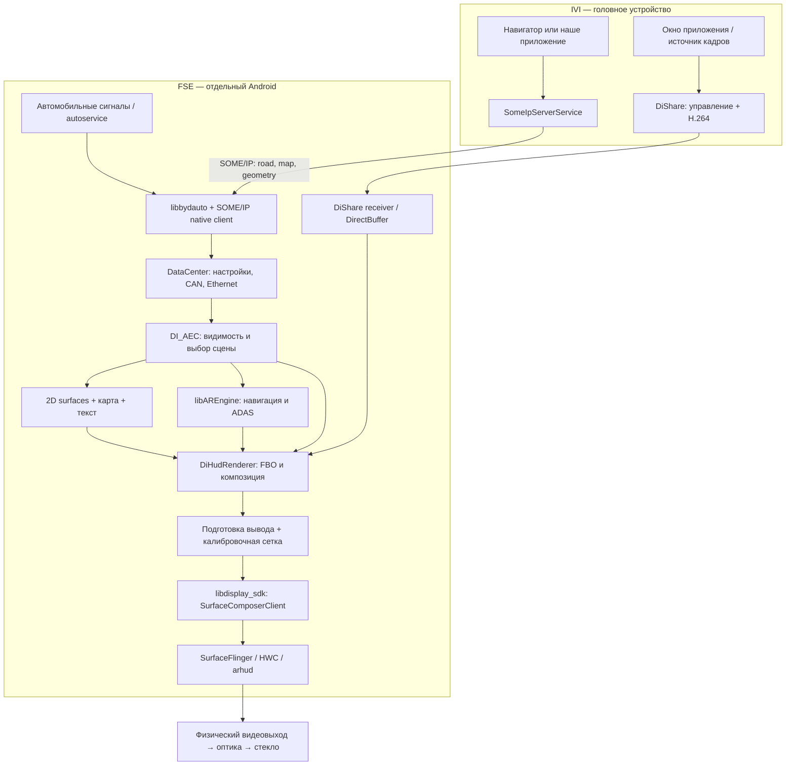

# BydHud: устройство штатного рендерера direct-drive HUD (FSE OTA)

Здесь описан BydHud (`com.byd.hud`, `/system/app/BydHud/BydHud.apk` из FSE OTA
`Di5.1_FSE_42.1.8.2605219.1.42.2.3.2605250.2`) так, как его используют варианты
HUD с прямым управлением с FSE (direct-drive). **На машине владельца он
неактивен:** пока `sys.hud.direct.config = 0`, PackageManager пропускает
`com.byd.hud` (BydHud not registered, `NameNotFoundException`), поэтому сцены,
профили SZ/HT/SN/EZ, crop карты и P-gate LVDS-сцены ниже относятся к этому
бинарнику, а не к отдельному HUD-контроллеру этой машины — см.
[§14.8 разбора HUD](../../docs/hud-projection-findings.md#fse-inspector-live).
Текст перенесён дословно из `docs/hud-projection-findings.md` (разделы 2–13)
2026-10-03; добавлены только пометки **Superseded** и исправлены относительные
ссылки. Нумерация сохранена, поэтому «§8» в других местах означает раздел 8 здесь.

## Содержание

- [2. Корпус, версия и состав приложения](#engineering-corpus) — OTA, хеши, manifest, нативные библиотеки.
- [3. Архитектура и слои абстракции](#engineering-layers) — схема IVI → FSE → `arhud`, восемь уровней контракта.
- [4. Запуск и жизненный цикл](#engineering-lifecycle) — gate PackageManager, Java-оболочка, нативные потоки.
- [5. Источники данных и управляющих сигналов](#engineering-inputs) — автомобильные свойства, 1B6, SOME/IP `0x8001`/`0x8003`.
- [6. Автомат сцен](#engineering-scenes) — `DI_AEC_Srceen_Mode`, P-gate `DI_AEC_LVDS_Show`, условия карты.
- [7. Раскладки и геометрия](#engineering-layout) — профили SZ/HT/SN/EZ, режимы, сборка раскладки.
- [8. Обработка карты](#engineering-map) — crop/Extend без масштабирования, маска, контракт отправителя.
- [9. Алгоритм рисования проекции](#engineering-render) — кадр сцены, AR, warping, вывод через `libdisplay_sdk`.
- [10. Можно ли подать видеопоток](#engineering-video) — DiShare по access type, `IMirrorSourceClient`, RTSP-заглушки.
- [11. Где можно вмешаться и какие нужны права](#engineering-access) — уровни доступа от IVI APK до прошивки.
- [12. Ограничения, диагностика и что осталось установить](#engineering-limits) — прежние наблюдения, исправления, план.
- [13. Указатель доказательств](#engineering-evidence) — файлы captures и адреса символов.

<a id="engineering-corpus"></a>

## 2. Корпус, версия и состав приложения

FSE OTA: `Di5.1_FSE_42.1.8.2605219.1.42.2.3.2605250.2.zip`.
Образ сообщает Android 12 / SDK 32, RK3588, fingerprint
`BYD-AUTO/FSE/FSE:12/SQ3A.220605.009.B1/eng.build.20260708.175801`.
Путь приложения в устройстве: `/system/app/BydHud/BydHud.apk`.

| Артефакт | Идентичность |
| --- | --- |
| APK | versionName `2.0.21`, versionCode `1`, 49 294 980 байт |
| SHA-256 APK | `00d976911ed17cc2e4e3e840dedcd4b5e768bf1ccad30ead4e87847b6ccf9976` |
| SHA-256 `libDiArHudP.so` | `a14125bbe3b589b0988160a15e4bd409bff9da76f2f2d77c39f162bef9419d06` |
| Версия основного native-кода | строка сборки `May 9 2026 17:36:04`, commit `ffa25c73dafec2b511c91d569e747a6ddd8e1879` |
| Версия AR-движка | `ArHudPro v2.0.1`, `May 9 2026 16:57:02`, commit `68fdb686c39cec00199887c911b01e43a490c160` |
| SHA-256 системного `libdisplay_sdk.so` | `fcfd8616354037a13957e5cf60d302e8f8572aa689acc5739b207d1982616cc1` |

Даты компиляции компонентов и дата сборки образа различаются. Нельзя
определять дату всего ПО только по имени OTA или версии Java-оболочки.

### 2.1. Java и manifest

- Пакет `com.byd.hud`, `sharedUserId="android.uid.system"`,
  `persistent="true"`, аппаратное ускорение.
- `MainApplication` управляет запуском и передаёт ресурсы в native.
- `MainActivity` — экспортируемая single-instance Activity, исключённая из
  recent tasks; есть MAIN action, обычной launcher category нет.
- Заявлены BYD-разрешения на instrument, bodywork, setting, AC, ADAS, phone
  и доступ к файлам. Это привилегированный компонент прошивки.
- В просмотренной Java-части нет экспортированного сервиса вида
  `submitFrame`, `setLayout` или `openVideoUrl`.
- View binding у Activity ведёт к `ConstraintLayout`. Основная картинка
  рисуется отдельной нативной поверхностью, а не деревом Android TextView/ImageView.

### 2.2. Библиотеки APK

| Библиотека | Размер, байт | Роль, подтверждённая символами/вызовами |
| --- | ---: | --- |
| `libhud.so` | 828 032 | JNI-входы Java, передача AssetManager и приватного пути, запуск native runtime |
| `libDiArHudP.so` | 1 890 960 | DataCenter, сигналы, SOME/IP, автомат сцен, 2D-элементы, карта, видеосцены, GL и warping |
| `libAREngine.so` | 2 906 984 | AR-навигация, ADAS-сцены, модели, координатные преобразования, состояние 3D-сцен |
| `libassimp.so` | 1 525 736 | Загрузка моделей; связана с графическим движком |
| `libfreetype.so` | 730 824 | Шрифты и глифы |
| `libhud_rtsp_codec.so` | 234 168 | Декодирование медиаданных; наличие не доказывает использование RTSP в активной сцене |
| `librtspclient.so` | 371 184 | RTSP/RTP-клиент; также не доказательство рабочего внешнего входа |

Системные зависимости: `libbydauto`, `libdisplay_sdk`, `libdiagnostic`,
`libsomeipnative-ndk`, `libsomeipimpl_proto`, protobuf, Android NDK media,
`libnativewindow`, EGL/GLES. Следовательно, перенести APK на обычный Android
и получить работающий HUD нельзя без соответствующих vendor-сервисов,
сигналов, конфигурации дисплея и ресурсов калибровки.

APK содержит 892 записи под `assets/`: профили раскладки, текстуры,
шрифты, AR JSON, 3D-модели, шейдеры и демонстрационные/калибровочные материалы.
Это основная часть внешнего вида, а не картинки, приходящие с IVI.

<a id="engineering-layers"></a>

## 3. Архитектура и слои абстракции



Схема показывает **нативный DirectBuffer-вариант**. Альтернативная ветка
DiShare запускает `HudClientActivity` на Android Display с `hud` в имени;
её нельзя без дополнительной проверки отождествлять со стрелкой
`VIDEO → GL` на этой схеме.

Уровни имеют разные контракты:

1. **Смысловые данные:** скорость, передача, маршрут, полоса, препятствия,
   состояние телефона, пользовательские настройки.
2. **Транспорт:** BYD auto API для автомобильных свойств; SOME/IP для
   навигации/ADAS; собственный протокол DiShare для видео.
3. **Нормализация и хранение:** `DiDcGet*`, структуры `CycleSignal`,
   конфигурация и данные SOME/IP, информация об online/offline.
4. **Решение, что показывать:** `DI_AEC_DataProcess` и производные флаги.
5. **Представление:** `Di*Surface`, `DiWidget`, `DiImage`, `DiTextFont`,
   AR-модели и анимации. Здесь существуют карта, скорость и предупреждения.
6. **Композиция:** текстуры, FBO, Z-порядок, alpha, scissor, GL-матрицы.
7. **Оптическая подготовка:** профильные flip/геометрия, warping по сетке.
8. **Вывод:** vendor NativeWindow, SurfaceFlinger/HWC, физический дисплей.

`Surface` в названии `DiMapSurface` означает внутренний C++-объект сцены.
Это **не отдельный Android Display и не доступный Binder Surface**, который
можно получить по имени из другого процесса.

<a id="engineering-lifecycle"></a>

## 4. Запуск и жизненный цикл

### 4.1. Java-оболочка

Предусловие всего раздела: пакет должен пройти системное сканирование.
`PackageManagerService.scanDirLI` вызывает `BydPackageUtil.nonDirectDrive`
и пропускает `com.byd.hud`, если `sys.hud.direct.config == 0`. Эта проверка
восстановлена по fallback DEX-декомпиляции, поскольку обычный JADX пропустил
тело `scanDirLI`. Это выбор аппаратной архитектуры, не проверка движения.


`MainApplication.onCreate()` инициализирует DiCar, получает
`ICarPropertyManager`, подписывается на `Body.BODYWORK_POWER_LEVEL`,
регистрирует наблюдение за дисплеями, передаёт `AssetManager` и путь
`getFilesDir()` в JNI, запускает `CPPThread → startMain()`.

Метод запуска Activity проверяет `getACCMode() == 2`, ищет дисплей с точным
именем `arhud`, передаёт его ID через `ActivityOptions.setLaunchDisplayId`
и запускает `MainActivity`. Есть `activity_once`: повторный вызов после
первого успешного старта не равнозначен созданию нового окна.

Callback питания при значении 2 вызывает запуск; при 0 у существующей
Activity вызывает `moveTaskToBack(false)`. Обнаружение нового дисплея
`arhud` также инициирует попытку запуска. Удаление дисплея в просмотренном
callback логируется.

**Не смешивать enum:** Java `BODYWORK_POWER_LEVEL == 2` и native
`DiDcGetPowerState() == 3` — проверки разных представлений состояния питания.
Это не обнаруженное противоречие «два разных правильных значения одного FID».

### 4.2. Нативная часть

`startMain` устанавливает обработчики сигналов, использует lock-файл
`/tmp/ArHud.pid`, загружает сохранённые настройки/профиль, инициализирует
DataCenter, `MainWindow`, очередь сообщений и рабочие потоки.

| Исполнитель | Что делает | Видимая в коде периодичность |
| --- | --- | --- |
| `DiSignalThread` | Читает автомобильные значения и online, обслуживает конфигурацию, callbacks и обратную связь | `usleep(30000)` в рабочем цикле |
| `DiSomeIpThread` | Инициализация native client, подписки, проверка online сервисов | `usleep(100000)` в цикле online |
| `readThread` | `DI_AEC_DataProcess → DI_AEC_GetDataValue → очередь` | `usleep(30000)` |
| Главный native loop | Забирает данные, вызывает `MainWindow::SendData`, в конце которого вызывается `RenderScene` | Дополнительный `usleep(5000)` |
| Диагностический поток | DTC/диагностическая инфраструктура | Не разобран как полный диагностический протокол |

Эти числа **не измеренная частота на стекле**: работа CPU/GPU, очередь,
декодирование и `eglSwapBuffers` добавляют время. Нельзя сделать вывод
«HUD гарантированно 33 fps» или «главный цикл 200 fps» только из `usleep`.

Есть функции `cppRuntimeFlag`, `isQuitedLoop`, `nativeActivityLifecycle`,
но наличие JNI-символа само по себе не доказывает, что каждый Activity
callback вызывает его. Поэтому `onPause`, уход Activity назад, очистка
native-сцены и выключение оптики — разные события.

<a id="engineering-inputs"></a>

## 5. Источники данных и управляющих сигналов

### 5.1. Автомобильные свойства

Основная цепочка: автомобильные данные → vendor auto service →
`libbydauto` (`android::get*`, `registerObserver`, `enableDevice`) →
`DI_Signal_Get` / `BYDHudAutoObserver` → DataCenter → `DI_AEC_Get_Signal`.
В коде BydHud нет необходимости самостоятельно открывать CAN-сокет.
Физический источник каждого CAN-сообщения до шлюза по этому APK не установлен.

Часть данных опрашивается, часть приходит через callbacks.
В `BYDHudAutoObserver` копируется таблица из 100 записей по 24 байта:
внутренний signal ID, device ID, FID и указатель callback. **Внутренний
signal ID не является FID и не является CAN arbitration ID.**

Доказанная цепочка управления внешним видео:

```text
DiShare HudScreenControl / HudClientActivity
  SET_FSE_INTELLIGENT_PROIECTION_SWITCH_SET_1B6 = 0x1B60A010
  начало = 2; конец = 1
    ↓ vendor auto service, device 1023
BydHud: signal 227 (0xE3)
  WhetherTheScreenIsDisplayedS_CallBack(value, ...)
    ↓ значение + признак valid
  DiDcGetScrenDisp()
    ↓
  DI_AEC_LVDS_Show()
    ↓
  DI_AEC_Srceen_Mode() → сцена 1 или штатная сцена 0
```

Связь `227 → device 1023 → FID 0x1B60A010` прочитана из таблицы
по адресу `0x6dce8` в `libDiArHudP.so`. Callback регистрируется в
`DiSignalThread::Regist_Signal_Listen`. Это связь двух компонентов по
конкретному свойству, а не совпадение названий.

### 5.2. Какие данные использует контроллер показа

| Источник/getter | Назначение |
| --- | --- |
| `DiDcGetHUDSwitch`, `DiDcGetDisplay` | Разрешение HUD и выбранная пользовательская раскладка |
| `DiDcGetPowerState`, `DiDcGetGear`, скорость | Питание, режим движения, показ приборов/ADAS/видео |
| `DiDcGetHUDSwitchStatusFeedback301S` | Отдельное подтверждение состояния HUD, участвующее в LVDS gate |
| `DiDcGetScrenDisp` | Play/stop от DiShare через 1B6 |
| `DiDcGetHUDShowCarMode`, factory, warp pattern/reset | Демонстрационная, заводская и калибровочная сцены |
| `DiDcGetNavigationETH`, `DiDcGetNavigationMap` | Состояние навигации и картинка карты |
| `DiDcGetLanesPicture`, данные манёвра | Бинарные картинки/инструкция навигации |
| ADAS, planned line, obstacles, vehicle position | Пространственная AR-графика и предупреждения |
| Двери, свет, AVH, запас хода, телефон, время | Остальная штатная информация и взаимное вытеснение элементов |

В отдельных getters, в том числе gear, power и HUD feedback, используется
последнее валидное значение, если новое невалидно/недоступно. Поэтому нельзя
обещать мгновенное безопасное гашение любой сцены при потере автомобиля в
сети: нужно отдельно проверять online-логику и все участвующие состояния.
`BYDHudAutoObserver::onServerDied()` в этой сборке — пустой `ret`.

### 5.3. Навигация через SOME/IP

На IVI наше приложение обращается к экспортированному
`SomeIpServerService`, который публикует события сервиса `266 = 0x010A`,
instance `1`, eventgroup `0x1101`. В разобранной IVI-прошивке в этом Binder
не обнаружены проверки вызывающего пакета для публикации этих событий.
Это характеристика данного образа, а не гарантия всех BYD.

| Событие | Содержимое | Что получает HUD |
| --- | --- | --- |
| `0x8001` | `HudRoadInfo_EG` / `HudRoadInfoNotifyStruct` | Состояние навигации, манёвр, расстояния, текст, lane picture в поле 7, maneuver picture в поле 8 и другие навигационные поля |
| `0x8003` | `HudNavigationmap`, protobuf string field 1 | Base64-кодированное изображение карты |
| `0x8002` | EHP/ADASIS-путь в исследованной IVI-прошивке | Не следует считать его доказанным видеовходом; отправитель не найден |
| `0x8004` | Подписка присутствует в новом FSE native-клиенте | В `MyCallBack::onSomeIpEvent` этой сборки нет его обработки: для `0x010A/1` разобраны только `0x8001` и `0x8003`; остальные проходят к выходу. Это не найденный дополнительный видеовход |

Native FSE использует `com::ts::car::someip::native::CNativeClient`,
`registListener`, `subscribe`, `startClient`, callback
`MyCallBack::onSomeIpEvent(hal::Message)` и protobuf C++.
Это не вызов Java `SomeIpServerService` внутри BydHud.

Помимо навигации зарегистрированы подписки:
`0x000A/0x000A/0x8001`, `0x000C/0x000C/{0x8001,0x8002,0x8003}`,
`0x000D/0x000D/{0x8001,0x8005}`, `0x000E/0x000E/0x8001`.
Обработчик декодирует vehicle position, obstacle info, lane lines,
change-lane data и planning line. Здесь поступают пространственные данные
для AR, а не изображения дороги с камеры.

`DiDcGetNavigationETH()` учитывает online навигационного сервиса.
`DiDcClearSomeIpData()` очищает группы данных при неподходящем питании или
offline. **Точный срок жизни каждого последнего кадра и каждого поля
этим исследованием не доказан**; service online не равен свежести кадра.

### 5.4. Что отправляет штатный навигатор

По ранее разобранному IVI: `NaviArHud` рисует отдельную 800×800 карту в
offscreen EGL, делает screenshot выбранного прямоугольника, масштабирует
его до согласованного размера, кодирует PNG/JPEG и публикует `0x8003`.
Для DiLink 5.1 fallback — 300×180, штатная генерация — 5 fps.

То есть **масштабирование уже предусмотрено на стороне отправителя**.
Отсутствие fit в BydHud не мешает штатному навигатору, который заранее
подготовил подходящий кадр.

Карта и дорожный пакет — разные события. Передача только PNG при неактивной
навигации может ничего не показать: именно это наблюдалось в пробе Yandex.
Одновременные публикации нашего приложения и штатного навигатора конкурируют
за одни и те же поля; отдельного compositor ownership API здесь не найдено.

<a id="engineering-scenes"></a>

## 6. Автомат сцен: когда видно изображение и что происходит на ходу

### 6.1. Приоритет выбора сцены

Ниже — восстановленный алгоритм `DI_AEC_Srceen_Mode`, включая порядок
проверок. Название с опечаткой `Srceen` сохранено как в символе.

```text
if calibration_show == 1:                         scene = 4
else if factory_show == 1:                        scene = 3
else if power_state != 3 or hud_switch != 1:       scene = 5
else if showroom_show == 1:                       scene = 2
else if lvds_show == 1:                           scene = 1
else:                                            scene = 0
```

| Scene | Смысл в `MainWindow::RenderScene` | Что рисуется |
| ---: | --- | --- |
| 0 | Штатный UI | Набор 2D-элементов и AR при подходящем HUD_TYPE |
| 1 | Внешнее LVDS/DiShare-видео | `DiLvdsSurface`, отдельная подготовка `renderPrepareLvds` |
| 2 | Showroom | `DiVideoSurface`, подготовка видео |
| 3 | Factory | `DiVideoSurface`, подготовка видео |
| 4 | Calibration | `DiPatternSurface`, калибровочная картинка |
| 5 | Закрытая/пустая сцена | Один раз очистить FBO, подготовить пустой кадр, выполнить warp и swap; далее повторную очистку подавляет флаг |

В ветках 2/3 есть fallback к `RenderUIScene`, если состояние видеоповерхности
не требует собственного кадра. Это не означает, что штатные приборы всегда
рисуются поверх каждого видео. В сцене 1 вызова `RenderUIScene` нет.

Служебные сцены проверяются раньше обычных HUD/power-условий. Это описание
заводского алгоритма, не пользовательский режим воспроизведения.
`calibration_show` имеет память состояния: pattern 1…38 устанавливает его,
reset 1 сбрасывает, другие значения сами по себе не обязаны сбросить флаг.

### 6.2. Точный gate внешней нативной видеосцены

`DI_AEC_LVDS_Show` восстанавливается без предположений о скорости:

```text
if screen_displayed == 2 and gear == 1 and hud_feedback_301 == 1:
    lvds_show = 1
else if screen_displayed == 1 or gear != 1 or hud_feedback_301 == 2:
    lvds_show = 0
else:
    сохранить предыдущее lvds_show
```

Здесь `gear == 1` — **P**. Это проверено по `DiGearSurface::Draw`:
таблица ветвления выводит `1 → P`, `2 → R`, `3 → N`, `4 → D`.
Нельзя подставлять вместо этого enum из Android Automotive VHAL:
там могут быть другие числа.

Следствия для **этой ветки данной сборки**:

- Нулевой скорости в D недостаточно: проверяется передача P.
- Переход в D/N/R сбрасывает `lvds_show`; при обычных условиях снова
  выбирается scene 0 с приборами и навигацией.
- Это локальное решение renderer. Оно не обязано посылать команду
  остановки IVI-encoder, разрывать TCP/UDP или убивать `HudClientActivity`.
- При возврате в P и сохранённых `screen_displayed=2`, feedback=1
  разрешение может установиться снова без нового нажатия Play.
- Неизвестные значения не всегда означают сброс: в последней ветке хранится
  предыдущее состояние, а отдельные getters также кешируют данные.

`DiLvdsPlayer::play/pause/stop` меняют разрешение работы DiShare buffer path
через `diEnableDiShare`; отрисовка выбранной сцены и жизненный цикл
сетевой сессии всё равно остаются разными механизмами.

### 6.3. Что это доказывает для машины владельца

**Доказано по OTA:** native LVDS-сцена BydHud ограничена P.
**Доказано снимком машины 2026-09-24:** FSE имеет
`sys.hud.direct.config = 0`, BydHud не зарегистрирован; IVI вновь сообщает
access type 3. В совпавшем по хешу FSE DiShare это `HudClientActivity`,
тогда как DirectBuffer используется при access type 1. Поэтому native
P-gate BydHud не объясняет ограничения текущего видеовхода. Нельзя переносить
его точный crop на отдельный HUD ECU. Работающий видеосеанс в новом снимке
не трассировался; вывод о маршруте опирается на конфигурацию и код receiver.

Кроме native gate существуют независимые причины окончания DiShare:
HUD availability, питание, звонок, ошибка декодера, удаление receiver,
политика overseas в IVI-прошивке. Их нельзя свести к одному `if (speed > 0)`.

### 6.4. Условия карты

В `DiMapSurface::Draw` карта видима, когда одновременно:

```text
received_map_string не пуста
and display_layout == 1
and vehicle_condition_overlay != 1
and navigation_active != 0
```

`navigation_active` в `DI_AEC_Navigation_Status`:

```text
power_state == 3 and (navigation_eth_status & 0xFE) == 2
```

То есть принимаются статусы 2 или 3 при нужном питании. Снаружи также
должна быть выбрана штатная сцена 0; в сцене видео карта не получает
свой обычный проход отрисовки.

`vehicle_condition_overlay` — автомобиль с индикацией открытых дверей.
`DI_AEC_VehicleCondition_Show` активирует его в P при открытой двери,
включая капот/багажник, и держит примерно секунду после закрытия.
Вне P этот overlay сбрасывается. Так карта может исчезнуть на стоянке
из-за приоритетного состояния кузова, хотя кадры продолжают приходить.

В этих условиях **нет запрета карты по скорости или выходу из P**.
Это согласуется с её назначением для навигации. Это не подмена отдельного
натурного испытания нашего отправителя на ходу.

<a id="engineering-layout"></a>

## 7. Раскладки и геометрия

Есть как минимум три независимых выбора:

1. **Профиль автомобиля:** HT/SZ/SN/EZ, задаёт геометрию, ресурсы,
   возможности и ориентацию вывода.
2. **Пользовательский режим:** STANDARD/SIMPLE/OFF_ROAD.
3. **Текущая сцена:** UI/video/calibration/blank и т. п.

Имена «профиль», «режим» и «сцена» не взаимозаменяемы. Размер картинки
не переключает профиль и не увеличивает выделенную карте область.

### 7.1. Профили из assets

Все координаты ниже — пиксели **логической сцены**, до окончательного
вывода/оптической коррекции. `DISPLAY_WIDTH/HEIGHT` — параметры профиля,
а не измерение реального Android display mode на машине.

| Профиль | Canvas | Effective rectangle x,y,w,h | AR rectangle w,h | Карта x,y,w,h | Альтернативная позиция карты | DISPLAY_WIDTH×HEIGHT |
| --- | --- | --- | --- | --- | --- | --- |
| SZ | 1280×640 | 106,141,1067,357 | 1067×217 | 850,269,300,180 | 850,278 | 1186×396 |
| HT | 1280×640 | 148,140,984,360 | 984×220 | 848,316,270,180 | 848,280 | 1094×400 |
| SN | 1440×480 | 244,80,953,319 | 953×179 | 924,215,270,180 | 924,170 | 1003×336 |
| EZ | 800×480 | 45,122,711,237 | 0×0 | 554,195,200,160 | 554,168 | 749×250 |

У SZ/HT/SN `HUD_TYPE=0`, у EZ `HUD_TYPE=1`.
`MainWindow` вызывает 3D-проход при типе 0. `SUPPORT_LVDS_PLAYER=true`
у SZ/HT/SN, `false` у EZ — ещё одно ограничение помимо условий движения.

Профиль читается `loadVechicleCfg → getCfgFilePath → loadJson → initHudConfig`.
Сохранённое поле `State/CarRecogni` участвует в старте; по коду default — SZ.
`LearnVechicleCfg` читает внутренний signal 457, сохраняет изменение и
завершает процесс для следующего запуска с новой конфигурацией.
AR-библиотека явно распознаёт HT `0x03`, SZ `0x04`, SN `0x05`.
**Назначать эти сокращения коммерческой модели по догадке нельзя.**

### 7.2. Пользовательский режим и путаница enum

`HudModeProperty` явно переводит semantic enum в автомобильное значение:

| Название | Java `HudMode.value` | Underlying значение |
| --- | ---: | ---: |
| SIMPLE | 1 | 2 |
| STANDARD | 2 | 1 |
| OFF_ROAD | 3 | 3 |

Поэтому ранее прочитанное underlying `1` действительно соответствует
STANDARD, хотя в Java enum STANDARD равен 2. Условие карты `display==1`
нужно читать в контексте native-конфигурации, а не копировать Java enum.

### 7.3. Как собирается штатная раскладка

`MainWindow` создаёт набор surfaces и передаёт каждому нормализованный
набор данных. Положение/размер/шрифт/текстура приходят из `HudConfig`.
Далее объект решает, показываться ли ему, меняет геометрию/alpha и
передаёт изображения или текст в renderer.

Основные группы:

| Группа | Найденные классы |
| --- | --- |
| Приборы | `DiSpeedSurface`, `DiSpeedUnitSurface`, `DiGearSurface`, `DiAvhSurface`, `DiRangeSurface`, `DiCurrentTimeSurface` |
| Навигация | `DiMapSurface`, `DiLaneSurface`, `DiInductionSurface`, `DiNextRoadDistSurface`, `DiRemainTimeSurface`, `DiTrafficLightSurface`, `DiDesAnimaSurface` |
| ADAS/предупреждения | `DiAccSurface`, `DiIccSurface`, `DiLdwSurface`, `DiNoaSurface`, `DiBsdSurface`, `DiArBlanketSurface`, `DiHandOffSurface`, `DiBoxSurface`, `DiOwsSurface` |
| Состояние машины/интерфейса | `DiVehicleConditionSurface`, `DiLightGroupSurface`, `DiPhoneSurface`, `DiTextRemindSurface`, left/right turn |
| Специальные сцены | `DiVideoSurface`, `DiLvdsSurface`, `DiPatternSurface` |

Наличие класса не означает его показ во всех профилях.
В `RenderUIScene` есть согласование геометрии: телефон влияет на размещение
других элементов, карта — на оставшееся время, speed limit — на ACC,
предупреждения — на destination animation. Это условная фиксированная
раскладка с анимациями, а не Android responsive layout.

У карты две профильные позиции; `DI_AEC_Map_Pos` выбирает состояние,
`DiMapSurface` анимирует переход. В конструкторе задано время 0,5 секунды.
Этот сдвиг всего окна не является сдвигом области чтения внутри PNG.

<a id="engineering-map"></a>

## 8. Обработка карты: почему виден кроп

Цепочка декодирования:

```text
SOME/IP 0x8003
  → protobuf HudNavigationmap.string
  → сохранённая строка DataCenter
  → DiMapSurface::SetData
  → Base64 decode / PicData::LoadPng(string)
  → декодер изображения в памяти
  → Crop при превышении размеров
  → Extend при нехватке размеров
  → обновление GL-текстуры
  → Draw карты и отдельной mask texture
```

Название `LoadPng` не следует считать строгим контрактом «только PNG»:
используется memory image decoder; в стоке отправитель умеет также JPEG.
Изображение здесь — самостоятельный закодированный кадр, а не H.264 NAL
и не участок непрерывного видеобитстрима.

Пусть `w,h` — входной кадр, `W,H` — размеры карты в профиле.

| Условие | Прямоугольник исходного кадра x,y,width,height |
| --- | --- |
| `w > W`, `h <= H` | `floor((w-W)/2), 0, W, h` |
| `w <= W`, `h > H` | `0, floor((h-H)/2), w, H` |
| `w > W`, `h > H` | `floor((w-W)/2), h-H, W, H` |
| Оба размера помещаются | Crop не нужен |

После crop при нехватке размера вызывается `Extend(W,H,5)`:
горизонтальное центрирование, вертикальная привязка к низу.
В этой ветке `Scaled` не вызывается. `PicData::Crop` копирует строки,
а не ресэмплирует их; memory loader сбрасывает vertical-flip.

**Пример для SZ:** из 600×360 берётся прямоугольник
`x=[150,450), y=[180,360)` — центральная по горизонтали нижняя часть.
Это не левый верхний угол. При 300×360 сохраняется средняя по высоте часть,
а не нижняя: алгоритм действительно различает превышение одной и двух осей.

Отсюда следуют наблюдения пробника: большая рамка исчезает, деления сетки
не отсчитываются от видимого нуля, центральный крест может оказаться у
границы или вне ожидаемого места. По одному такому кадру нельзя надёжно
назвать размер окна. Ранняя гипотеза о top-left crop ниже в журнале устарела.

### Маска и масштабирование всей сцены

Для SZ используется `MapMask.png`, для HT/SN `MapMask_270_180.png`,
для EZ `CommonS/MapMask_200_160.png`. Маска — отдельная чёрная текстура с
переменным alpha, смягчающая края. У SZ alpha в центре 0, в середине
верхнего/боковых краёв 211, у нижнего центра 0. Видимость маски управляется
отдельно от карты и зависит от состояния навигационного изображения.

Дальнейшая подготовка всей сцены и оптический warp могут изменять форму
окончательного изображения. Поэтому верны одновременно два утверждения:
**входной oversized PNG не fit-ится в слот**, но **весь HUD проходит
геометрические преобразования перед выводом**.

### Практический контракт отправителя

Отправитель должен сам подготовить кадр нужного размера: выбрать область
интереса, уменьшить с сохранением пропорций, добавить необходимые поля,
затем кодировать. Передавать 600×360 ради большего поля обзора бесполезно:
это увеличивает объём работы, но не размер слота.

До чтения активного профиля разумная проверенная отправная точка этой машины
— 300×180; это **проверенный вход**, а не окончательно измеренный native slot.
В пробе IVI принимал 15 fps при 300×180 и 10 fps при 400×300/600×360.
Приём Binder/сети, скорость изменения texture и видимая частота на стекле
должны измеряться отдельно.

<a id="engineering-render"></a>

## 9. Алгоритм рисования проекции

### 9.1. Один кадр штатной сцены

1. DataCenter обновляет значения из автомобильных и Ethernet-источников.
2. `DI_AEC_DataProcess` рассчитывает производные состояния и видимость.
3. `MainWindow::SendData` вызывает `SetData` у созданных surfaces и
   передаёт выбранный scene ID в `RenderScene`.
4. Renderer привязывает и очищает FBO.
5. Для scene 0 выполняет `RenderUIScene`; при `HUD_TYPE=0` — `Render3D`.
6. `Render2D` рисует собранные изображения и текст поверх соответствующей
   сцены, с видимостью, alpha, геометрией и порядком элементов.
7. `renderPrepareUi` применяет геометрию вывода UI; у video и LVDS свои
   подготовительные проходы. Для штатного UI включается соответствующий scissor.
8. `renderWarp` деформирует итоговую текстуру по сетке калибровки.
9. `SwapBuffer` предъявляет кадр EGL/NativeWindow.

`DiWidget` хранит позицию, размер, opacity, visibility и Z;
`DiImage` — изображение/текстуру; `DiTextFont` — текст и параметры шрифта.
Есть `sortAllImages` и `sortAllFonts`, shader uniforms и GL draw calls.
Это удерживаемый набор объектов сцены, обновляемый по состоянию.

### 9.2. AR — вычисляемая 3D-сцена

`MainWindow::Render3D` лениво инициализирует `ArEngine`, затем передаёт
`ArEnginData_t`. `StartArHud::ArEngineRender` обновляет высоту,
вызывает `SceneRender::startFrame`, `ArNavigation::update`,
`Adas::update`, затем `SceneRender::draw`.

В AR имеются:

- Навигационные сцены straight, keep left/right, turn left/right,
  U-turn, roundabout, destination; модель и фазы анимации выбираются кодом.
- Модели arrow, phoenix, butterfly и другие внутренние варианты;
  загрузка/проверка моделей, в том числе сообщения о MD5 verification.
- `SceneState::tryStartScene`: арбитраж и взаимное исключение сцен.
- ADAS-геометрия: линии дороги/планируемого движения, препятствия,
  перестроение, зоны предупреждений.
- `ArFusion`: преобразования `gcj02ToWgs84`, `wgs84ToUtm`, `utmToVeh`,
  `vehToGl`, `lonlatToGl`, а также pixel/near-clip/GL conversion.
  Выбор географического преобразования зависит от региональной конфигурации.
- Камера/проекция, interpolation высоты и матрицы view/projection.
  `gear` в `getCurrentGearVp` относится к ступени регулировки высоты HUD,
  а не автоматически к передаче коробки; контекст — `updateHeight`.

Таким образом, «стрелка лежит на дороге» получается из геометрии маршрута,
положения автомобиля, профильных параметров виртуального изображения и
матриц. В изученном входе AR нет обязательного видеокадра реальной дороги.
Не установлено, что BydHud сам делает computer vision или распознаёт камеру.

`arfusion.json` для SZ, например, задаёт `screenWidth=1280`,
`screenHeight=640`, `uiWidth=1067`, `uiHeight=357`, `hfov=8.69`,
`vfov=2.9`, `vid=7.02`, параметры положения/высоты глаза и виртуального
прямоугольника. Семантика названий указывает на модель оптики;
единицы всех полей не подтверждены отдельной спецификацией.
Здесь `opticalHeight=397`, тогда как 2D-профиль имеет `DISPLAY_HEIGHT=396`:
это два разных файла, их значения нельзя молча уравнивать.

### 9.3. Warping для стекла

`diPicProcessingSurface` загружает `gridWarp.para` через
`getHudWarpDataPath`, создаёт `DiPicWarping` / `warpingPoint`, генерирует
таблицы vertices/indices и рисует текстуру на полученной сетке.
Имеются загрузка, сохранение, повторная генерация, обновление данными,
backup-путь и отдельный поворот `rotate(float)`.

Это **деформация итогового кадра**, нужная для геометрии выходного тракта.
Нельзя путать её с `Crop` карты. Точная физическая модель линзы,
полный формат всех калибровочных коэффициентов и персональная калибровка
машины ещё не восстановлены; нельзя утверждать, что это конкретный
полином только по названию warping.

Строки и path helpers указывают на `/collect2/hudresources`, `warpData`,
`gridWarp.para`, `hudconfig/hudconfig.ini`; Java также передаёт private path.
Фактически выбранные runtime-пути следует читать по логам/getter,
а не предполагать, что любая копия одноимённого файла будет использована.

В профилях видео/LVDS у SZ/HT/EZ указаны X-flip=true, Y-flip=false,
у SN — X-flip=false, Y-flip=true. Эти преобразования относятся к
соответствующим текстурным трактам; ими нельзя объяснять исходный
memory-image crop без прослеживания последующих проходов.

### 9.4. Как кадр попадает в дисплей

`diGLESContex::GLESContex_init` вызывает `initNativeWindow(0)` и
`getNativeWindow(0)`, получает реальные width/height/format,
настраивает буферы и EGL window surface/context. При отсутствии окна
пытается получить его снова.

В извлечённом системном `libdisplay_sdk.so`:

- `phys_display_type=0` переводится в имя `arhud` и layer stack `2000`.
- `DirectBufferUtils::getDisplayIdByName` читает
  `/vendor/etc/BydDisplayConfigs.xml`.
- `initNativeWindow` использует `SurfaceComposerClient`: physical display
  token/mode/state, `createSurface`, `setLayer`, `show`, `setSize`,
  `setLayerStack`, `setDisplayLayerStack`, `apply`.
- Это отдельная поверхность семейства `DirectBuffer_*`, а не переданный
  из Java `SurfaceView`.

В конфигурации платы A1 `LVDS-2` связан с `arhud`, vendor DisplayId 8;
рядом `LVDS-3 → dlp`, `LVDS-4 → skyscreen`. Это данные прошивки.
Vendor ID 8, Android logical displayId и layer stack 2000 — **разные
пространства идентификаторов**; нельзя механически запускать Activity
на display 8 без чтения текущего `dumpsys display`.

Связь FSE → физический выход установлена конфигурацией и кодом SDK.
Точная микросхема панели, интерфейс её контроллера, оптическое гашение,
яркость источника света и механика регулировки не восстанавливаются
полностью из этого приложения.

<a id="engineering-video"></a>

## 10. Можно ли подать видеопоток

### 10.1. Рабочий путь DiShare

На IVI DiShare может создать `BYD-Mirror`, запустить в нём окно приложения,
закодировать SurfaceFlinger-композицию в H.264 и передать её FSE.
По прежнему разбору IVI: 30 fps cap, 12 Mbit/s CBR, TCP control на 13132,
видеофрагменты UDP; потеря фрагмента ведёт к пропуску кадра и запросу IDR.
Это параметры просмотренной реализации, не измеренная пропускная
способность и не обещанная задержка.

Принимающая ветка выбирается `SETTING_HUD_INTEGRATE_CONFIG_FLAG`:

| Access type | Действие FSE DiShare | Связь с BydHud |
| ---: | --- | --- |
| 1 | `startHudForFse`: mirror client получает `DirectBufferInterface.getSurface(1)` | Нативный BydHud регистрирует DirectBuffer callback, получает буферы и рисует через `DiLvdsSurface` |
| 2 | `startHudForIvi` возвращает код 55 | В просмотренной реализации не выполнено |
| Иное, в том числе 3 | `startHudForLeftDoMain`: поиск Android Display с `hud` в имени и запуск `HudClientActivity` | Конфигурация машины владельца; BydHud не зарегистрирован. Условия показа отдельного контроллера не установлены |

`HudClientActivity` посылает тот же play-state FID 1B6 и умеет профильные
padding. Это подтверждает управление состоянием, но **не доказывает**,
что декодированная Activity-картинка проходит через `DiLvdsSurface`.

На уровне SDK native callback создаёт BufferQueue/CpuConsumer,
регистрирует producer в Binder `ProducerService`; Java
`DirectBufferInterface` получает соответствующую Surface.
Это внутренняя vendor-инфраструктура FSE.

Не смешивать два enum:

| API | Значения |
| --- | --- |
| `phys_display_type` в native output SDK | 0=arhud; 1/2/3=dlp; 4=skyscreen |
| Java `DirectBufferInterface` buffer type | 1=DISHARE; 2=QT; 3=VIRTUAL_SCREEN_DLP; 4=VIRTUAL_SCREEN_HUD |

В firmware также есть `bydCreatVirtualDisplayService`. Несмотря на поля
и callback для HUD/type 4, `appCreateVirtualDisplay` немедленно возвращается
при `type != 3`, а регистрация callback выполнена только для DLP/type 3.
Рабочее создание virtual HUD в этом сервисе **не реализовано** в просмотренной
сборке. Имена и неиспользуемый каркас не являются готовым способом вывода.

### 10.2. Собственный источник вместо окна приложения

В ранее разобранном DiShare есть
`IDiShareApiService.setMirrorSourceClient(IMirrorSourceClient)`:
источник сам передаёт H.264 в UDP framing DiShare по полученному адресу,
обслуживает запросы ключевых кадров и жизненный цикл stream.
Это не API «дай произвольный Surface в BydHud» и не стандартный RTSP URL.

Готовые отправители/обвязка существуют в исследовательском и legacy-коде
репозитория; для первого воспроизводимого результата проще штатная
трансляция окна. Видеокартинка и показ штатной скорости одновременно
не следуют из этого API. В наблюдавшемся сеансе скорость исчезала.

### 10.3. Локальное видео внутри BydHud

`DiVideoPlayer` и `DiVideoSurface` обслуживают factory/showroom-сцены;
в assets есть `resources/warpTestPattern/{SZ,HT,SN,EZ}/ARHUD.mp4`.
Присутствуют MediaExtractor/MediaCodec и буферы кадров.
Наличие этого плеера не даёт обычному IVI-приложению команды открыть
произвольный файл на FSE.

### 10.4. RTSP: важная граница найденного

`DiSRPlayer` содержит строку `rtsp://192.168.195.2:29570`.
Но в проверенной сборке его `playerInit`, `play`, `pause`, `stop`,
`registerPlayerBuff`, `allocPlayerResources` в основном только логируют;
`DiSRStreamSurface::Draw` и `SetData` — пустой `ret`;
`DiSRPlayer::DecoderFrameGetIndex` всегда возвращает `-1`.

Вывод: в составе остался задел/вариант реализации SR streaming,
но **активный RTSP-видеовход BydHud этим не подтверждён**.
Присутствие `librtspclient.so` и адреса в strings недостаточно для
рекомендации «подними RTSP-сервер, и HUD покажет поток».

### 10.5. Поток отдельных картинок

Через `0x8003` можно показывать последовательность PNG/JPEG — пробник это
уже делал. Но на каждом кадре выполняются упаковка, Base64, protobuf,
передача, декодирование изображения и обновление текстуры. Нет временного
сжатия, clock синхронизации видео и согласованного с отправителем playback API.
Это подходящий механизм маленькой карты; он не равнозначен видеотракту
для полноэкранной камеры с малой задержкой.

<a id="engineering-access"></a>

## 11. Где можно вмешаться и какие нужны права

| Уровень | Точка доступа | Возможности и границы |
| --- | --- | --- |
| Обычное приложение IVI | SOME/IP Binder, road `0x8001`, map `0x8003` | Свои картинки в штатных слотах; сохраняется управление раскладкой со стороны HUD. Уже проверено. |
| Обычное приложение IVI | DiShare control, receiver `screen_hud` | Трансляция окна при доступном receiver; уже проверено в P. |
| IVI custom stream | `IMirrorSourceClient` | Собственный H.264 с framing/lifecycle DiShare; сложнее стандартного casting. |
| HUD settings API | `ICarHudService` через CarServiceProvider | On/off, layout, тема, стрелки, высота/угол/яркость, fusion/map settings; не загрузка картинки. SET требует vendor permissions. |
| Shell/системный диагностический доступ | `autoservice`, чтение FID, dumpsys, logcat | Установление состояния/ветки, сверка APK. Права конкретной FSE надо подтвердить. |
| Системный процесс FSE | `DirectBufferInterface`, `ProducerService` | Работа с локальными surfaces/буферами. С IVI Binder через сеть к ним не обратиться напрямую. Доступ стороннего FSE APK не проверен. |
| Процесс BydHud | `MainWindow`, `DiMapSurface`, `HudConfig`, `ArEngine` | Внутрипроцессные C++ объекты; экспорт символа в ELF не делает его удалённым API. |
| Системная прошивка FSE | APK assets, native `.so`, vendor display config | Теоретически изменение внешнего вида/рендера; нужны системная подпись/доставка/совместимость и отдельный план восстановления. В этой работе не менялись. |
| Оптика/контроллер HUD | Калибровка, диагностический тракт | Обнаружены интерфейсные следы; полный аппаратный контракт ещё не разобран. |

Нельзя получить HUD на IVI обычным `DisplayManager.getDisplays`, если
дисплей принадлежит другому Android-устройству. Аналогично cluster
`BydProjectionService` и его `shared_fission_*` surfaces не являются
доступом к `arhud` FSE.

Увеличение map PNG, изменение манифеста нашего приложения или запуск
Activity с произвольным displayId не меняют `LAYOUT_MAPSURFACE_W/H`.
Чтобы контролировать весь штатный layout, нужен доступ на стороне
renderer; чтобы поместить свою карту в существующий slot, он не нужен.

<a id="engineering-limits"></a>

## 12. Ограничения, диагностика и что осталось установить

### 12.1. Подтверждённые ранее наблюдения на машине

- Картинка манёвра менялась по входным кадрам; field 8 применяется и в
  существующем навигационном сценарии на ходу.
- Map `0x8003` показывался справа от скорости, несмотря на отсутствие
  валидного feature flag `0x38B00030`.
- 600×360 обрезался. Статический разбор нашёл конкретный crop-алгоритм.
- Yandex crop 300×180 при 5 fps показался после добавления дорожного пакета
  с активной навигацией; только изображение не сработало.
- DiShare видео было плавным на глаз в P и заменяло штатный HUD, в том
  числе скорость. Измерения задержки и поведения на ходу нет.

Это отдельные датированные результаты, а не новый live-прогон.

### 12.2. Исправления прежних выводов

| Ранний вывод/предположение | Уточнение после FSE OTA |
| --- | --- |
| «Renderer находится только в недоступном HUD ECU» / «нашли BydHud, значит ECU только проектор» | OTA поддерживает разные архитектуры. При `sys.hud.direct.config == 0` PackageManager пропускает BydHud. Наличие физического видеовыхода FSE не определяет, где синтезируется штатная сцена. |
| «Размер карты, наверное, 300×180» | Это рабочий вход на машине и один из профилей BydHud; регистрация BydHud на машине отсутствует. Точный размер слота отдельного контроллера ещё надо измерить. |
| «Большая карта обрезается от левого верхнего угла» | В неактивном здесь BydHud native crop имеет центрирование и правило bottom-center при превышении обеих осей. Алгоритм отдельного контроллера этим не установлен. |
| «Правило движения вообще неизвестно» | Для native LVDS найден точный P-gate. Для наблюдавшейся ветки access type 3 вопрос остаётся открытым. |
| «Библиотека RTSP означает возможность подать URL» | Выявленные SR методы — заглушки; рабочий внешний URL API не найден. |
| «Рамка, canvas и разрешение проектора — одно» | Это три разных уровня геометрии; после слота есть композиция и warp. |

### 12.3. Различать способы исчезновения картинки

При диагностике надо различать: отправитель перестал публиковать;
SOME/IP сервис offline; nav status неактивен; картинку вытеснила дверь/сцена;
выбран другой layout; native scene очищена; DiShare receiver unavailable;
декодер потерял IDR; Activity остановилась; vendor surface исчезла;
физический HUD выключил свет. Один симптом «ничего нет» не указывает,
на каком из этих уровней причина.

При этом отсутствие падений и успешный `fireEvent` подтверждают только
часть пути. Для end-to-end нужны хотя бы номер кадра на стекле и состояния
renderer/receiver в тот же момент.

### 12.4. Приоритет дальнейшего исследования

1. **Сделано 2026-09-24:** fingerprint, свойства FSE, PackageManager,
   физический APK BydHud и хеш установленного DiShare считаны Inspector.
   BydHud исключён из регистрации. Его `CarRecogni`/profile/DirectBuffer
   теперь не являются приоритетом для данной машины.
2. Перечень Android Display уже получен: `arhud` 1280×640. Следующий уровень —
   surface/layer inventory и текущая `HudClientActivity` во время видеосеанса;
   обычный Inspector таких прав не имеет. `dumpsys display` не выполнялся.
3. Зафиксировать принимающий `getHudAccessType` и события DiShare. На IVI
   значение 3 считано; все 13 BYDAuto getter на FSE получили отказ в доступе.
   Это разные источники данных, их нельзя выдавать за один синхронный снимок.
4. Сопоставить gear, speed, power, HUD availability, состояние receiver и
   видимый результат по общей временной шкале. Семейства 1B6 и 301 на IVI
   сейчас возвращают 65535; они не являются надёжным индикатором сеанса.
   Не подменять передачу/скорость ради обхода неизвестного условия.
5. Проверить правильный fit на стороне отправителя: рамка, круг,
   независимые метки краёв, кадры 270×180/300×180. Для отдельного HUD ECU
   точную геометрию ещё нужно измерить: код BydHud её не доказывает.
6. Для карты отдельно измерить частоту обновления/задержку; для DiShare —
   переход сцены и сохранность штатной информации. Дорожная проверка
   конкретной ветки остаётся отдельным согласованным опытом.

Полезные read-only артефакты будущего сеанса: `getprop sys.hud.direct.config`,
`getprop sys.piex.light.type`, `dumpsys package com.byd.hud`,
`dumpsys display`, `dumpsys SurfaceFlinger --list`,
`dumpsys activity activities`, ограниченный `logcat` с `DiArHud`, `ArHudPro`, `de_bi`,
`HudScreenControl`, `HudClientActivity`, `DeviceConfigHelper`.
Привилегированные dump/logcat-команды FSE приведены как план и на FSE
не запускались. Четыре `getprop`, PackageManager и DisplayManager уже
выполнены от UID Inspector; см. [натурный отчёт](#fse-inspector-live).

Для машины не установлены: точная геометрия слота отдельного контроллера,
его правило выбора видео в access type 3 и задержка. Для direct-drive
ветки OTA остаются неразобранными весь формат `gridWarp.para`, условия AR-анимаций и
тайм-ауты отдельных protobuf полей; реальная частота/латентность;
привилегии стороннего APK для FSE DirectBuffer. Прошивка содержит гораздо
больше кода, чем можно считать доказанным по именам символов.

<a id="engineering-evidence"></a>

## 13. Указатель доказательств для продолжения

Артефакты лежат в ignored `captures/fse-firmware-20260924/`:
`extraction.json` содержит размеры и hashes; `jadx/` — Java;
`bydhud-unpacked/` — ресурсы, символы и дизассемблер.
ELF-адреса ниже — виртуальные адреса символов **данного `.so`**, а не
адреса процесса с учётом ASLR. После обновления прошивки они могут измениться.

| Предмет | Файл/символ |
| --- | --- |
| Java start/lifecycle | `jadx/BydHud/sources/com/byd/hud/{MainApplication,MainActivity}.java`, `bydhud-unpacked/manifest.txt` |
| Начало native | `libDiArHudP.so`: `startMain` `0x990ac` |
| Signal API и FID | `DI_Signal_Get` `0xa39d0`, `DI_Signal_Listener` `0xa525c`, table `0x6dce8`; извлечена в `native-signal-table.json` |
| Callback 1B6 | `WhetherTheScreenIsDisplayedS_CallBack` `0xa5418`, регистрация `0xdc198` |
| SOME/IP подписки/декодирование | `DiSomeIpThread::mainLoop` `0xde9b0`, `MyCallBack::onSomeIpEvent` `0xa7868` |
| Производные состояния | `DI_AEC_Get_Signal` `0x9ca3c`, `DI_AEC_DataProcess` `0x9cd84` |
| Navigation active | `DI_AEC_Navigation_Status` `0x9d730` |
| Video P-gate / selector | `DI_AEC_LVDS_Show` `0x9d7e0`, `DI_AEC_Srceen_Mode` `0x9d830` |
| Перекрытие дверями | `DI_AEC_VehicleCondition_Show` `0x9d8b0` |
| Gear enum P/R/N/D | `DiGearSurface::Draw` `0x111de4`, jump table `0x70378` |
| Profile / learn | `loadVechicleCfg` `0xb11c4`, `initHudConfig` `0xb1698`, `LearnVechicleCfg` `0xddd04` |
| Передача данных/scene draw | `MainWindow::SendData` `0xfe978`, `RenderScene` `0xfec98`, `RenderUIScene` `0xfef30`, `Render3D` `0xff26c` |
| Карта | `DiMapSurface` ctor `0x117880`, `Draw` `0x117d44`, `SetData` `0x117e90`; crop decisions `0x117ff0–0x118124`, Extend call `0x118180` |
| Пиксельные операции | `PicData::LoadPng(string)` `0xf5c08`, `PicData::Crop` `0xf5ff0`, memory loader flip reset `0x139748` |
| LVDS | `DiLvdsPlayer::playerInit` `0xe014c`, `play` `0xe044c`, `pause` `0xe0484`, `stop` `0xe04a8`, `DiLvdsSurface::Draw` `0xf914c` |
| DirectBuffer | `diInitDishareResource` `0x17ba98`, `diReadDiShareBufferIndex` `0x17bfec`, `diEnableDiShare` `0x17c1a0` |
| RTSP-задел | `DiSRPlayer` ctor `0xf6afc`, `playerInit` `0xf6e54`, `play` `0xf6ecc`, `DiSRStreamSurface::Draw/SetData` `0xfbc1c/0xfbc20` |
| Warping / output context | `diPicProcessingSurface::init_glBuff` `0x16a3c8`, `renderForDiArHud` `0x16ab58`, `DiPicWarping::DiWarpingDataInit` `0x16d0a8`, `GLESContex_init` `0x16b84c` |
| AR | `libAREngine.so`: `StartArHud::InitArEngine` `0x1c4190`, `ArEngineRender` `0x1c4604`, `ArFusion::lonlatToGl` `0x1c8b88`, `ArNavigation::render` `0x296df0` |
| Vendor surface creation | `libdisplay_sdk.so`: `initNativeWindow` `0xa01c`, `registerDirectBufferCallback` `0xae84`, `DirectBufferUtils::getDisplayNameByType` `0xdd24`, `getLayerStackByType` `0xddc0` |
| Receiver Java | `jadx/DiShare/sources/com/byd/dishare/device/HudScreenControl.java`, `app/activity/HudClientActivity.java`, `j/d/n/n/p.java` |
| DirectBuffer Java | `jadx/framework/sources/android/graphics/surface/DirectBufferInterface.java` |
| Режимы HUD | `jadx/DiCarServer/sources/com/byd/car/property/vision/hud/HudModeProperty.java` |
| Layout/resources | `bydhud-unpacked/assets/resources/layout/*_vechicleCfg.json`, `assets/arResources/json/{SZ,HT,SN}/` |

`inspect_native.py` рядом с дизассемблером помогает выбирать функции и
показывать строковые литералы. Это вспомогательный просмотрщик, не
декомпилятор: решение о ветвлении проверялось по инструкциям и jump tables.
JADX имеет ошибки декомпиляции; его `UnsupportedOperationException` в
неразобранном методе не означает, что прошивка действительно кидает это
исключение. Отсутствующий метод нельзя использовать как доказательство
отсутствия firmware-функции.

Смежные темы: [DiShare API](dishare-api-notes.md),
[навигационный пакет и приборка](instrument-display-findings.md),
[доступ и установка на FSE](fse-app-installation.md).
